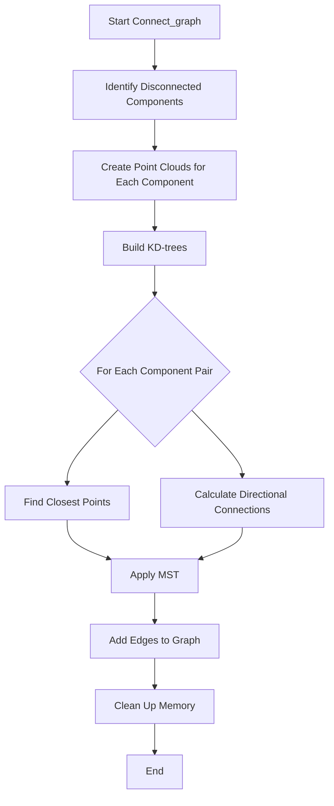
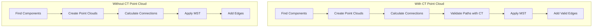

# Understanding PR3DCluster's Connect_graph Functions

## Overview
The `Connect_graph()` functions in PR3DCluster are responsible for connecting disconnected components in a point cloud graph representation of detector data. These functions handle scenarios both with and without CT (Computed Tomography) point cloud reference data.

The difference between these two are elaborated in the later text.

## Key Components

### 1. Graph Structure
- Uses Boost Graph Library for graph operations
- Vertices represent points in 3D space
- Edges represent connections between points with weights based on distance

### 2. Component Analysis
The function first identifies disconnected components:
```cpp
std::vector<int> component(num_vertices(*graph));
const int num = connected_components(*graph, &component[0]);
```

### 3. Point Cloud Creation
For each disconnected component:
- Creates separate point clouds
- Builds KD-trees for efficient nearest neighbor searches
```cpp
std::vector<ToyPointCloud*> pt_clouds;
for (int j=0; j!=num; j++) {
    ToyPointCloud *pt_cloud = new ToyPointCloud();
    pt_clouds.push_back(pt_cloud);
}
```

### 4. Connection Strategies

#### a) Direct Distance Connection
- Finds closest points between components
- Connects if distance is below threshold (3cm)
```cpp
if (std::get<2>(index_index_dis[j][k]) < 3*units::cm) {
    index_index_dis_mst[j][k] = index_index_dis[j][k];
}
```

#### b) Directional Connection
For larger point clouds (>100 points):
- Uses Hough transform to find principal directions
- Connects points along these directions
```cpp
TVector3 dir1 = VHoughTrans(p1, 30*units::cm, pt_clouds.at(j));
dir1 *= -1;
std::pair<int,double> result1 = pt_clouds.at(k)->get_closest_point_along_vec(
    p1, dir1, 80*units::cm, 5*units::cm, 7.5, 3*units::cm
);
```

### 5. Minimum Spanning Tree (MST)
Uses Boost's Prim's algorithm to:
- Ensure minimal connections between components
- Avoid redundant connections
```cpp
prim_minimum_spanning_tree(temp_graph, &predecessors[0], 
    boost::root_vertex(possible_root_vertex.at(i)));
```

## Flow Diagram



## Example Usage

Here's a simplified example of how the graph connection works:

```cpp
// Create a PR3DCluster instance
WCPPID::PR3DCluster* cluster = new WCPPID::PR3DCluster(1);

// Add some cells to create disconnected components
cluster->AddCell(cell1, time_slice1);
cluster->AddCell(cell2, time_slice2);

// Create the initial graph
cluster->Create_graph();

// Connect the graph components
cluster->Connect_graph();

// Now the graph should be connected if valid paths exist
```

## Key Considerations

1. **Distance Thresholds**
   - Short connections: < 3cm
   - Medium connections: < 5cm
   - Long connections: up to 80cm with directional validation

2. **Point Cloud Size**
   - Special handling for large point clouds (>100 points)
   - More sophisticated connection strategies for larger clusters

3. **Memory Management**
   - Creates temporary point clouds
   - Proper cleanup after connection establishment

4. **Edge Weighting**
   - Closer connections get lower weights
   - Directional connections get slightly higher weights (1.1-1.2x)
   - Used in path finding algorithms

## Performance Considerations

- Uses KD-trees for efficient nearest neighbor searches
- MST ensures minimal number of connections
- Memory usage scales with number of disconnected components


# Comparison of Connect_graph Functions

## Overview

The PR3DCluster class has two variants of the Connect_graph function:
1. `Connect_graph(WCP::ToyPointCloud* ref_point_cloud)`
2. `Connect_graph(WCP::ToyCTPointCloud& ct_point_cloud, WCP::ToyPointCloud* ref_point_cloud)`

## Key Differences

### 1. Path Validation

**With CT Point Cloud:**
```cpp
// Validates the path between points by checking intermediate points
double dis = sqrt(pow(p1.x-p2.x,2)+pow(p1.y-p2.y,2)+pow(p1.z-p2.z,2));
double step_dis = 1.0*units::cm;
int num_steps = dis/step_dis + 1;
int num_bad = 0;
for (int ii=0; ii!=num_steps; ii++) {
    Point test_p;
    test_p.x = p1.x + (p2.x-p1.x)/num_steps*(ii+1);
    test_p.y = p1.y + (p2.y-p1.y)/num_steps*(ii+1);
    test_p.z = p1.z + (p2.z-p1.z)/num_steps*(ii+1);
    if (!ct_point_cloud.is_good_point(test_p)) {
        num_bad++;
    }
}

// Rejects connection if too many bad points
if (num_bad > 7 || num_bad > 2 && num_bad >= 0.75*num_steps) {
    index_index_dis[j][k] = std::make_tuple(-1,-1,1e9);
}
```

**Without CT Point Cloud:**
- No intermediate path validation
- Only checks endpoint distances and angles
- More permissive in allowing connections

### 2. Connection Criteria

**With CT Point Cloud:**
- More stringent connection requirements
- Validates entire path between points
- Rejects connections with too many invalid points along path
- Checks both direct and directional connections against CT data

**Without CT Point Cloud:**
- Relies mainly on geometric criteria
- Uses only distance and angle checks
- More likely to accept connections between components

### 3. Graph Structure



### 4. Code Structure Comparison

```cpp
// Common Elements in Both Functions
void PR3DCluster::Connect_graph(...) {
    // 1. Component identification
    std::vector<int> component(num_vertices(*graph));
    const int num = connected_components(*graph,&component[0]);

    // 2. Point cloud creation
    std::vector<ToyPointCloud*> pt_clouds;
    for (int j=0; j!=num; j++) {
        pt_clouds.push_back(new ToyPointCloud());
    }

    // 3. Distance calculations
    std::vector<std::vector<std::tuple<int,int,double>>> index_index_dis;
}

// Key Differences
// With CT Point Cloud:
{
    // Additional path validation
    for (int ii=0; ii!=num_steps; ii++) {
        if (!ct_point_cloud.is_good_point(test_p)) {
            num_bad++;
        }
    }
}

// Without CT Point Cloud:
{
    // Direct connection based on distance
    if (std::get<2>(index_index_dis[j][k]) < 3*units::cm) {
        // Connect points
    }
}
```

## Implementation Details

### Additional Features in CT Version

1. **Path Quality Check**
   - Samples points along connection path
   - Validates against CT point cloud
   - Rejects connections with poor path quality

2. **Enhanced Validation**
   - More thorough checking of connections
   - Uses CT data to verify path feasibility
   - Higher confidence in connections

### Performance Implications

**With CT Point Cloud:**
- More computationally intensive
- Additional validation steps
- More memory usage for path checking
- More robust connections

**Without CT Point Cloud:**
- Faster execution
- Less memory usage
- Simpler validation
- More lenient connections

## Use Case Recommendations

1. **Use CT Point Cloud Version When:**
   - High accuracy is required
   - CT data is available
   - Path validation is critical
   - False connections are costly

2. **Use Non-CT Version When:**
   - Quick processing is priority
   - CT data unavailable
   - Approximate connections acceptable
   - Processing resources limited

## Conclusion

The CT point cloud version provides more robust and validated connections at the cost of increased computational overhead. The non-CT version is simpler and faster but may create connections that would be invalid when checked against CT data. Choice between them should be based on available data and accuracy requirements.