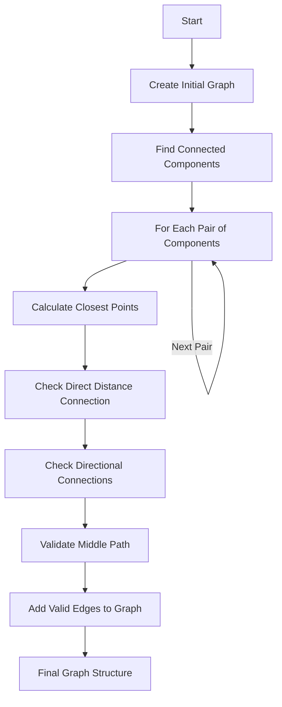

# Understanding Connect_graph_overclustering_protection Function

## Overview

The `Connect_graph_overclustering_protection()` function is part of the Wire-Cell reconstruction toolkit and serves to protect against over-clustering by carefully analyzing and validating connections between point clusters in 3D space. It's designed to ensure that clusters are properly separated when there isn't sufficient evidence to connect them.

## Function Purpose

The main goals of this function are:
1. Examine potential connections between separate point clusters
2. Validate these connections using multiple criteria
3. Protect against incorrect merging of clusters that should remain separate
4. Build a graph structure representing valid connections between points

## Key Components and Helper Functions

The function relies on several helper functions:

1. `check_connectivity()`: Validates if two points should be connected by checking:
   - Charge deposition patterns
   - Geometric relationships
   - Path continuity between points

[more details](./check_connectivity.md)


2. `check_direction()`: Analyzes directional relationships between points by examining:
   - Drift direction alignment
   - Wire plane angles
   - Parallelism between segments

   [more details](./check_direction.md)

3. `VHoughTrans()`: Performs Hough transformation to identify linear patterns

4. `get_closest_wcpoints()`: Finds nearest points in the point cloud

## Logical Flow



## Detailed Algorithm Steps

1. **Initial Graph Creation**
```cpp
// Create graph from point cloud
const int N = point_cloud->get_num_points();
graph = new MCUGraph(N);
Establish_close_connected_graph();
```

2. **Component Analysis**
```cpp
// Find connected components
std::vector<int> component(num_vertices(*graph));
const int num = connected_components(*graph, &component[0]);
```

3. **Connection Validation**
```cpp
// Example of checking connections between components
for (int j=0; j!=num; j++) {
    for (int k=j+1; k!=num; k++) {
        std::tuple<int, int, double> temp_index_index_dis = 
            pt_clouds.at(j)->get_closest_points(pt_clouds.at(k));
        
        // Validate the connection
        if (std::get<0>(temp_index_index_dis) != -1) {
            bool flag = check_connectivity(temp_index_index_dis, 
                                        cloud, 
                                        ct_point_cloud, 
                                        pt_clouds.at(j), 
                                        pt_clouds.at(k));
            // Process results...
        }
    }
}
```

## Protection Mechanisms

1. **Distance-Based Protection**
- Checks for minimum separation between clusters
- Validates path continuity between points
```cpp
if (std::get<2>(temp_index_index_dis) <= 0.9*units::cm) {
    // Additional validation for close points
    flag = check_connectivity(..., 0.3*units::cm, true);
}
```

2. **Direction-Based Protection**
- Examines alignment with wire planes
- Checks for parallel trajectories
```cpp
std::vector<bool> flag_1 = check_direction(dir1);
std::vector<bool> flag_2 = check_direction(dir2);
std::vector<bool> flag_3 = check_direction(dir3);
```

3. **Middle Path Validation**
- Ensures continuous charge deposition
- Checks for gaps in trajectories

## Key Parameters

Important parameters that control the function's behavior:

- `step_size`: Controls granularity of path checking (typically 0.6 cm)
- `angle_cut`: Maximum allowed angle deviation (typically 30°)
- `distance_cut`: Maximum allowed point separation
- `min_points`: Minimum points required for valid cluster

## Usage Example

Here's a typical usage scenario:

```cpp
// Create cluster object
WCPPID::PR3DCluster cluster(cluster_id);

// Setup point cloud
cluster.Create_point_cloud();

// Apply overclustering protection
cluster.Connect_graph_overclustering_protection(ct_point_cloud);

// Get results
MCUGraph* protected_graph = cluster.get_graph();
```

## Common Pitfalls and Solutions

1. **Sparse Point Clouds**
   - Problem: Insufficient points for reliable connection validation
   - Solution: Implement minimum point density requirements

2. **Ambiguous Connections**
   - Problem: Multiple possible connection paths
   - Solution: Use scoring system to select best path

3. **Edge Cases**
   - Problem: Points near detector boundaries
   - Solution: Special handling for boundary regions

## Performance Considerations

- The function's complexity scales with N² where N is the number of points
- Memory usage depends on point cloud size and graph structure
- Consider using spatial indexing for large point clouds

## Future Improvements

Potential areas for enhancement:

1. Parallel processing for large point clouds
2. Machine learning for connection validation
3. Adaptive parameter tuning
4. Improved boundary handling

## References

1. Wire-Cell Documentation
2. Boost Graph Library Documentation
3. Point Cloud Processing Techniques