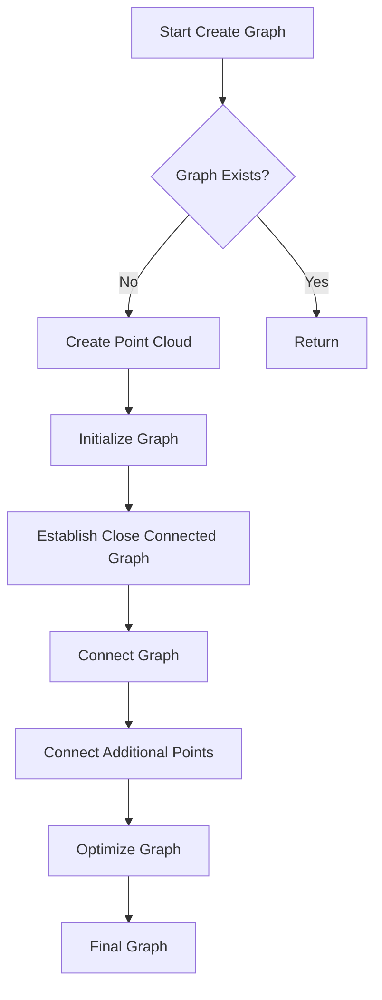
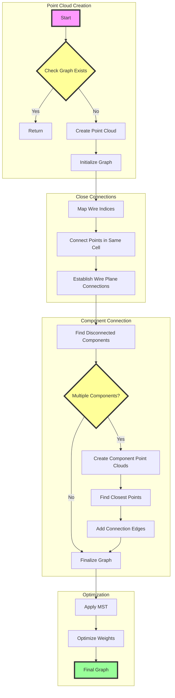
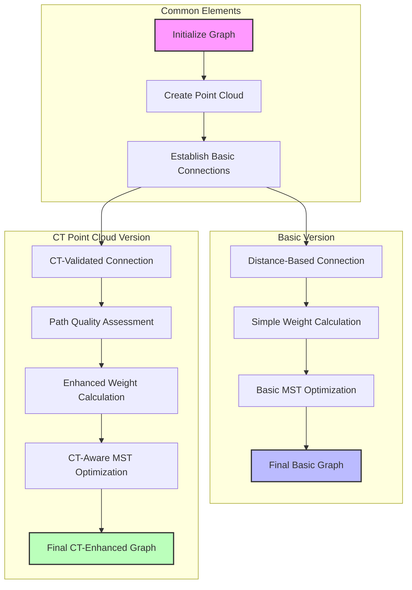

# Create Graph Function Documentation

## Overview

The `create_graph()` functions in the PR3DCluster class are responsible for constructing a graph representation of 3D points in a particle track/shower. The graph connects nearby points that are likely part of the same particle trajectory.

## Main Components

### Graph Structure
- Uses Boost Graph Library's adjacency list
- Vertices represent 3D points in space
- Edges connect related points
- Edge weights represent distances between points

### Core Functions (see latter for detailed explainations)

1. `Create_graph(ToyPointCloud* ref_point_cloud)` 
   - Basic graph creation without CT point cloud
2. `Create_graph(ToyCTPointCloud& ct_point_cloud, ToyPointCloud* ref_point_cloud)`
   - Extended version that also uses CT point cloud information

## Algorithm Flow



## Key Steps Explained

### 1. Initial Setup
```cpp
// Check if graph already exists
if (graph != (MCUGraph*)0) 
    return;

// Create point cloud if needed
if (point_cloud == (ToyPointCloud*)0)
    Create_point_cloud();

// Initialize graph with N vertices
const int N = point_cloud->get_num_points();
graph = new MCUGraph(N);
```

### 2. Establish Close Connected Graph
This step connects points that are close to each other within the same merged cell:

```cpp
void Establish_close_connected_graph() {
    // Get cloud points
    WCP::WCPointCloud<double>& cloud = point_cloud->get_cloud();
    
    // Create maps for wire indices
    std::map<SlimMergeGeomCell*, std::map<int, std::set<int>>> map_mcell_uindex_wcps;
    std::map<SlimMergeGeomCell*, std::map<int, std::set<int>>> map_mcell_vindex_wcps;
    std::map<SlimMergeGeomCell*, std::map<int, std::set<int>>> map_mcell_windex_wcps;
    
    // Connect points based on wire plane intersections
    for (auto mcell : mcells) {
        // Find points that share wire intersections
        // Add edges between nearby points
    }
}
```

For more detailed information on the `Establish_close_connected_graph` function, refer to the [Establish Close Connected Graph Documentation](establish_close_connected_graph.md).


### 3. Connect Graph Components
The function then connects different components of the graph:

```cpp
void Connect_graph() {
    // Find disconnected components
    std::vector<int> component(num_vertices(*graph));
    const int num = connected_components(*graph, &component[0]);
    
    if (num > 1) {
        // Create point clouds for each component
        std::vector<ToyPointCloud*> pt_clouds;
        
        // Find closest points between components
        // Add edges to connect components
        
        // Apply MST (Minimum Spanning Tree) to optimize connections
    }
}
```

For more detailed information on the `Connect_graph` function, refer to the [Connect Graph Documentation](connect_graph.md).

## Key Features

1. **Multi-plane Wire Analysis**
   - Considers U, V, W wire planes
   - Connects points based on wire intersections
   - Handles dead/noisy channels

2. **Component Connection**
   - Finds disconnected components
   - Uses shortest distance and direction-based connections
   - Applies MST for optimal connections

3. **Distance-based Edge Weighting**
   - Edge weights based on 3D distance between points
   - Special handling for long-distance connections
   - Direction-based weighting for track-like structures

## Example Usage

```cpp
WCPPID::PR3DCluster* cluster = new WCPPID::PR3DCluster(1);
// Add cells to cluster...

// Basic graph creation
cluster->Create_graph();

// Or with CT point cloud
WCP::ToyCTPointCloud ct_point_cloud;
cluster->Create_graph(ct_point_cloud);
```

## Important Considerations

1. **Memory Management**
   - Graph is deleted when cluster is destroyed
   - Point clouds are managed separately
   - Careful handling of temporary point clouds

2. **Performance Optimization**
   - Uses KD-trees for efficient nearest neighbor search
   - Limits number of edges per vertex
   - Optimizes component connections

3. **Error Handling**
   - Checks for null pointers
   - Validates wire indices
   - Handles edge cases in component connection

## Graph Properties 

The resulting graph has these key characteristics:

1. **Vertex Properties**
   - 3D position
   - Wire indices (U,V,W)
   - Associated merged cell

2. **Edge Properties**
   - Distance between points
   - Connection type (same cell/different cell)
   - Weight factor based on connection quality


# Flow diagram




# Comparison of Create_graph Functions

## Function Signatures

1. Basic Version:
```cpp
void Create_graph(WCP::ToyPointCloud* ref_point_cloud = 0);
```

2. CT Point Cloud Version:
```cpp
void Create_graph(WCP::ToyCTPointCloud& ct_point_cloud, WCP::ToyPointCloud* ref_point_cloud = 0);
```

## Core Differences

### 1. Path Validation
The key difference is that the CT point cloud version adds path validation between connected points.

Basic Version:
- Connects points based purely on geometric proximity
- Does not check the path between points

CT Point Cloud Version:
- Validates paths between connected points using CT point cloud data
- Checks if the path between points passes through active detector regions

Example of path validation in CT version:
```cpp
// Check the path between points
double dis = sqrt(pow(p1.x-p2.x,2) + pow(p1.y-p2.y,2) + pow(p1.z-p2.z,2));
double step_dis = 1.0*units::cm;
int num_steps = dis/step_dis + 1;
int num_bad = 0;

for (int ii=0; ii!=num_steps; ii++) {
    Point test_p;
    test_p.x = p1.x + (p2.x-p1.x)/num_steps*(ii+1);
    test_p.y = p1.y + (p2.y-p1.y)/num_steps*(ii+1);
    test_p.z = p1.z + (p2.z-p1.z)/num_steps*(ii+1);
    
    // Check if point is in active region using CT point cloud
    if (!ct_point_cloud.is_good_point(test_p)) {
        num_bad++;
    }
}

// Reject connection if too many bad points
if (num_bad > 7 || (num_bad > 2 && num_bad >= 0.75*num_steps)) {
    // Remove or prevent edge creation
}
```

### 2. Edge Weight Calculation

Basic Version:
- Edge weights based primarily on Euclidean distance
- Simple weighting scheme

CT Point Cloud Version:
- More sophisticated edge weight calculation
- Takes into account path quality through detector
- Adjusts weights based on detector activity

### 3. Component Connection Strategy

Basic Version:
```cpp
void Connect_graph(WCP::ToyPointCloud* ref_point_cloud) {
    // Simple component connection based on distance
    for (int j=0; j!=num; j++) {
        for (int k=j+1; k!=num; k++) {
            if (std::get<2>(index_index_dis[j][k]) < 3*units::cm) {
                // Connect components
            }
        }
    }
}
```

CT Point Cloud Version:
```cpp
void Connect_graph(WCP::ToyCTPointCloud& ct_point_cloud, 
                  WCP::ToyPointCloud* ref_point_cloud) {
    // More sophisticated connection with path validation
    for (int j=0; j!=num; j++) {
        for (int k=j+1; k!=num; k++) {
            if (std::get<2>(index_index_dis[j][k]) < 3*units::cm) {
                // Validate path using CT point cloud
                if (validate_path(ct_point_cloud, p1, p2)) {
                    // Connect components
                }
            }
        }
    }
}
```

### 4. Connection Quality Assessment

Basic Version:
- Primarily uses distance-based metrics
- Simple checks for connection validity

CT Point Cloud Version:
- Uses CT point cloud to assess connection quality
- Considers detector activity along connection path
- More robust against spurious connections

## Common Elements

Both versions share:
1. Basic graph structure creation
2. Point cloud management
3. Initial close connection establishment
4. MST-based optimization

## Performance Implications

1. Computational Cost:
   - Basic version is faster due to simpler checks
   - CT version requires additional path validation

2. Memory Usage:
   - CT version requires additional memory for CT point cloud
   - Both versions have similar graph memory requirements

3. Accuracy:
   - CT version generally produces more accurate connections
   - Basic version may create some spurious connections

## Usage Guidelines

Choose Basic Version When:
- Quick preliminary analysis is needed
- Detector effects are not critical
- Processing speed is priority

Choose CT Point Cloud Version When:
- Accurate track reconstruction is required
- Detector effects are important
- Can afford additional computational cost

## Example Scenarios

### Basic Version Scenario
```cpp
// Quick cluster analysis
PR3DCluster* cluster = new PR3DCluster(1);
cluster->Create_graph();
```

### CT Point Cloud Version Scenario
```cpp
// Detailed reconstruction
PR3DCluster* cluster = new PR3DCluster(1);
ToyCTPointCloud ct_cloud;
// ... populate CT point cloud ...
cluster->Create_graph(ct_cloud);
```

## Key Takeaways

1. The CT point cloud version provides more accurate but slower graph creation
2. Basic version is suitable for quick analysis
3. Both versions maintain the same fundamental graph structure
4. CT version adds crucial path validation and quality assessment
5. Choice between versions depends on specific use case requirements

# Flow Diagram

