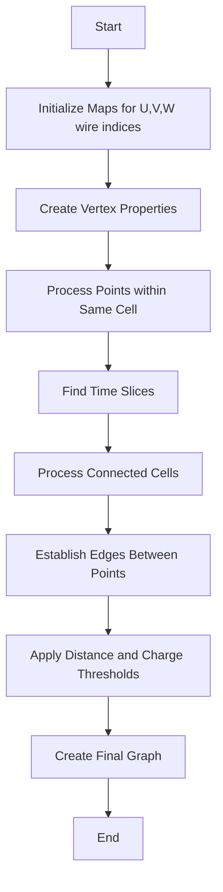

# Understanding establish_close_connected_graph()

## Purpose
The `establish_close_connected_graph()` function creates a graph structure connecting points in 3D space from wire chamber data. It establishes connections between points that are spatially close and belong to either the same merged cell or adjacent cells in time.

## Algorithm Overview



## Key Components

### 1. Data Structures

```cpp
// Maps to store wire indices for each merged cell
std::map<SlimMergeGeomCell*, std::map<int, std::set<int>>> map_mcell_uindex_wcps;
std::map<SlimMergeGeomCell*, std::map<int, std::set<int>>> map_mcell_vindex_wcps;
std::map<SlimMergeGeomCell*, std::map<int, std::set<int>>> map_mcell_windex_wcps;

// Storage for closest points
std::map<std::pair<int,int>, std::set<std::pair<double,int>>> closest_index;

// Connected cells storage
std::vector<std::pair<SlimMergeGeomCell*,SlimMergeGeomCell*>> connected_mcells;
```

### 2. Wire Index Mapping
The function first creates mappings between merged cells and their wire indices:

```cpp
// Example of creating wire index mappings
for (auto it = mcells.begin(); it!=mcells.end(); it++) {
    SlimMergeGeomCell *mcell = (*it);
    std::vector<int>& wcps = point_cloud->get_mcell_indices(mcell);
    
    for (auto it1 = wcps.begin(); it1!=wcps.end(); it1++) {
        WCPointCloud<double>::WCPoint& wcp = cloud.pts[*it1];
        
        // Map U wire indices
        if (map_uindex_wcps.find(wcp.index_u)==map_uindex_wcps.end()) {
            std::set<int> wcps;
            wcps.insert(wcp.index);
            map_uindex_wcps[wcp.index_u] = wcps;
        } else {
            map_uindex_wcps[wcp.index_u].insert(wcp.index);
        }
        // Similar mapping for V and W wires
    }
}
```

### 3. Time Slice Processing

```cpp
// Process points within time slices
for (size_t i=0; i!= time_slices.size(); i++) {
    SMGCSet& mcells_set = time_cells_set_map[time_slices.at(i)];
    
    // Process cells in same time slice
    if (mcells_set.size()>=2) {
        for (auto it2 = mcells_set.begin(); it2!=mcells_set.end();it2++) {
            SlimMergeGeomCell *mcell1 = *it2;
            auto it2p = it2;
            it2p++;
            for (auto it3 = it2p; it3!=mcells_set.end(); it3++) {
                SlimMergeGeomCell *mcell2 = *(it3);
                if (mcell1->Overlap_fast(mcell2,2))
                    connected_mcells.push_back(std::make_pair(mcell1,mcell2));
            }
        }
    }
}
```

### 4. Edge Creation Process

```cpp
// Example of edge creation between points
for (auto it = connected_mcells.begin(); it!= connected_mcells.end(); it++) {
    SlimMergeGeomCell *mcell1 = (*it).first;
    SlimMergeGeomCell *mcell2 = (*it).second;
    
    std::vector<int>& wcps1 = point_cloud->get_mcell_indices(mcell1);
    std::vector<int>& wcps2 = point_cloud->get_mcell_indices(mcell2);
    
    // Process points and create edges
    for (auto pt1 : wcps1) {
        for (auto pt2 : wcps2) {
            double distance = calculate_distance(pt1, pt2);
            if (distance < threshold) {
                add_edge(pt1, pt2, distance);
            }
        }
    }
}
```

## Key Features

1. **Wire Plane Processing**
   - Handles U, V, and W wire planes separately
   - Creates mappings between wire indices and points
   - Maintains spatial relationships between points

2. **Time-Based Connection**
   - Processes points within same time slice
   - Connects adjacent time slices
   - Handles gaps in time slices

3. **Distance Thresholding**
   - Uses maximum wire intervals
   - Applies charge thresholds
   - Considers spatial proximity

4. **Graph Construction**
   - Creates vertices for each point
   - Establishes edges based on proximity
   - Weights edges by distance

## Implementation Details

### Point Selection Criteria

```cpp
const int max_num_nodes = 5;
const int max_num_edges = 12;

// Direction reference vectors for edge creation
double ref_dir_y[max_num_edges];
double ref_dir_z[max_num_edges];
for (size_t i=0; i!=max_num_edges; i++) {
    ref_dir_z[i] = cos(2*3.1415926/max_num_edges * i);
    ref_dir_y[i] = sin(2*3.1415926/max_num_edges * i);
}
```

### Charge Thresholding

```cpp
double charge_threshold_max = 4000;
double charge_threshold_min = 4000;
double charge_threshold_other = 4000;

// Adjust thresholds for bad planes
std::vector<WirePlaneType_t> bad_planes = mcell->get_bad_planes();
if (bad_planes.size()>0) {
    if (max_wire_plane_type==bad_planes.at(0)) {
        charge_threshold_max = 0;
    }
    // Similar adjustments for other planes
}
```

## Usage Example

```cpp
// Example usage
WCPPID::PR3DCluster* cluster = new WCPPID::PR3DCluster(1);
// Add cells to cluster...

// Create point cloud
cluster->Create_point_cloud();

// Create graph
const int N = cluster->get_num_points();
MCUGraph *graph = new MCUGraph(N);

// Establish connections
cluster->Establish_close_connected_graph();

// Process results
std::vector<int> component(num_vertices(*graph));
const int num = connected_components(*graph, &component[0]);
```

## Performance Considerations

1. **Memory Usage**
   - Uses efficient data structures for large point clouds
   - Maintains maps for quick lookups
   - Optimizes storage for wire indices

2. **Computational Efficiency**
   - Uses spatial indexing for faster nearest neighbor searches
   - Implements early pruning of distant points
   - Optimizes edge creation for large graphs

3. **Scalability**
   - Handles variable numbers of points
   - Adapts to different detector configurations
   - Manages multiple time slices efficiently