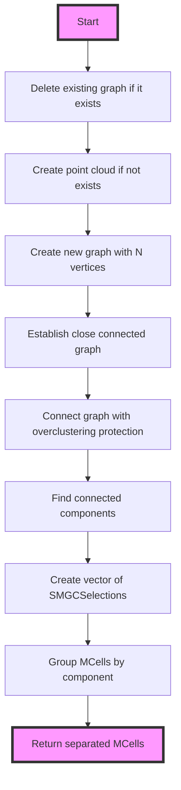

# PR3DCluster examine_graph() Function Documentation

## Overview

The `examine_graph()` function is responsible for analyzing and potentially splitting a cluster of 3D points into separate components based on connectivity analysis. It's particularly useful for protecting against over-clustering, where multiple distinct objects might have been incorrectly grouped together.

## Function Signature
```cpp
std::vector<SMGCSelection> WCPPID::PR3DCluster::Examine_graph(WCP::ToyCTPointCloud& ct_point_cloud)
```

## Logical Flow



## Key Steps

1. **Graph Preparation**
   ```cpp
   if (graph!=(MCUGraph*)0)
       delete graph;
   if (point_cloud==(ToyPointCloud*)0)
       Create_point_cloud();
   ```
   - Cleans up any existing graph
   - Ensures point cloud exists

2. **Graph Creation**
   ```cpp
   const int N = point_cloud->get_num_points();
   graph = new MCUGraph(N);
   ```
   - Creates new graph with N vertices (one per point)

3. **Graph Connection**
   ```cpp
   Establish_close_connected_graph();
   Connect_graph_overclustering_protection(ct_point_cloud);
   ```
   - Establishes initial connections between close points
   - Applies protection against overclustering

4. **Component Analysis**
   ```cpp
   std::vector<int> component(num_vertices(*graph));
   const int num = connected_components(*graph, &component[0]);
   ```
   - Identifies connected components in the graph
   - Returns number of separate components

5. **Result Organization**
   ```cpp
   std::vector<SMGCSelection> sep_mcells;
   std::set<SlimMergeGeomCell*> used_mcells;
   for (int i=0; i!=num; i++) {
       SMGCSelection mcells;
       sep_mcells.push_back(mcells);
   }
   ```
   - Creates vector to hold separated components
   - Tracks used MCells to avoid duplicates

## Called Functions

1. **Create_point_cloud()**
   - Creates point cloud representation of cluster

2. **Establish_close_connected_graph()**
   - Establishes initial graph connections between nearby points

3. **Connect_graph_overclustering_protection()** [more details](./connect_graph_overclustering_protection.md)
   - Applies protection against overclustering
   - Uses connectivity analysis and distance metrics

4. **connected_components()**
   - Boost graph library function
   - Identifies separate connected components in graph

## Example Usage

```cpp
// Example of using examine_graph
WCPPID::PR3DCluster cluster(1);  // Create cluster with ID 1
WCP::ToyCTPointCloud ct_point_cloud;

// Add some cells to cluster
cluster.AddCell(cell1, time_slice1);
cluster.AddCell(cell2, time_slice2);

// Examine the graph structure
std::vector<SMGCSelection> separated_components = 
    cluster.Examine_graph(ct_point_cloud);

// Process separated components
for(auto& component : separated_components) {
    std::cout << "Component size: " << component.size() << std::endl;
    // Process each component...
}
```

## Key Data Structures

1. **MCUGraph**
   - Boost undirected graph
   - Vertices represent points
   - Edges represent connections

2. **SMGCSelection**
   - Vector of SlimMergeGeomCell pointers
   - Represents grouped cells in components

3. **ToyPointCloud**
   - Collection of 3D points
   - Used for spatial analysis

## Protection Mechanisms

The function implements several protection mechanisms:

1. **Duplicate Prevention**
   ```cpp
   std::set<SlimMergeGeomCell*> used_mcells;
   // ... 
   if (used_mcells.find(mcell)==used_mcells.end()) {
       used_mcells.insert(mcell);
       sep_mcells[component[i]].push_back(mcell);
   }
   ```

2. **Memory Management**
   ```cpp
   if (graph!=(MCUGraph*)0)
       delete graph;
   ```

3. **Component Validation**
   - Ensures points are properly assigned to components
   - Maintains cell relationships within components

## Notes

- The function is critical for cluster quality control
- Uses boost graph library for efficient graph operations
- Handles both spatial and connectivity relationships
- Returns vector of separated components for further processing