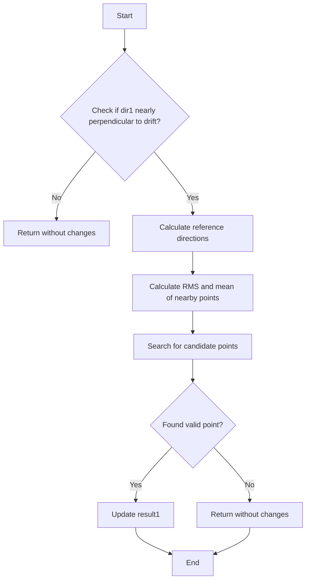

# Understanding search_for_connection_isochronous()

## Purpose
The `search_for_connection_isochronous()` function is designed to find connections between wire chamber track segments that are nearly parallel to the wire planes (isochronous). This is a specialized case in particle tracking where traditional methods may fail.

## Key Parameters
- `result1`: Pair containing the found point index and distance (output parameter)
- `p1`: Starting point for the search
- `dir1`: Initial direction vector
- `pcloud1, pcloud2`: Point clouds representing the track segments to connect
- `search_distance`: Maximum distance to search
- `angle_cut`: Maximum angle between drift direction and search direction
- `tran_dis_cut`: Maximum transverse distance allowed

## Algorithm Flow



## Implementation Details

1. **Initial Direction Check**
```cpp
TVector3 drift_dir(1,0,0);
if (result1.first < 0 && fabs(drift_dir.Angle(dir1)/3.1415926*180.-90.) < angle_cut) {
    // Proceed with isochronous search
    ...
}
```

2. **Calculate Reference Directions**
```cpp
// Calculate orthogonal directions for search
dir1 = dir1.Unit();
TVector3 dir2 = dir1.Cross(drift_dir);
dir2 = dir2.Unit();  // in plane direction
TVector3 dir3 = dir1.Cross(dir2);
```

3. **Statistical Analysis**
```cpp
// Calculate RMS values in each direction
double rms[3] = {0,0,0};
double mean[3] = {0,0,0};
std::vector<std::pair<WCP::SlimMergeGeomCell*,Point>> pts = 
    pcloud1->get_closest_points(p1, 30*units::cm);

for (size_t i=0; i!=pts.size(); i++) {
    TVector3 dir(pts.at(i).second.x - p1.x, 
                 pts.at(i).second.y - p1.y,
                 pts.at(i).second.z - p1.z);
    // Project onto reference directions
    double tmp1 = dir.Dot(dir1);
    double tmp2 = dir.Dot(dir2);
    double tmp3 = dir.Dot(dir3);
    
    // Accumulate statistics
    mean[0] += tmp1;
    rms[0] += pow(tmp1,2);
    // ... similar for other components
}
```

4. **Point Search**
```cpp
// Search through second point cloud for matching points
double min_dis = 1e9;
int min_index = -1;
for (size_t qx = 0; qx != tmp_cloud.pts.size(); qx++) {
    TVector3 tmp_dir(tmp_cloud.pts.at(qx).x - p1.x,
                    tmp_cloud.pts.at(qx).y - p1.y,
                    tmp_cloud.pts.at(qx).z - p1.z);
    
    // Check if point satisfies constraints
    if (fabs(tmp_dis3) < tran_dis_cut && 
        (fabs(tmp_dis3) < rms[2]/orig_dis * tmp_dis || 
         fabs(tmp_dis3) < 0.9*units::cm)) {
        
        // Calculate quality metric
        double value = pow(2*tmp_dis1/search_distance,2) + 
                      pow(tmp_dis2*orig_dis,2)/(pow(rms[0]*tmp_dis,2)+pow(rms[1]*tmp_dis,2)) +
                      pow(tmp_dis3*orig_dis,2)/pow(rms[2]*tmp_dis,2);
                      
        // Update if better point found
        if (value < min_dis) {
            min_dis = value;
            min_index = qx;
        }
    }
}
```

## Key Concepts

1. **Isochronous Tracks**
   - Tracks that are nearly parallel to the wire planes
   - Challenging because they produce signals in multiple wires at the same time
   - Require special handling for proper reconstruction

2. **Direction Analysis**
   - Uses three orthogonal directions for analysis
   - dir1: Initial search direction
   - dir2: In-plane perpendicular direction
   - dir3: Cross product of dir1 and dir2

3. **Quality Metrics**
   - Uses RMS values to characterize track spread
   - Combines multiple distance components for point selection
   - Weights different directions based on track characteristics

4. **Constraints**
   - Transverse distance limits
   - Angular cuts relative to drift direction
   - Statistical bounds based on track properties

## Usage Example

```cpp
// Example usage
TVector3 dir1(0, 1, 0);  // Example direction
WCP::Point p1(0, 0, 0);  // Starting point
std::pair<int,double> result1(-1, 0);  // Initialize result

// Call the function
search_for_connection_isochronous(result1, p1, dir1, 
                                pcloud1, pcloud2,
                                80*units::cm,  // search_distance
                                10.0,          // angle_cut
                                1.5*units::cm  // tran_dis_cut
                                );

// Check result
if (result1.first >= 0) {
    std::cout << "Found connection point at index: " << result1.first 
              << " distance: " << result1.second << std::endl;
}
```