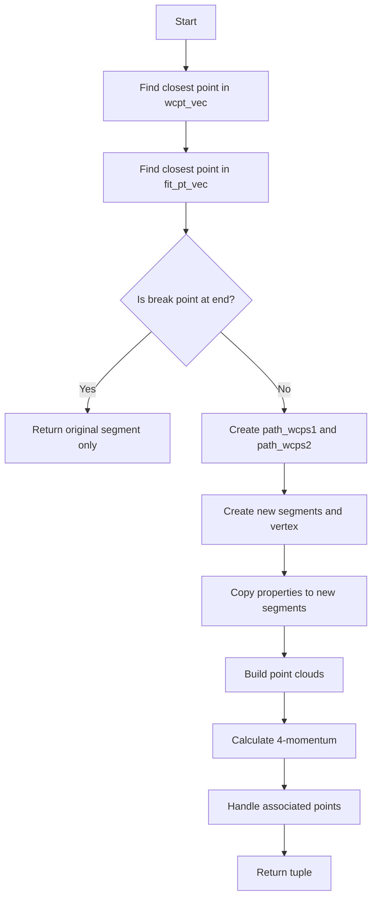

# Break Segment At Point Function Documentation

## Function Signature
```cpp
std::tuple<ProtoSegment*, ProtoVertex*, ProtoSegment*> break_segment_at_point(
    WCP::Point& p, 
    int& acc_segment_id, 
    int& acc_vertex_id
);
```

## Purpose
The `break_segment_at_point` function splits a ProtoSegment into two segments at a specified point, creating a new vertex at the break point. This is useful for track reconstruction and segmentation of particle trajectories.

## Input Parameters

1. `WCP::Point& p`: 
   - The 3D point where the segment should be broken
   - Contains x, y, z coordinates
   - Passed by reference

2. `int& acc_segment_id`:
   - Accumulator for segment IDs
   - Used to assign unique IDs to new segments
   - Passed by reference and incremented during function execution

3. `int& acc_vertex_id`:
   - Accumulator for vertex IDs
   - Used to assign unique ID to new vertex
   - Passed by reference and incremented during function execution

## Return Value

Returns a tuple containing three pointers:
1. First ProtoSegment (before break point)
2. New ProtoVertex (at break point)
3. Second ProtoSegment (after break point)

## Function Flow



## Detailed Implementation Steps

### 1. Finding Break Points
```cpp
// Find closest point in wcpt_vec
int nbreak = -1;
double min_dis = 1e9;
for (size_t i=0; i!=wcpt_vec.size(); i++) {
    double dis = sqrt(pow(wcpt_vec.at(i).x-p.x,2) + 
                     pow(wcpt_vec.at(i).y-p.y,2) + 
                     pow(wcpt_vec.at(i).z-p.z,2));
    if (dis < min_dis) {
        min_dis = dis;
        nbreak = i;
    }
}

// Similar process for fit_pt_vec to find nbreak_fit
```

### 2. Edge Case Handling
- Checks if break point is at beginning or end of segment
- If so, returns original segment without breaking

### 3. Creation of New Objects
Creates three new objects:
1. First segment (sg1)
2. Vertex (vtx)
3. Second segment (sg2)

### 4. Property Transfer
Transfers various properties to new segments including:
- Direction properties (dir_weak, flag_dir)
- Particle properties (particle_type, particle_mass)
- Shower flags (flag_shower_trajectory, flag_shower_topology)
- Fit related vectors (fit_pt_vec, dQ_vec, dx_vec, etc.)

### 5. Point Cloud Building
```cpp
sg1->build_pcloud_fit();
sg2->build_pcloud_fit();
```

### 6. Associated Points Distribution
Distributes associated points between segments based on proximity:
```cpp
for (size_t i=0; i!=cloud.pts.size(); i++) {
    Point p(cloud.pts.at(i).x, cloud.pts.at(i).y, cloud.pts.at(i).z);
    if (sg1->get_closest_point(p).first < sg2->get_closest_point(p).first) {
        sg1->add_associate_point(...);
    } else {
        sg2->add_associate_point(...);
    }
}
```

## Important Data Structures

### Vectors Handled
1. Position vectors:
   - `wcpt_vec`: Wire-cell points
   - `fit_pt_vec`: Fitted points

2. Measurement vectors:
   - `dQ_vec`: Charge measurements
   - `dx_vec`: Distance measurements
   - `dQ_dx_vec`: Charge per unit length

3. Projection vectors:
   - `pu_vec`, `pv_vec`, `pw_vec`: U, V, W wire plane projections
   - `pt_vec`: Time projections

4. Quality metrics:
   - `reduced_chi2_vec`: Fit quality measurements
   - `fit_flag_skip`: Skip flags for fits

## Best Practices

1. Always check return values for nullptr
2. Ensure input point is within reasonable distance of segment
3. Handle memory management for created objects
4. Verify segment IDs and vertex IDs are properly incremented

## Error Handling

The function handles several edge cases:
- Break point at segment ends
- Invalid break points
- Empty segments
- Missing associated points

## Performance Considerations

- Uses squared distances to avoid unnecessary sqrt operations
- Efficiently copies properties to new segments
- Maintains point cloud structures for spatial queries