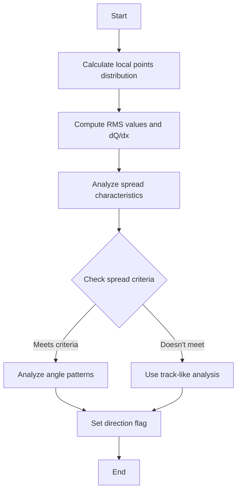
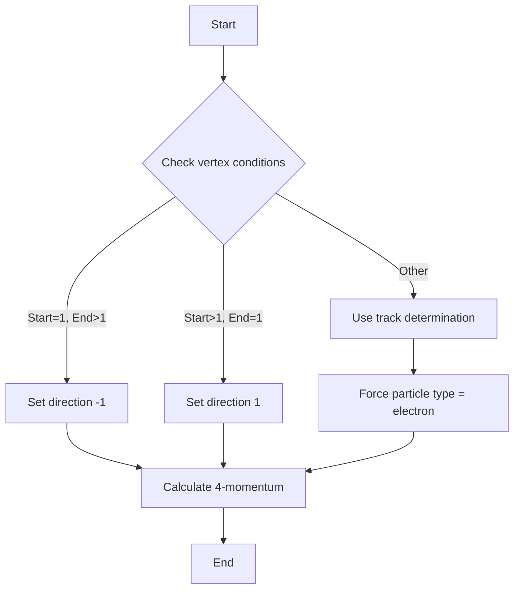
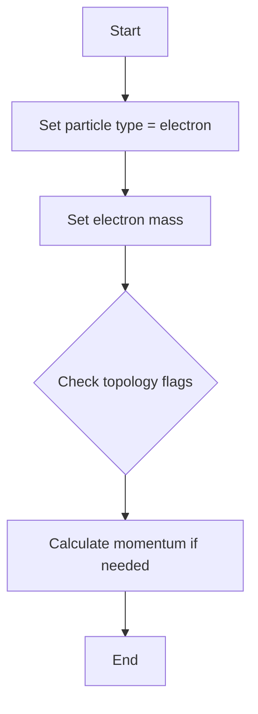

# Shower Direction Determination Logic

The ProtoSegment class implements three main methods for determining shower directions:

1. `determine_shower_direction()`
2. `determine_dir_shower_trajectory()`
3. `determine_dir_shower_topology()`

## 1. determine_shower_direction()

This is the main function for analyzing local point distributions to determine shower direction.

### Process Flow:



### Key Steps:

1. **Local Points Analysis**
   - Groups associated points around each fit point
   - Calculates local coordinate system for each point:
     - Direction 1: Along track
     - Direction 2: Perpendicular to drift
     - Direction 3: Cross product of 1 and 2

2. **RMS Value Computation**
   - Calculates spread in each direction
   - Focuses on transverse spread (Direction 3)
   - Computes dQ/dx values

3. **Spread Analysis**
   - Tracks maximum spread
   - Measures length of large spread regions
   - Evaluates spread patterns for shower-like behavior

4. **Direction Criteria**
   ```
   IF max_spread > 0.7 cm AND 
      (length > 3 cm AND length < 15 cm AND
       large_spread_length > 0.2 * total_length)
   OR
   IF max_spread > 0.8 cm AND 
      length >= 15 cm AND
      large_spread_length > 0.3 * total_length
   OR
   IF max_spread > 1.0 cm AND
      large_spread_length > 0.4 * total_length
   ```

5. **Angle Analysis**
   - Examines angles between segments
   - Checks drift angle alignment
   - Sets direction based on angle patterns

## 2. determine_dir_shower_trajectory()

Simpler method focused on trajectory-based direction determination.



### Key Features:
- Sets particle type to electron (11)
- Direction based on vertex connections
- Calculates 4-momentum after direction set
- Used for clear trajectory cases

## 3. determine_dir_shower_topology()

Focuses on topological features of the shower.



### Characteristics:
- Always sets particle as electron
- More conservative in direction determination
- Used when topology clearly indicates shower
- Direction often left ambiguous (flag_dir = 0)

## Common Elements

All three methods share:

1. **Particle Type Handling**
   - Usually set to electron (11)
   - Mass set to electron mass

2. **Direction Flags**
   - 1: Forward direction
   - -1: Backward direction
   - 0: Ambiguous/uncertain

3. **Energy Calculations**
   - 4-momentum computation
   - dQ/dx analysis
   - Length considerations

## Usage Guidelines

1. `determine_shower_direction()` is most comprehensive
   - Best for general cases
   - Uses most detailed analysis
   - Most computationally intensive

2. `determine_dir_shower_trajectory()` for clear cases
   - When trajectory is well-defined
   - Faster computation
   - More definitive results

3. `determine_dir_shower_topology()` for topology-driven cases
   - When shower structure is clear
   - Most conservative
   - Least likely to make direction determination

The methods work together to provide a robust shower direction determination system, with different approaches suitable for different shower characteristics.

## Implementation Details

### Key Data Structures

1. **Point Storage and Tracking**
```cpp
// Core point vectors
std::vector<WCP::WCPointCloud<double>::WCPoint> wcpt_vec;  // Original points
std::vector<WCP::Point> fit_pt_vec;                        // Fitted points
WCP::ToyPointCloud *pcloud_associated;                     // Associated points cloud
WCP::ToyPointCloud *pcloud_fit;                           // Fitted points cloud

// Measurement vectors - parallel to fit_pt_vec
std::vector<double> dQ_vec;        // Charge measurements
std::vector<double> dx_vec;        // Distance measurements
std::vector<double> dQ_dx_vec;     // Charge density
std::vector<double> pu_vec;        // U-wire projection
std::vector<double> pv_vec;        // V-wire projection
std::vector<double> pw_vec;        // W-wire projection
std::vector<double> pt_vec;        // Time projection
```

2. **Direction Analysis Structures**
```cpp
std::vector<PointVector> local_points_vec;  // Points grouped by proximity
std::vector<std::tuple<double,double,double>> vec_rms_vals;  // RMS spread values
std::vector<double> vec_dQ_dx;  // Local charge density
std::vector<TVector3> vec_dir;  // Direction vectors
```

### Key Implementation Methods

1. **Local Point Analysis**
```cpp
// Example of point grouping logic
for (size_t i = 0; i!= cloud.pts.size(); i++) {
    Point test_p(cloud.pts.at(i).x, cloud.pts.at(i).y, cloud.pts.at(i).z);
    std::vector<std::pair<size_t,double>> results = 
        pcloud_fit->get_closest_index(test_p,1);
    local_points_vec.at(results.front().first).push_back(test_p);
}
```

2. **Direction Calculation**
```cpp
TVector3 drift_dir(1,0,0);  // Drift direction reference

// Calculate local directions
TVector3 dir_1, dir_2, dir_3;
if (dir_1.Angle(drift_dir)/3.1415926*180. < 7.5) {
    dir_1.SetXYZ(1,0,0);
    dir_2.SetXYZ(0,1,0);
    dir_3.SetXYZ(0,0,1);
} else {
    dir_2 = drift_dir.Cross(dir_1);
    dir_2 = dir_2.Unit();
    dir_3 = dir_1.Cross(dir_2);
}
```

3. **Spread Analysis**
```cpp
// Example of spread calculation
for (size_t j=0; j!=local_points_vec.at(i).size(); j++) {
    std::get<0>(vec_rms_vals.at(i)) += 
        pow(std::get<0>(vec_projs.at(j)) - std::get<0>(means),2);
    std::get<1>(vec_rms_vals.at(i)) += 
        pow(std::get<1>(vec_projs.at(j)) - std::get<1>(means),2);
    std::get<2>(vec_rms_vals.at(i)) += 
        pow(std::get<2>(vec_projs.at(j)) - std::get<2>(means),2);
}
```

### Critical Thresholds and Constants

```cpp
// Spread thresholds
constexpr double MIN_SPREAD = 0.7 * units::cm;
constexpr double MED_SPREAD = 0.8 * units::cm;
constexpr double MAX_SPREAD = 1.0 * units::cm;

// Length ratios
constexpr double MIN_LENGTH_RATIO = 0.2;
constexpr double MED_LENGTH_RATIO = 0.3;
constexpr double MAX_LENGTH_RATIO = 0.4;

// Angle thresholds (degrees)
constexpr double MIN_ANGLE = 7.5;
constexpr double DRIFT_ANGLE = 90.0;
```

### Performance Considerations

1. **Memory Management**
   - Point clouds use KD-trees for efficient spatial queries
   - Vector operations are optimized for parallel data structures
   - Careful memory allocation for large point sets

2. **Computational Efficiency**
   - Uses pre-calculated values where possible
   - Minimizes redundant calculations in RMS computations
   - Employs early exit conditions for clear cases

3. **Accuracy vs Speed**
   - Balance between precise angle calculations and approximations
   - Uses different methods based on shower complexity
   - Adapts computation detail based on point density

### Error Handling

1. **Data Validation**
```cpp
if (pcloud_associated == 0) return false;
if (fit_pt_vec.size() < 2) return false;
```

2. **Edge Cases**
```cpp
// Handle short segments
if (length < 1.5*units::cm && (start_n == 1 || end_n == 1)) {
    // Special handling for very short segments
}

// Handle ambiguous cases
if (flag_dir == 0 && particle_type == 11) {
    // Special handling for unclear electron cases
}
```

### Integration Points

1. **Vertex Connection**
   - Interfaces with ProtoVertex class for endpoint handling
   - Maintains connectivity information for shower reconstruction

2. **Track/Shower Differentiation**
   - Shares information with track identification methods
   - Uses common measurement vectors for consistency

3. **Energy Calculation**
   - Links to particle identification systems
   - Provides input for calorimetric calculations