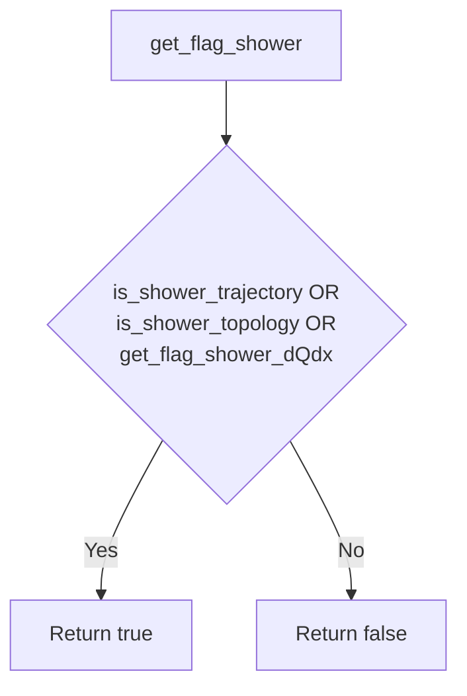
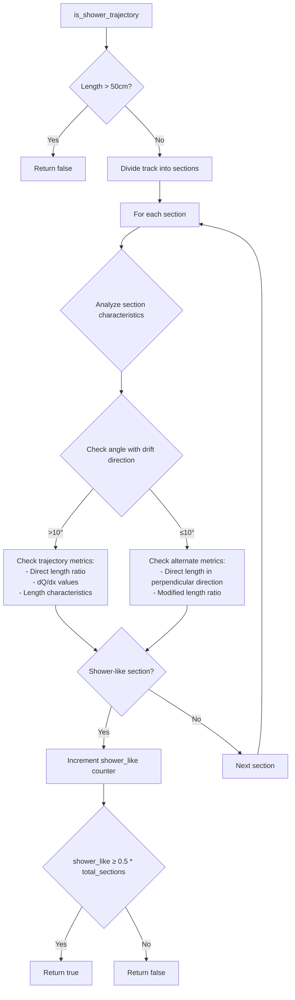
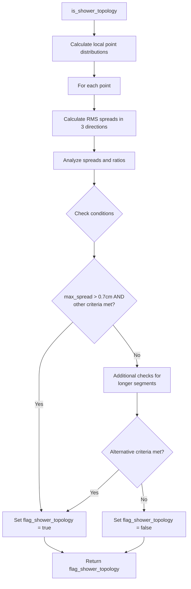
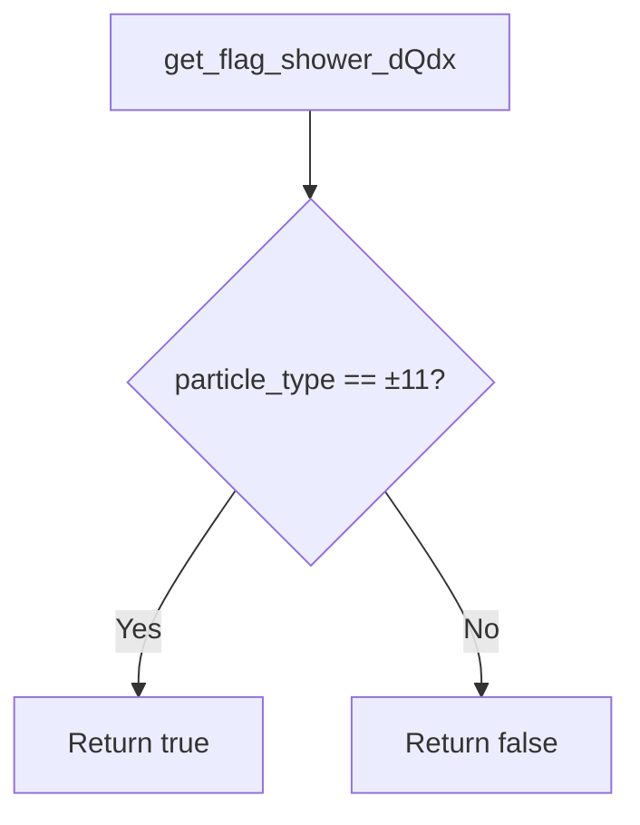

# ProtoSegment Shower Identification Logic

The ProtoSegment class contains three key methods for identifying shower-like particle tracks:

1. `is_shower_trajectory()` 
2. `is_shower_topology()`
3. `get_flag_shower_dQdx()`

## Overall Shower Identification

The main `get_flag_shower()` function returns true if ANY of the above three methods identify the segment as shower-like:



## 1. is_shower_trajectory()

This method analyzes the trajectory characteristics to identify shower-like patterns.



Key metrics for shower identification:
- Length ratio between direct path and actual trajectory
- dQ/dx (charge deposition) values
- Angles relative to drift direction
- Spatial deviations

## 2. is_shower_topology()

Analyzes the spatial distribution of associated points around the track to identify shower-like patterns.



Key topology metrics:
- RMS spread of associated points
- Large spread length ratio
- Total effective length
- Continuous spread characteristics

## 3. get_flag_shower_dQdx()

Simplest method that checks particle identification:



This method returns true if the particle is identified as an electron/positron (particle_type = ±11).

## Interaction Between Methods

The three methods complement each other:

- `is_shower_trajectory()`: Focuses on track path characteristics
- `is_shower_topology()`: Analyzes spatial point distribution
- `get_flag_shower_dQdx()`: Uses particle identification

A segment is considered a shower if any method identifies it as such, providing redundancy and robustness in shower identification.

## Key Parameters

1. Trajectory Analysis:
   - Length thresholds: 50cm, 20cm, 10cm
   - Angle thresholds: 10°, 7.5°
   - dQ/dx thresholds: Various normalized values

2. Topology Analysis:
   - Spread thresholds: 0.7cm, 0.8cm, 1.0cm
   - Length ratios: 0.2, 0.3, 0.4
   - Various combination criteria

3. Particle Identification:
   - Uses standard particle codes
   - Electron/positron: ±11

## Internal Data Structures and Calculations

### Key Member Variables

```cpp
// Point cloud data
WCP::ToyPointCloud* pcloud_fit;         // Main track points
WCP::ToyPointCloud* pcloud_associated;   // Associated nearby points
WCP::ToyPointCloud* pcloud_associated_steiner;  // Steiner tree points

// Track geometry
std::vector<WCP::Point> fit_pt_vec;     // 3D points of the track
std::vector<WCP::WCPointCloud<double>::WCPoint> wcpt_vec; // Raw wire chamber points

// Charge data 
std::vector<double> dQ_vec;             // Charge deposit per point
std::vector<double> dx_vec;             // Distance between points
std::vector<double> dQ_dx_vec;          // Charge per unit length

// Wire plane projections
std::vector<double> pu_vec;             // U wire plane projection  
std::vector<double> pv_vec;             // V wire plane projection
std::vector<double> pw_vec;             // W wire plane projection
std::vector<double> pt_vec;             // Time tick information

// Quality metrics
std::vector<double> reduced_chi2_vec;    // Fit quality per point
std::vector<int> fit_index_vec;          // Index mapping
std::vector<bool> fit_flag_skip;         // Points to skip

// Classification flags
bool flag_shower_trajectory;
bool flag_shower_topology; 
bool flag_dir;                           // Direction flag
int particle_type;                       // PDG particle code
```

### Key Data Processing Examples

1. RMS Spread Calculation:
```cpp
// From is_shower_topology()
std::vector<PointVector> local_points_vec(fit_pt_vec.size());
std::vector<std::tuple<double,double,double>> vec_rms_vals;

// Group nearby points
for (auto point : pcloud_associated->get_cloud().pts) {
    auto closest = pcloud_fit->get_closest_index(point, 1);
    local_points_vec[closest.front().first].push_back(point);
}

// Calculate RMS spread in each direction
for (size_t i=0; i < local_points_vec.size(); i++) {
    TVector3 dir_1, dir_2, dir_3;
    // Calculate orthogonal directions...
    double rms_1 = 0, rms_2 = 0, rms_3 = 0;
    for (auto& p : local_points_vec[i]) {
        // Project point onto directions and calculate RMS
        // Store in vec_rms_vals
    }
}
```

2. Length Ratio Calculation:
```cpp
// From is_shower_trajectory() 
double direct_length = sqrt(pow(fit_pt_vec.back().x - fit_pt_vec.front().x,2) +
                          pow(fit_pt_vec.back().y - fit_pt_vec.front().y,2) +
                          pow(fit_pt_vec.back().z - fit_pt_vec.front().z,2));

double integrated_length = 0;
for (size_t i=0; i < fit_pt_vec.size()-1; i++) {
    integrated_length += sqrt(pow(fit_pt_vec[i+1].x - fit_pt_vec[i].x,2) +
                            pow(fit_pt_vec[i+1].y - fit_pt_vec[i].y,2) + 
                            pow(fit_pt_vec[i+1].z - fit_pt_vec[i].z,2));
}

double length_ratio = direct_length / integrated_length;
```

3. Charge Analysis:
```cpp
// Calculate median dQ/dx
std::vector<double> vec_dQ_dx;
for (size_t i=0; i < dQ_vec.size(); i++) {
    vec_dQ_dx.push_back(dQ_vec[i]/(dx_vec[i] + 1e-9));
}
std::nth_element(vec_dQ_dx.begin(), 
                vec_dQ_dx.begin() + vec_dQ_dx.size()/2, 
                vec_dQ_dx.end());
double medium_dQ_dx = vec_dQ_dx[vec_dQ_dx.size()/2];
```

### Wire Plane Coordinate System

The detector uses three wire planes (U, V, W) for position reconstruction:

```plaintext
W plane │  U plane │  V plane
   \    │    /    │    \
    \   │   /     │     \
     \  │  /      │      \
      \ │ /       │       \
       \│/        │        \
        X         │         X
```

- Each plane measures charge deposits at different angles
- pu_vec, pv_vec, pw_vec store projections onto each plane
- Combined projections help reconstruct 3D position
- Wire plane data helps verify shower-like patterns

## Additional Notes

- The methods use both geometric and charge deposition information
- Multiple criteria provide redundancy in identification
- Different thresholds are used for different track lengths
- Analysis is performed in both absolute and relative terms