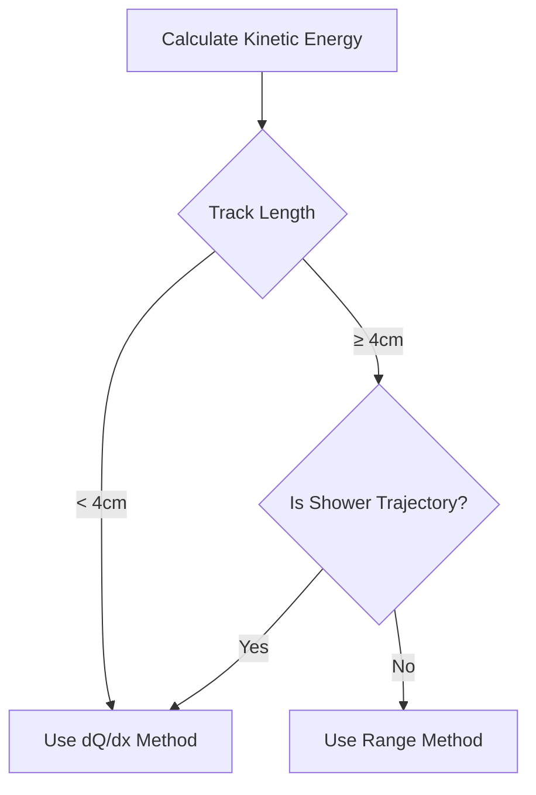
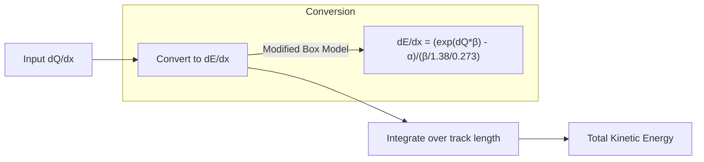
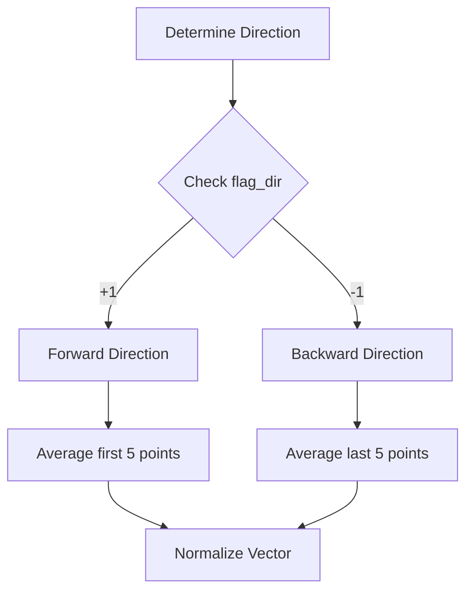
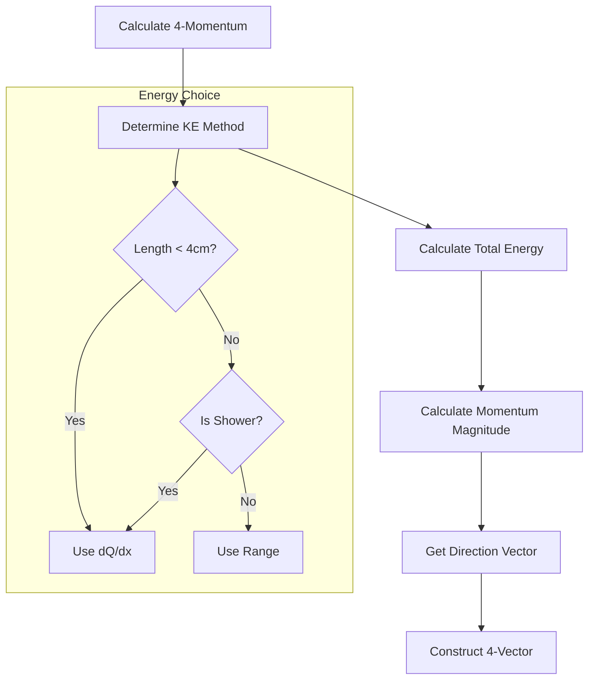

# Energy and Momentum Analysis in ProtoSegment

## Overview
The ProtoSegment class implements several methods for calculating kinetic energy and momentum of particle trajectories. The main functions can be grouped into three categories:

1. Kinetic Energy Calculation
   - cal_kine_range()
   - cal_kine_dQdx()
2. Direction Vector Calculation
   - cal_dir_3vector()
   - cal_dir_3vector(Point& p, double dis_cut)
3. Four-Momentum Assembly
   - cal_4mom()

## Kinetic Energy Calculation

### Strategy Selection Logic

### 1. Range-Based Method (cal_kine_range)

The range-based method calculates kinetic energy based on the particle's total path length using particle-specific range-to-energy conversion graphs.

Key points:
- Uses predefined range-to-energy curves from TPCParams
- Different curves for different particle types (e-, μ±, π±, K±, p)
- More reliable for longer tracks (≥ 4cm)
- Formula: KE = graph->Eval(length/units::cm) * units::MeV

### 2. dQ/dx-Based Method (cal_kine_dQdx)

This method calculates kinetic energy by integrating the energy loss along the track using charge deposition measurements.

Key features:
- Uses modified box model for dQ/dx to dE/dx conversion
- Parameters: α = 1.0, β = 0.255
- Handles edge effects at track endpoints
- More reliable for short tracks (< 4cm)

## Direction Vector Calculation

### 1. Basic Direction (cal_dir_3vector)

Features:
- Uses flag_dir to determine forward/backward direction
- Averages multiple points for stability
- Returns unit vector

### 2. Local Direction (cal_dir_3vector with point)

Calculates direction vector around a specific point within a distance cut:
- Finds all points within dis_cut radius
- Computes average position relative to reference point
- Returns normalized direction vector

## Four-Momentum Assembly (cal_4mom)

The cal_4mom function combines kinetic energy and direction calculations to construct the full 4-momentum vector.

Process:
1. Calculates kinetic energy (KE) using appropriate method
2. Total energy = KE + rest mass
3. Momentum magnitude = sqrt(E² - m²)
4. Direction from cal_dir_3vector()
5. Constructs components:
   - E = KE + mass
   - p_x = p * dir.X()
   - p_y = p * dir.Y()
   - p_z = p * dir.Z()

## Usage Considerations

1. Energy Method Selection:
   - Short tracks (< 4cm): Always use dQ/dx method
   - Shower-like segments: Use dQ/dx method
   - Long tracks: Use range method unless shower-like

2. Direction Determination:
   - Relies on flag_dir from pattern recognition
   - Forward (+1): Start → End
   - Backward (-1): End → Start
   - Weak directions stored in dir_weak flag

3. Particle Type Dependencies:
   - Different range curves for different particles
   - Mass values affect momentum calculation
   - Supported types: e±, μ±, π±, K±, p

4. Calibration Constants:
   - Box model parameters (α, β)
   - Energy units conversion
   - Charge collection calibration