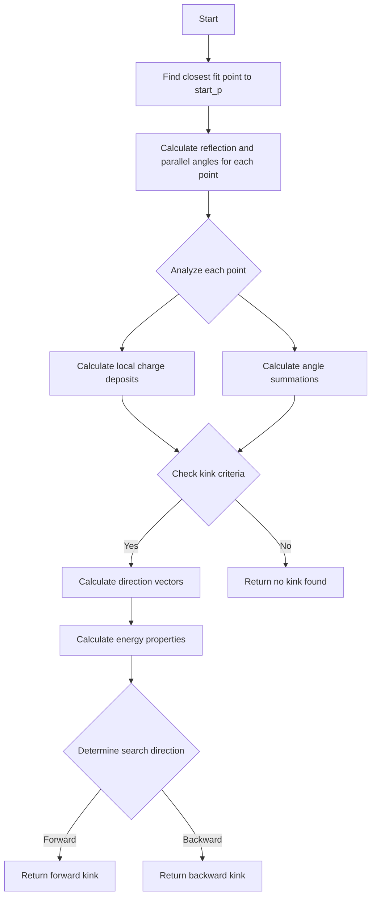

# Analysis of ProtoSegment::search_kink Function

## Overview
The `search_kink` function is designed to find significant directional changes ("kinks") in particle tracks within a wire chamber detector. It analyzes both geometric and charge deposition properties to identify potential kink points.

## Input Parameters
- `start_p` (WCP::Point): Starting point for the kink search
- The function also uses multiple internal class members including:
  - `fit_pt_vec`: Vector of fitted 3D points along the track
  - `dQ_vec`: Vector of charge deposits
  - `dx_vec`: Vector of distance segments

## Output Parameters
Returns a tuple containing:
- `Point p`: Location of identified kink
- `TVector3 dir1`: Direction vector before the kink 
- `TVector3 dir2`: Direction vector after the kink
- `bool flag_search`: Flag indicating if further searching is needed

## Algorithm Flow

## Detailed Algorithm Steps

1. **Initial Point Location**
   - Finds the closest fitted point to the provided start point
   - Establishes reference for angle calculations

2. **Angle Calculations**
   - For each point, calculates two types of angles:
     - Reflection angles: Angular change in track direction
     - Parallel angles: Angle relative to drift direction
   - Uses multiple point samples (up to 6 points in each direction)

3. **Kink Identification Criteria**
   The function identifies a kink if any of these conditions are met:

   a) Primary criteria:
   - Parallel angle > 10° AND
   - Reflection angle > 30° AND
   - Sum of angles > 15°

   b) Secondary criteria:
   - Parallel angle > 7.5° AND
   - Reflection angle > 45° AND
   - Sum of angles > 25°

   c) Third criteria:
   - Parallel angle > 15° AND
   - Reflection angle > 27° AND
   - Sum of angles > 12.5°

4. **Direction Analysis**
   - Calculates average positions before and after potential kink
   - Determines direction vectors in both segments
   - Analyzes charge deposition patterns

5. **Flag Determination**
   - Sets search direction based on:
     - Charge deposition patterns
     - Length ratios of segments
     - Angle consistency
   - Determines if further searching is needed

## Key Metrics Used

1. **Angle Measurements**
   - `refl_angles`: Measures track direction changes
   - `para_angles`: Measures alignment with drift direction

2. **Energy Metrics**
   - Local charge density (dQ/dx)
   - Integrated charge over segments

3. **Geometric Properties**
   - Segment length ratios
   - Distance from endpoints

## Special Considerations

1. **Edge Cases**
   - Handles points near track endpoints
   - Accounts for track segments too close to boundaries

2. **Quality Checks**
   - Minimum distance requirements
   - Charge threshold validations
   - Angle consistency verification

## Usage Notes

1. Function should be called after track reconstruction
2. Works best with well-defined tracks
3. May require multiple passes for complex trajectories
4. Returns `false` flag when insufficient evidence for kink

## Implementation Considerations

1. **Performance**
   - Uses optimized vector operations
   - Employs early termination conditions
   - Caches calculated values

2. **Robustness**
   - Handles missing or noisy data points
   - Includes multiple validation criteria
   - Uses averaging to reduce noise impact