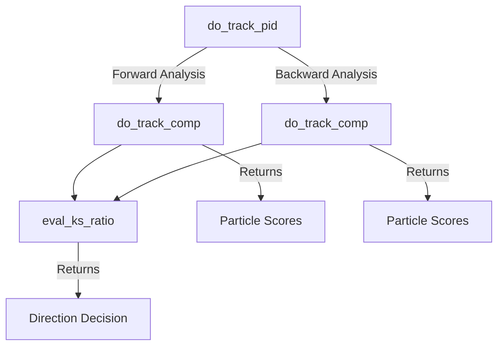
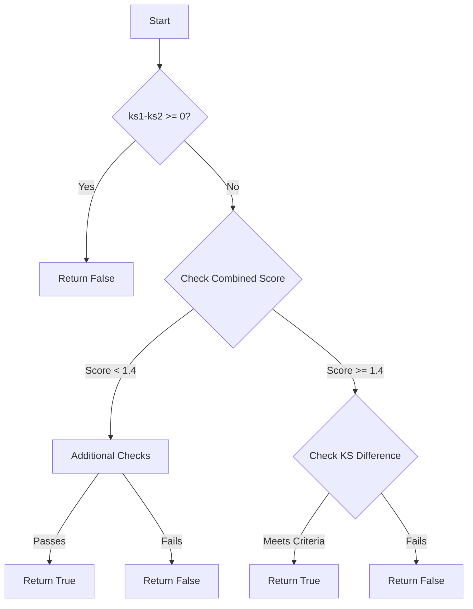

# ProtoSegment::determine_dir_track Function Analysis

This function determines the direction and particle type of a track segment based on its charge deposition pattern (dQ/dx) and other characteristics.

## Function Parameters
- `start_n`: Number of connected segments at start point
- `end_n`: Number of connected segments at end point
- `flag_print`: Boolean for debug printing

## Key Steps

1. **Initialization and Point Selection**
   ```cpp
   // Initialize direction flag and calculate working points
   flag_dir = 0;
   int npoints = fit_pt_vec.size();
   // Adjust start and end points based on vertex conditions
   ```

2. **Length and Charge Calculation**
   - Creates vectors for length (L) and charge deposition (dQ_dx)
   - Calculates cumulative distance and dQ/dx for each point
   - Excludes vertex points if necessary

3. **Track Direction and PID**
   ```mermaid
   graph TD
      A[Start] --> B{Track Length Check}
      B -->|≥ 2 points| C[Track PID Analysis]
      B -->|< 2 points| D[Skip PID]
      C --> |Long Track|E[Detailed PID]
      C --> |Short Track|F[Simple PID]
      E --> G[Set Particle Type]
      F --> G
      G --> H[Calculate Mass]
      H --> I[Calculate 4-momentum]
      I --> J[End]
   ```

4. **Particle Type Determination**
   - For unknown particles (type = 0):
     - If medium dQ/dx > 75.25 ke/cm → proton (2212)
     - If medium dQ/dx < 51.6 ke/cm → muon (13)
     - Special case for short tracks (< 4cm)

5. **Direction Determination Rules**
   - Electron tracks with multiple connections: weak direction
   - Short tracks (< 1.5cm): weak direction
   - Vertex activities affect direction flag
   - Poor particle scores may convert track to shower

6. **Final Properties**
   - Sets particle mass based on determined type
   - Calculates 4-momentum if direction is determined
   - Updates track properties and scores

## Key Thresholds
- Track length thresholds:
  - Short track: < 1.5 cm
  - Long track: > 10 cm
- dQ/dx thresholds:
  - Base unit: 43e3
  - Proton threshold: > 1.75 × base
  - Muon threshold: < 1.2 × base

## Output Variables
- `flag_dir`: Track direction (-1, 0, or 1)
- `particle_type`: Determined particle type
- `particle_mass`: Corresponding mass
- `particle_4mom`: 4-momentum (if direction determined)


# Track PID and Direction Analysis Functions

## Function Overview and Relationships



## 1. do_track_comp Function

### Purpose
Compares measured dQ/dx profile against known particle profiles (muon, proton, electron) using Kolmogorov-Smirnov tests.

### Parameters
- `L`: Vector of cumulative distances
- `dQ_dx`: Vector of charge deposits
- `compare_range`: Range to compare (default 35 cm)
- `offset_length`: Offset from end (default 1 cm)

### Process Flow
1. Gets reference dQ/dx profiles from TPCParams
2. Selects points within comparison range
3. Creates histograms for:
   - Measured data
   - Muon expectation
   - MIP-like particle (50 ke/cm)
   - Proton expectation
   - Electron expectation
4. Performs KS tests and ratio calculations
5. Returns vector of metrics:
   ```cpp
   results[0] = direction_metric
   results[1] = muon_score
   results[2] = proton_score
   results[3] = electron_score
   ```

## 2. eval_ks_ratio Function

### Purpose
Evaluates KS test results to determine track direction validity.

### Parameters
- `ks1`, `ks2`: KS test results
- `ratio1`, `ratio2`: Energy deposit ratios

### Decision Logic


## 3. do_track_pid Function

### Purpose
Makes final determination of particle type and direction using forward/backward analysis.

### Process
1. Creates reversed vectors for backward analysis
2. Calls do_track_comp for both directions
3. Determines particle type based on best scores:
   - Muon (13): Default
   - Proton (2212): If proton score is best
   - Electron (11): If electron score is best and track < 20cm

### Direction Decision Matrix
| Forward | Backward | Result |
|---------|----------|---------|
| True    | False    | Forward |
| False   | True     | Backward|
| True    | True     | Best Score|
| False   | False    | No Direction*|

*Unless force flag is set

### Key Thresholds
- Track length for electron consideration: < 20 cm
- Score evaluation uses combination of KS test and ratio differences
- Direction determination uses complex scoring based on multiple metrics

