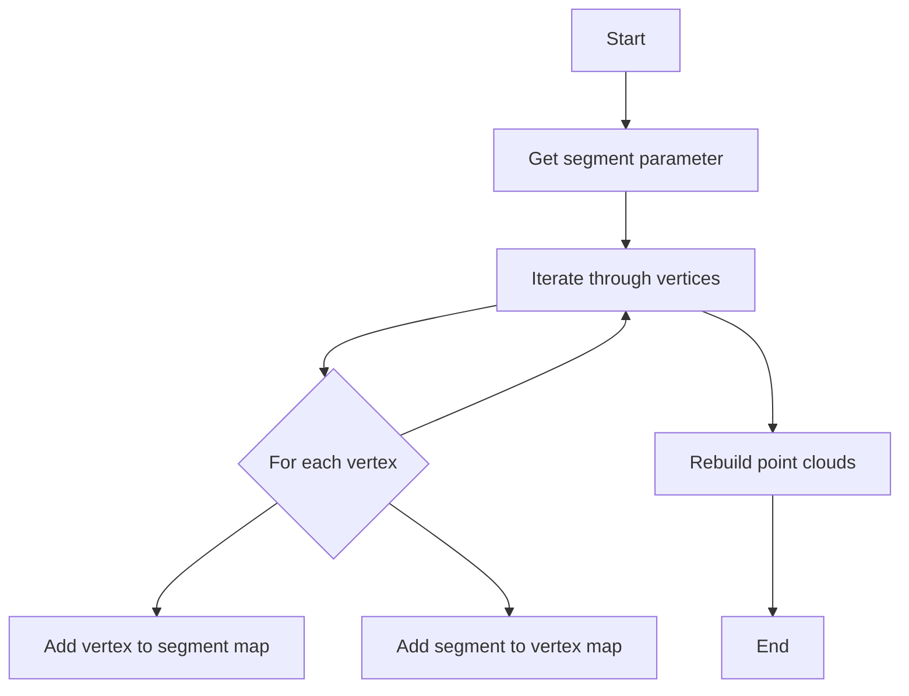
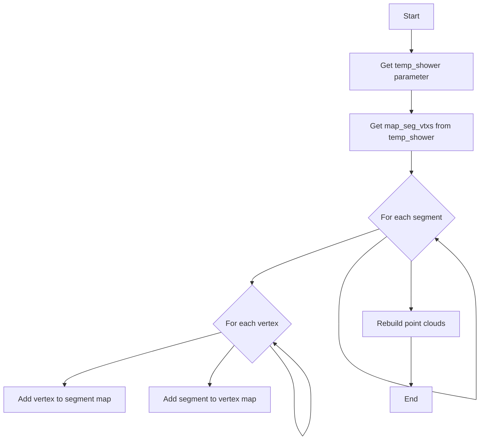

# WCShower add_segment and add_shower Documentation

## Overview

The WCShower class contains two key methods for adding new elements to an existing shower structure:
- `add_segment`: Adds a single ProtoSegment and its associated vertices
- `add_shower`: Merges another WCShower object into the current one

## add_segment Method

### Purpose
The `add_segment` method adds a single ProtoSegment and its associated vertices to the shower's internal graph structure.

### Function Signature
```cpp
void add_segment(WCPPID::ProtoSegment* seg, Map_Proto_Segment_Vertices& map_segment_vertices)
```

### Logic Flow



### Implementation Details

1. Takes a ProtoSegment pointer and a reference to map_segment_vertices as input
2. For each vertex associated with the segment in map_segment_vertices:
   - Adds the vertex to map_seg_vtxs[seg]
   - Adds the segment to map_vtx_segs[vtx]
3. Calls rebuild_point_clouds() to update the point cloud representations

### Code Example
```cpp
void WCShower::add_segment(ProtoSegment* seg, Map_Proto_Segment_Vertices& map_segment_vertices) {
    // Iterate through vertices associated with the segment
    for (auto it = map_segment_vertices[seg].begin(); 
         it != map_segment_vertices[seg].end(); 
         it++) {
        ProtoVertex *vtx = *it;
        // Add bidirectional mapping
        map_seg_vtxs[seg].insert(vtx);  // Segment -> Vertex
        map_vtx_segs[vtx].insert(seg);  // Vertex -> Segment
    }
    // Update point cloud representation
    rebuild_point_clouds();
}
```

## add_shower Method

### Purpose
The `add_shower` method merges another WCShower object into the current one by combining their segment-vertex mappings.

### Function Signature
```cpp
void add_shower(WCPPID::WCShower* temp_shower)
```

### Logic Flow



### Implementation Details

1. Takes a pointer to another WCShower object as input
2. Gets the Map_Proto_Segment_Vertices from the input shower
3. For each segment-vertices mapping:
   - For each vertex associated with the segment:
     - Adds the vertex to map_seg_vtxs[seg] in current shower 
     - Adds the segment to map_vtx_segs[vtx] in current shower
4. Calls rebuild_point_clouds() to update the point cloud representations

### Code Example
```cpp
void WCShower::add_shower(WCShower* temp_shower) {
    // Get segment-vertex mappings from input shower
    Map_Proto_Segment_Vertices& tmp_map_seg_vtxs = temp_shower->get_map_seg_vtxs();
    
    // Iterate through all segments
    for (auto it = tmp_map_seg_vtxs.begin(); it != tmp_map_seg_vtxs.end(); it++) {
        ProtoSegment *seg = it->first;
        // Iterate through vertices for each segment
        for (auto it1 = it->second.begin(); it1 != it->second.end(); it1++) {
            ProtoVertex *vtx = *it1;
            // Add bidirectional mapping
            map_seg_vtxs[seg].insert(vtx);  // Segment -> Vertex
            map_vtx_segs[vtx].insert(seg);  // Vertex -> Segment
        }
    }
    // Update point cloud representation 
    rebuild_point_clouds();
}
```

## Key Data Structures

Both methods operate on these primary data structures:

1. `map_seg_vtxs`: Maps ProtoSegments to sets of ProtoVertices
   - Type: `Map_Proto_Segment_Vertices` (std::map<ProtoSegment*, std::set<ProtoVertex*>>)
   - Maintains segment → vertices relationships

2. `map_vtx_segs`: Maps ProtoVertices to sets of ProtoSegments  
   - Type: `Map_Proto_Vertex_Segments` (std::map<ProtoVertex*, std::set<ProtoSegment*>>)
   - Maintains vertex → segments relationships

## Point Cloud Rebuilding

Both methods conclude by calling `rebuild_point_clouds()` which:
1. Deletes existing point cloud objects
2. Creates new point clouds for:
   - Fitted points (pcloud_fit)
   - Associated points (pcloud_associated)
3. Rebuilds KD-tree indices for efficient spatial queries

This ensures the shower's spatial representation remains consistent with its updated structure.