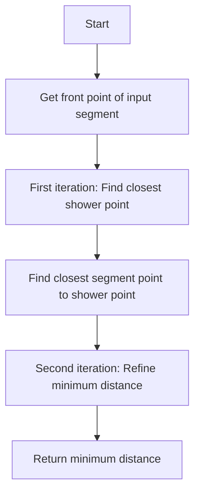
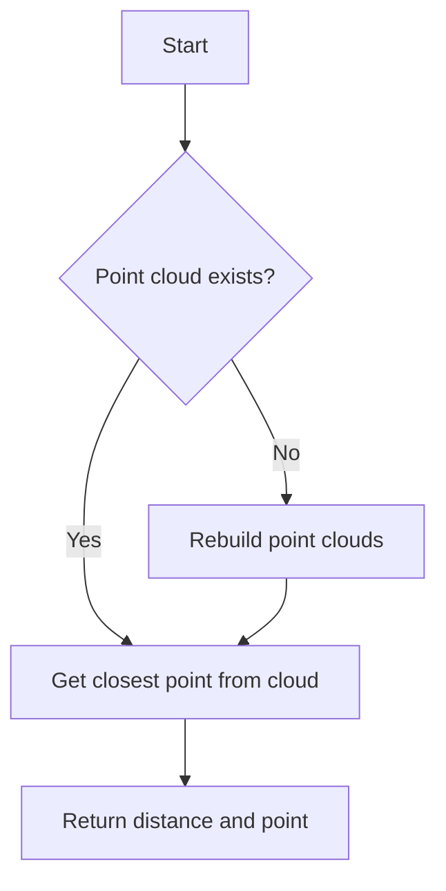

# WCShower Distance Functions Documentation

## Overview

The WCShower class implements several distance-related functions that help determine spatial relationships between various components of particle showers. These functions are crucial for shower reconstruction and analysis.

## Functions Overview

### 1. `get_closest_dis(ProtoSegment* seg)`

This function calculates the minimum distance between a given ProtoSegment and the shower.

```cpp
double WCPPID::WCShower::get_closest_dis(WCPPID::ProtoSegment* seg) {
    double min_dis = 1e9;
    Point min_point;
    Point test_p = seg->get_point_vec().front();
    
    // First iteration: Find closest point in shower to segment start
    for (auto it = map_seg_vtxs.begin(); it != map_seg_vtxs.end(); it++) {
        WCPPID::ProtoSegment *sg = it->first;
        std::pair<double, WCP::Point> results = sg->get_closest_point(test_p);
        if (results.first < min_dis) {
            min_dis = results.first;
            min_point = results.second;
        }
    }
    
    // Second iteration: Find closest point in segment to shower
    std::pair<double, WCP::Point> results1 = seg->get_closest_point(min_point);
    test_p = results1.second;
    
    // Final iteration: Refine minimum distance
    for (auto it = map_seg_vtxs.begin(); it != map_seg_vtxs.end(); it++) {
        WCPPID::ProtoSegment *sg = it->first;
        std::pair<double, WCP::Point> results = sg->get_closest_point(test_p);
        if (results.first < min_dis) {
            min_dis = results.first;
            min_point = results.second;
        }
    }
    
    return min_dis;
}
```

#### Logic Flow:


### 2. `get_closest_point(Point& p)`

This function finds the closest point in the shower to a given 3D point.

```cpp
std::pair<double, WCP::Point> WCPPID::WCShower::get_closest_point(WCP::Point& p) {
    if (pcloud_fit == (ToyPointCloud*)0)
        rebuild_point_clouds();
    
    return pcloud_fit->get_closest_point(p);
}
```

#### Logic Flow:


## Geometric Concepts

The distance calculations operate in 3D space and use several key geometric concepts:

1. **Point-to-Segment Distance**: Finding the minimum distance between a point and a line segment
2. **Segment-to-Segment Distance**: Finding the minimum distance between two line segments
3. **Point Cloud Optimization**: Using point clouds to accelerate spatial queries

## Implementation Details

### Point Cloud Usage

The class maintains two point clouds:
- `pcloud_fit`: Contains fitted points of the shower
- `pcloud_associated`: Contains associated points from the detector

These point clouds are used to optimize spatial queries through efficient data structures (likely KD-trees).

### Distance Calculation Strategy

1. **Initial Approximation**:
   - Start with a point from the input segment
   - Find closest point in shower segments

2. **Refinement**:
   - Use the found point to find closest point back on input segment
   - Perform final iteration to refine minimum distance

3. **Optimization**:
   - Uses point clouds for efficient spatial queries
   - Implements iterative refinement for better accuracy

## Usage Examples

```cpp
// Example 1: Finding distance between segment and shower
WCPPID::ProtoSegment* test_segment = /* ... */;
double distance = shower.get_closest_dis(test_segment);

// Example 2: Finding closest point in shower
WCP::Point test_point(x, y, z);
auto result = shower.get_closest_point(test_point);
double distance = result.first;
WCP::Point closest_point = result.second;
```

## Performance Considerations

- Point cloud operations are O(log n) for queries
- Each distance calculation involves multiple iterations
- Rebuilding point clouds is an expensive operation, done only when necessary

## Common Use Cases

1. **Shower Reconstruction**:
   - Determining shower boundaries
   - Identifying connected segments

2. **Particle Tracking**:
   - Following particle trajectories
   - Connecting shower fragments

3. **Event Analysis**:
   - Calculating shower properties
   - Determining spatial relationships between shower components