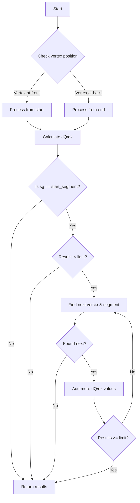
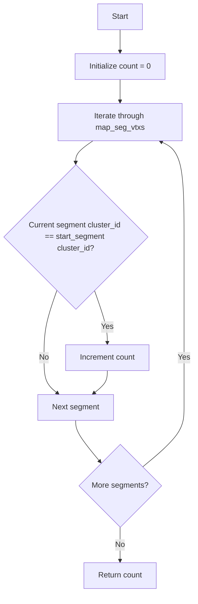
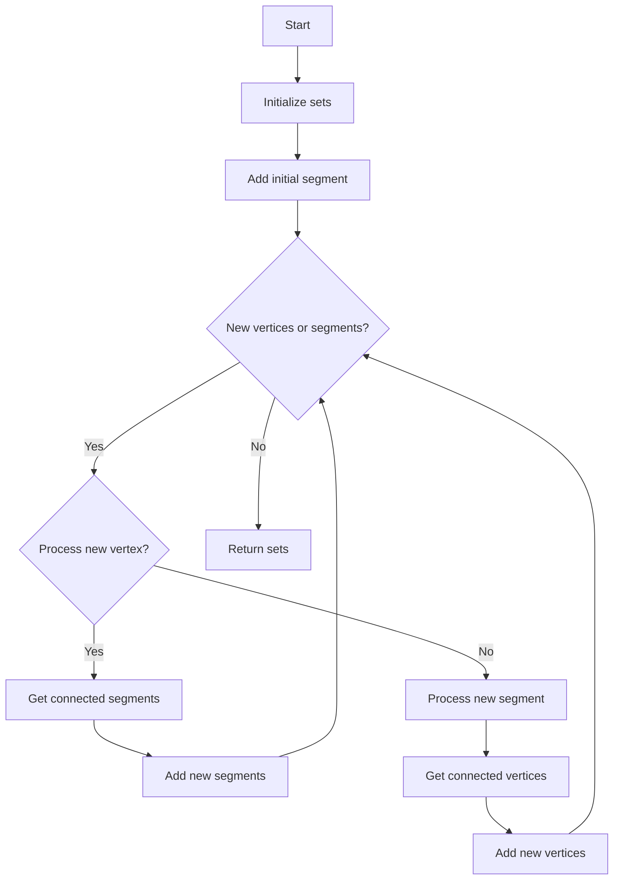
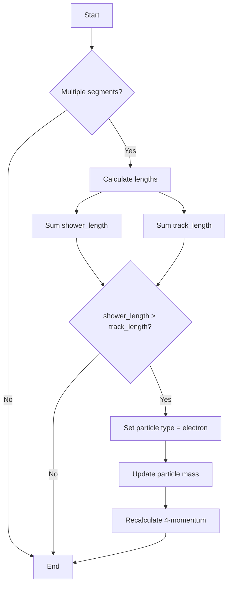

# WCShower Class Functions Documentation

## Table of Contents
1. [get_stem_dQ_dx Function](#get_stem_dqdx)
2. [get_num_main_segments Function](#get_num_main_segments)
3. [get_connected_pieces Function](#get_connected_pieces)
4. [update_particle_type Function](#update_particle_type)

## get_stem_dQ_dx Function <a name="get_stem_dqdx"></a>

### Purpose
Calculates the dQ/dx (charge deposition per unit length) values for a given vertex and segment combination, with an optional limit on the number of values to return.

### Function Signature
```cpp
std::vector<double> get_stem_dQ_dx(WCPPID::ProtoVertex *vertex, 
                                  WCPPID::ProtoSegment *sg, 
                                  int limit = 20)
```

### Logic Flow



### Key Steps
1. Initial dQ/dx calculation for given segment
   - Gets dQ and dx vectors from segment
   - Calculates dQ/dx based on vertex position (front/back)
   - Normalizes by detector constant (43e3/units::cm)

2. Extension for start segment (if needed)
   - Finds connected vertices and segments
   - Checks angle conditions (< 25 degrees)
   - Adds additional dQ/dx values up to limit
   - Maximum of 3 connected segments checked

## get_num_main_segments Function <a name="get_num_main_segments"></a>

### Purpose
Counts the number of segments that belong to the same cluster as the start segment.

### Function Signature
```cpp
int get_num_main_segments()
```

### Logic Flow



## get_connected_pieces Function <a name="get_connected_pieces"></a>

### Purpose
Returns sets of connected segments and vertices starting from a given segment.

### Function Signature
```cpp
std::pair<std::set<WCPPID::ProtoSegment*>, std::set<WCPPID::ProtoVertex*>> 
get_connected_pieces(WCPPID::ProtoSegment* tseg)
```

### Logic Flow



### Implementation Details
1. Uses two vectors for processing:
   - new_segments: Segments to be processed
   - new_vertices: Vertices to be processed
   
2. Uses two sets for results:
   - used_segments: All connected segments
   - used_vertices: All connected vertices

3. Processing continues until no new connections found

## update_particle_type Function <a name="update_particle_type"></a>

### Purpose
Updates the particle type based on the characteristics of connected segments.

### Function Signature
```cpp
void update_particle_type()
```

### Logic Flow



### Key Points
1. Only processes if multiple segments exist
2. Classifies segments into:
   - Shower-like: `seg->get_flag_shower() || fabs(seg->get_particle_type())!=2212`
   - Track-like: Otherwise

3. Updates properties if shower-like characteristics dominate:
   - Sets particle type to electron (11)
   - Updates mass to electron mass
   - Recalculates 4-momentum

### Related Constants
```cpp
// Electron particle type
const int ELECTRON_TYPE = 11;

// TPCParams electron mass
// Accessed via: mp.get_mass_electron()
```