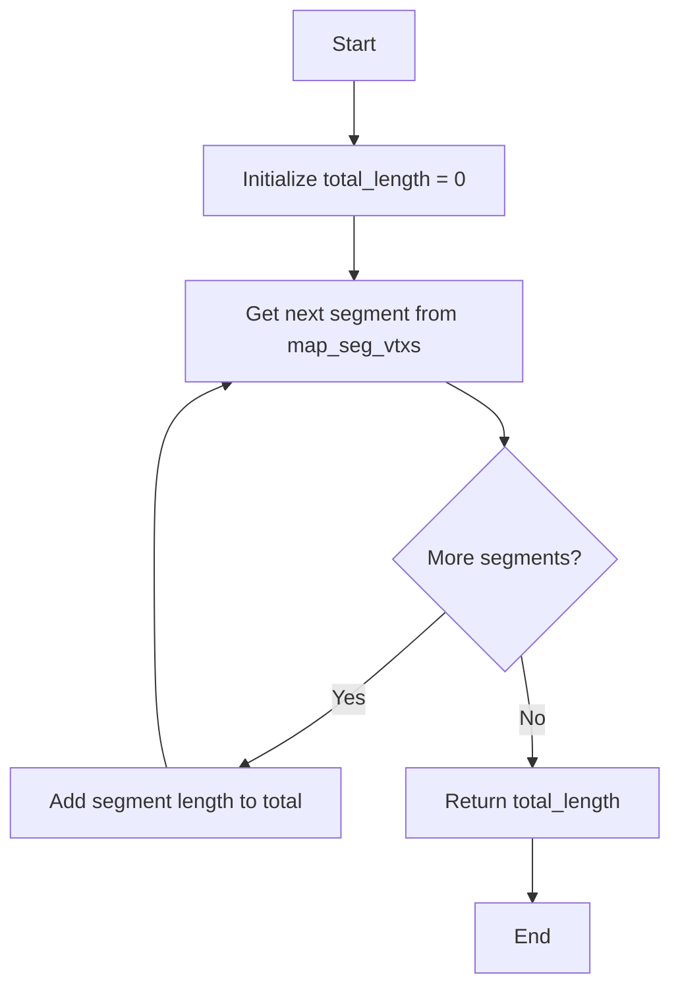
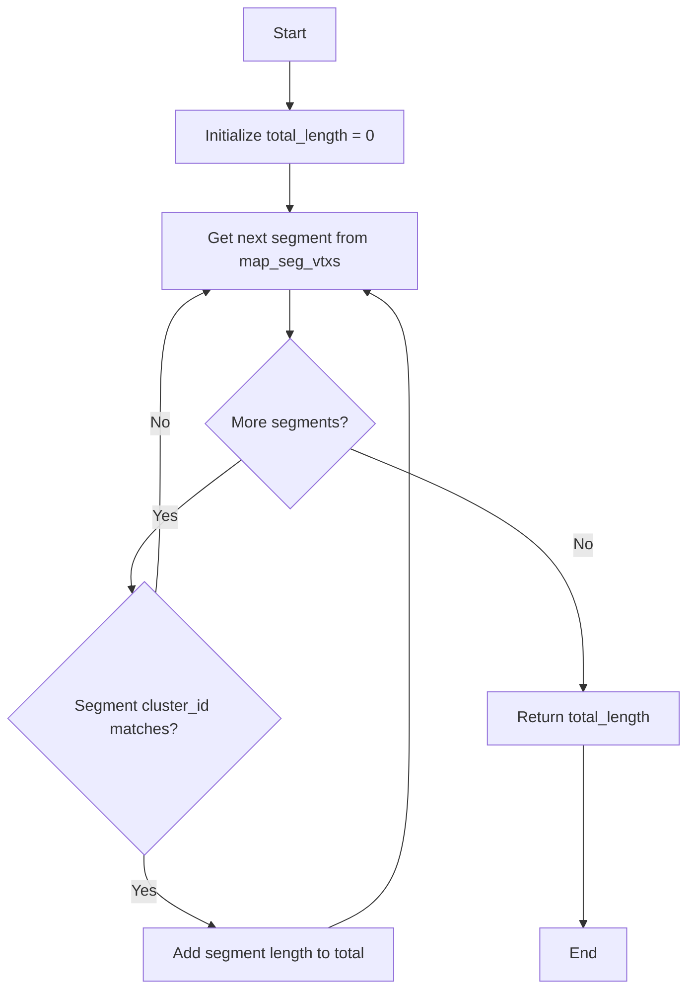
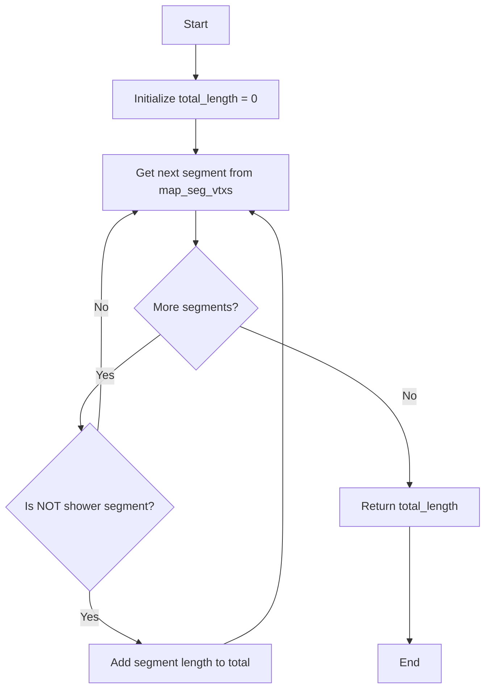

# WCShower Length Calculation Functions Analysis

## Overview

The WCShower class includes several functions for calculating different types of lengths associated with particle showers. These functions serve different purposes and handle various cases in the shower reconstruction.

## Functions Analysis

### 1. get_total_length()

```cpp
double WCPPID::WCShower::get_total_length() {
    double total_length = 0;
    for (auto it = map_seg_vtxs.begin(); it!= map_seg_vtxs.end(); it++) {
        WCPPID::ProtoSegment *sg = it->first;
        total_length += sg->get_length();
    }
    return total_length;
}
```

**Purpose**: Calculates the total length of all segments in the shower
**Logic**:
- Iterates through all segments in map_seg_vtxs
- Sums up the length of each segment unconditionally
- Returns total accumulated length

**Flow Diagram**:


### 2. get_total_length(int tmp_cluster_id)

```cpp
double WCPPID::WCShower::get_total_length(int tmp_cluster_id) {
    double total_length = 0;
    for (auto it = map_seg_vtxs.begin(); it!= map_seg_vtxs.end(); it++) {
        WCPPID::ProtoSegment *sg = it->first;
        if (sg->get_cluster_id() == tmp_cluster_id)
            total_length += sg->get_length();
    }
    return total_length;
}
```

**Purpose**: Calculates total length of segments belonging to a specific cluster
**Logic**: 
- Takes a cluster ID as input
- Iterates through all segments
- Only adds length if segment belongs to specified cluster
- Returns filtered total length

**Flow Diagram**:


### 3. get_total_track_length()

```cpp
double WCPPID::WCShower::get_total_track_length() {
    double total_length = 0;
    for (auto it = map_seg_vtxs.begin(); it!= map_seg_vtxs.end(); it++) {
        WCPPID::ProtoSegment *sg = it->first;
        if (!sg->get_flag_shower())
            total_length += sg->get_length();
    }
    return total_length;
}
```

**Purpose**: Calculates total length of track-like segments only
**Logic**:
- Iterates through all segments
- Only adds length of segments that are NOT flagged as shower-like
- Returns total track length

**Flow Diagram**:


## Key Differences and Usage

1. **get_total_length()**
   - Most inclusive function
   - Counts all segments regardless of type or cluster
   - Used when total shower extent is needed

2. **get_total_length(int tmp_cluster_id)**
   - Cluster-specific calculation
   - Only includes segments from specified cluster
   - Useful for analyzing specific sub-components of shower

3. **get_total_track_length()**
   - Most selective function
   - Only includes non-shower segments
   - Used for analyzing track-like portions of the shower

## Implementation Notes

- All functions rely on map_seg_vtxs container which maps ProtoSegments to their associated vertices
- Length calculations depend on ProtoSegment's get_length() method
- No error checking is performed on segment validity
- Functions return double precision values
- All functions are non-destructive and don't modify shower state

## Common Use Cases

1. Total shower extent calculation:
```cpp
double total_extent = shower->get_total_length();
```

2. Cluster-specific analysis:
```cpp
double cluster_length = shower->get_total_length(cluster_id);
```

3. Track component analysis:
```cpp
double track_portion = shower->get_total_track_length();
```