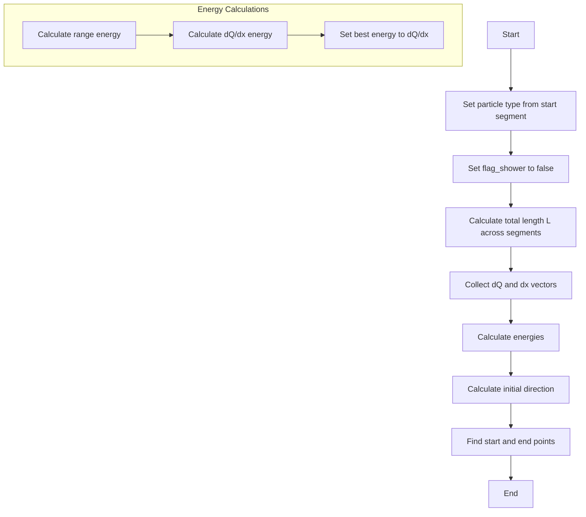
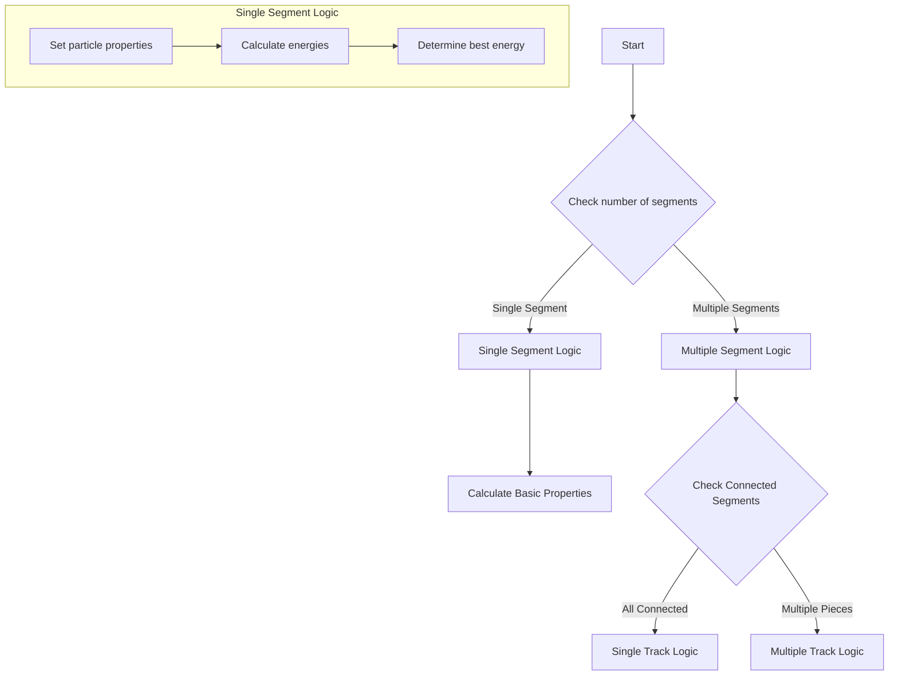

# WCShower Kinematics Functions Analysis

## Overview

The WCShower class contains two main functions for calculating kinematics:
1. `calculate_kinematics()` - General kinematics calculation
2. `calculate_kinematics_long_muon()` - Specialized calculation for long muon tracks

## 1. calculate_kinematics_long_muon()

### Purpose
Calculates kinematics specifically for long muon tracks within specified segments.

### Logic Flow


### Key Steps:
1. **Basic Setup**
   - Sets particle type from start_segment
   - Sets flag_shower to false (since it's a muon)

2. **Length Calculation**
   ```cpp
   double L = 0;
   for (auto it = map_seg_vtxs.begin(); it != map_seg_vtxs.end(); it++) {
       if (segments_in_muons.find(sg) != segments_in_muons.end())
           L += sg->get_length();
   }
   ```

3. **Energy Calculations**
   - Range Energy: `kenergy_range = start_segment->cal_kine_range(L)`
   - dQ/dx Energy: `kenergy_dQdx = start_segment->cal_kine_dQdx(vec_dQ, vec_dx)`
   - Best Energy: Set to dQ/dx energy for long muons

4. **Direction and Points**
   - Sets initial direction from start segment
   - Calculates start/end points based on vertex positions

## 2. calculate_kinematics()

### Purpose
General kinematics calculation for all types of particle tracks/showers.

### Logic Flow


### Key Conditions and Branching:

1. **Single Segment Case** (map_seg_vtxs.size()==1)
   ```cpp
   if (map_seg_vtxs.size()==1) {
       particle_type = start_segment->get_particle_type();
       flag_shower = start_segment->get_flag_shower();
       // Calculate energies...
   }
   ```

2. **Multiple Segment Case**
   - Checks if segments are connected
   - Different logic for single track vs multiple tracks

3. **Energy Selection Logic**
   ```cpp
   // For single track with connection type 1
   if (start_segment->get_length() < 4*units::cm) {
       kenergy_best = kenergy_dQdx;
   } else {
       kenergy_best = kenergy_range;
   }
   ```

### Special Cases:

1. **Connection Types**
   - Type 1: Direct connection
   - Type 2: Indirect connection with gap
   - Type 3: Association connection

2. **Track Length Thresholds**
   - Short tracks (<4cm): Use dQ/dx energy
   - Long tracks (≥4cm): Use range energy

3. **Direction Calculation**
   - For short segments (<8cm): Uses wider area for direction
   - For long segments: Uses segment direction directly

### Important Variables:

1. **Energy Variables**
   - `kenergy_range`: Energy from range
   - `kenergy_dQdx`: Energy from charge deposition
   - `kenergy_best`: Best energy estimate
   - `kenergy_charge`: Charge-based energy (set externally)

2. **Geometric Variables**
   - `start_point`: Starting position
   - `end_point`: Ending position
   - `init_dir`: Initial direction vector

## Usage Notes

1. The long muon calculation is more specialized and straightforward, focusing on continuous tracks.

2. The general kinematics calculation handles more cases and has more complex branching logic.

3. Energy calculations depend on:
   - Track length
   - Connection type
   - Whether it's a shower
   - Number of segments

4. Both functions update the same core set of class members:
   - Particle type
   - Energies
   - Directions
   - Start/end points