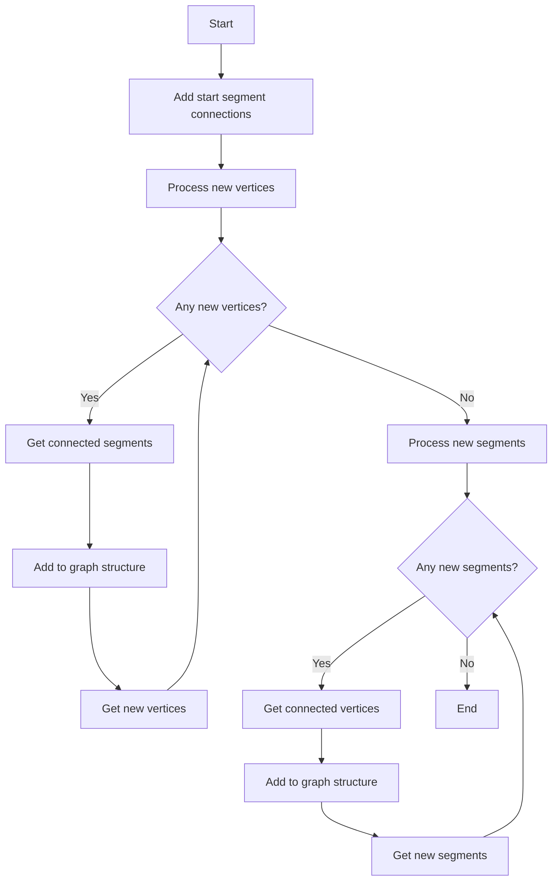
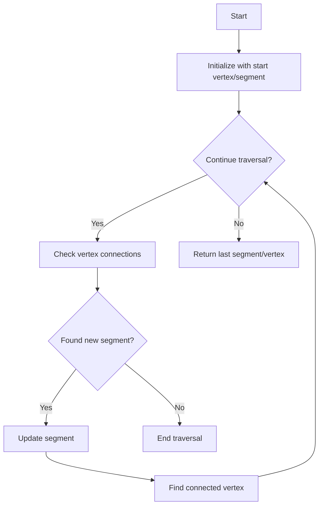
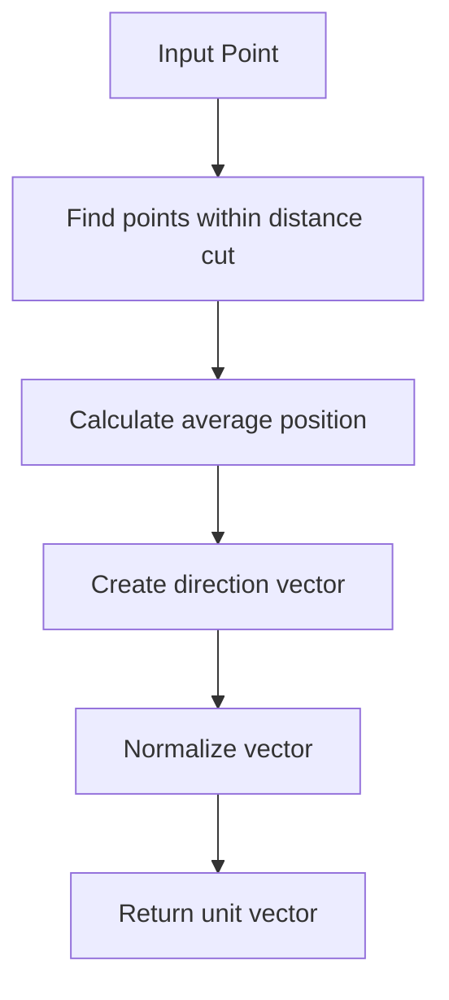

# WCShower Class Function Analysis

## Overview
The WCShower class appears to be part of a particle detector analysis system, specifically handling shower-type events in a wire chamber detector. Let's analyze key functions and their relationships.

## 1. complete_structure_with_start_segment()

### Purpose
Builds a complete graph structure starting from an initial segment, connecting related vertices and segments.

### Algorithm Flow


### Key Steps:
1. Initializes with start segment and connects its vertices (excluding start vertex)
2. Iteratively processes:
   - New vertices: Finds connected segments and adds them to the graph
   - New segments: Finds connected vertices and adds them to the graph
3. Updates internal maps:
   - map_vtx_segs: Maps vertices to their connected segments
   - map_seg_vtxs: Maps segments to their connected vertices

### Code Structure:
```cpp
void complete_structure_with_start_segment(...) {
    // Initialize with start segment vertices
    for (auto vtx : map_segment_vertices[start_segment]) {
        if (vtx == start_vertex) continue;
        map_vtx_segs[vtx].insert(start_segment);
        map_seg_vtxs[start_segment].insert(vtx);
        new_vertices.push_back(vtx);
    }

    // Iterative processing
    while(new_vertices.size() > 0 || new_segments.size() > 0) {
        // Process vertices
        if (new_vertices.size() > 0) {
            // Add connected segments
        }

        // Process segments
        if (new_segments.size() > 0) {
            // Add connected vertices
        }
    }
}
```

## 2. get_last_segment_vertex_long_muon()

### Purpose
Identifies the last segment and vertex in a muon track by traversing the connected segments.

### Algorithm Flow


### Key Features:
- Tracks used segments to avoid loops
- Follows muon track topology
- Returns pair of final segment and vertex

### Code Logic:
```cpp
std::pair<ProtoSegment*, ProtoVertex*> get_last_segment_vertex_long_muon(...) {
    // Start from initial position
    ProtoVertex* s_vtx = start_vertex;
    ProtoSegment* s_seg = start_segment;
    std::set<ProtoSegment*> used_segments;
    
    while(flag_continue) {
        // Find next segment
        for (auto sg : map_vtx_segs[s_vtx]) {
            if (segments_in_muons.count(sg) && !used_segments.count(sg)) {
                s_seg = sg;
                used_segments.insert(s_seg);
                flag_continue = true;
                break;
            }
        }
        
        // Find next vertex
        if (flag_continue) {
            for (auto vtx : map_seg_vtxs[s_seg]) {
                if (vtx != s_vtx) {
                    s_vtx = vtx;
                    break;
                }
            }
        }
    }
    
    return std::make_pair(s_seg, s_vtx);
}
```

## 3. cal_dir_3vector()

### Purpose
Calculates the direction vector at a given point by averaging nearby points within a distance cut.

### Algorithm
1. Takes input point and distance cut parameter
2. Finds all points within distance cut
3. Calculates center of mass of selected points
4. Returns normalized direction vector from input point to center of mass

### Visualization


### Implementation Details:
```cpp
TVector3 cal_dir_3vector(Point p, double dis_cut) {
    Point p1(0,0,0);  // Accumulator for average
    Int_t ncount = 0;
    
    // Sum all points within distance cut
    for (auto segment : map_seg_vtxs) {
        for (auto point : segment->get_point_vec()) {
            double dis = sqrt(pow(point.x - p.x,2) +
                            pow(point.y - p.y,2) +
                            pow(point.z - p.z,2));
            if (dis < dis_cut) {
                p1.x += point.x;
                p1.y += point.y;
                p1.z += point.z;
                ncount++;
            }
        }
    }
    
    // Calculate and normalize direction vector
    TVector3 v1(p1.x/ncount - p.x,
                p1.y/ncount - p.y,
                p1.z/ncount - p.z);
    return v1.Unit();
}
```

## Key Data Structures

### Internal Maps
1. `map_vtx_segs`: Maps vertices to their connected segments
   ```cpp
   Map_Proto_Vertex_Segments map_vtx_segs;
   ```

2. `map_seg_vtxs`: Maps segments to their connected vertices
   ```cpp
   Map_Proto_Segment_Vertices map_seg_vtxs;
   ```

### Important Class Members
- `start_vertex`: Initial vertex of the shower
- `start_segment`: Initial segment of the shower
- `start_connection_type`: Type of connection (1=direct, 2=indirect, 3=associated)

## Common Usage Patterns

1. **Shower Structure Building**:
   ```cpp
   WCShower shower;
   shower.set_start_vertex(vertex, type);
   shower.set_start_segment(segment);
   shower.complete_structure_with_start_segment(map_vertex_segments, 
                                              map_segment_vertices,
                                              used_segments);
   ```

2. **Direction Calculation**:
   ```cpp
   WCShower shower;
   // ... initialization ...
   Point p(x, y, z);
   TVector3 direction = shower.cal_dir_3vector(p, 15*units::cm);
   ```

3. **Muon Track Analysis**:
   ```cpp
   WCShower shower;
   // ... initialization ...
   auto [last_segment, last_vertex] = 
       shower.get_last_segment_vertex_long_muon(segments_in_muons);
   ```