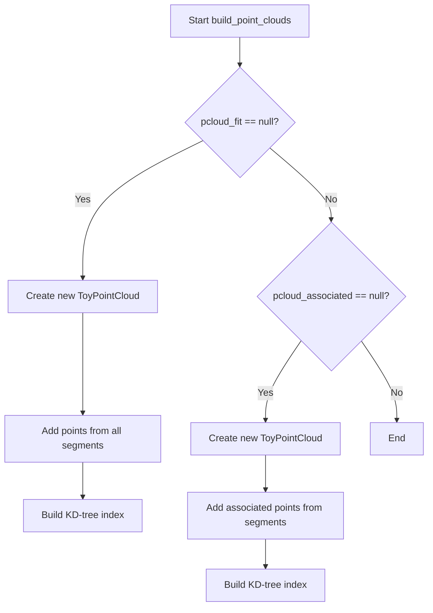

# WCShower Point Cloud Building Documentation

## Overview

The WCShower class uses point clouds to manage collections of 3D points that represent the shower geometry. It maintains two main point cloud objects:

1. `pcloud_fit` - Contains the fitted trajectory points 
2. `pcloud_associated` - Contains associated points from the detectors

## Key Functions

### rebuild_point_clouds()

```cpp
void WCPPID::WCShower::rebuild_point_clouds() {
    if (pcloud_fit != (ToyPointCloud*)0) 
        delete pcloud_fit;
    if (pcloud_associated != (ToyPointCloud*)0) 
        delete pcloud_associated;
    pcloud_fit = 0;
    pcloud_associated = 0;
    build_point_clouds();
}
```

This function:
1. Deletes existing point cloud objects if they exist
2. Resets pointers to null 
3. Calls build_point_clouds() to recreate them

Used when the shower geometry changes and point clouds need to be reconstructed from scratch.

### build_point_clouds()

Logic flow:



Key steps:

1. For pcloud_fit:
   - Creates new ToyPointCloud if null
   - Iterates through all segments
   - Adds point vectors from each segment
   - Builds KD-tree spatial index

2. For pcloud_associated:
   - Creates new ToyPointCloud if null  
   - Iterates through segments
   - For segments with associated clouds:
     - Adds U/V/W 2D points
     - Adds 3D points
   - Builds KD-tree spatial index

## Using Point Clouds

The point clouds enable efficient spatial queries through their KD-tree indices. Key usage functions:

### get_closest_point()
```cpp
std::pair<double, WCP::Point> WCPPID::WCShower::get_closest_point(WCP::Point& p) {
    if (pcloud_fit == (ToyPointCloud*)0)
        rebuild_point_clouds();
    return pcloud_fit->get_closest_point(p); 
}
```

Used to find nearest point in the fitted trajectory to a given 3D point.

### get_closest_dis()
```cpp
double WCPPID::WCShower::get_closest_dis(WCPPID::ProtoSegment *seg) {
    Point test_p = get_closest_point(seg->get_point_vec().front()).second;
    test_p = seg->get_closest_point(test_p).second;
    test_p = get_closest_point(test_p).second;
    return seg->get_closest_point(test_p).first;
}
```

Returns minimum distance between a segment and the shower by:
1. Finding closest shower point to segment start
2. Finding closest segment point to that shower point
3. Finding closest shower point to that segment point
4. Finding final minimum distance

## Integration with Other Components

The point clouds are used throughout other shower functionality:

- Kinematics calculations use point clouds for spatial queries
- Segment adding/removal triggers point cloud rebuilding
- Track finding uses point clouds for proximity checks

Example usage in calculate_kinematics():
```cpp
void WCPPID::WCShower::calculate_kinematics() {
    // ...
    if (start_connection_type == 1 || pcloud_fit == 0) {
        // Use segment points directly
    } else {
        // Use point cloud for spatial queries
        start_point = get_closest_point(start_vertex->get_fit_pt()).second;
    }
    // ...
}
```

## Key Points

- Point clouds provide efficient spatial indexing of shower geometry
- Two separate clouds track fitted and associated points
- Rebuilding happens when shower structure changes 
- KD-trees enable fast nearest neighbor queries
- Used extensively in shower analysis algorithms

## Dependencies

The implementation relies on:
- ToyPointCloud class for point cloud management
- KD-tree implementation for spatial indexing
- ProtoSegment class providing point vectors
- Map_Proto_Segment_Vertices storing segment-vertex relationships