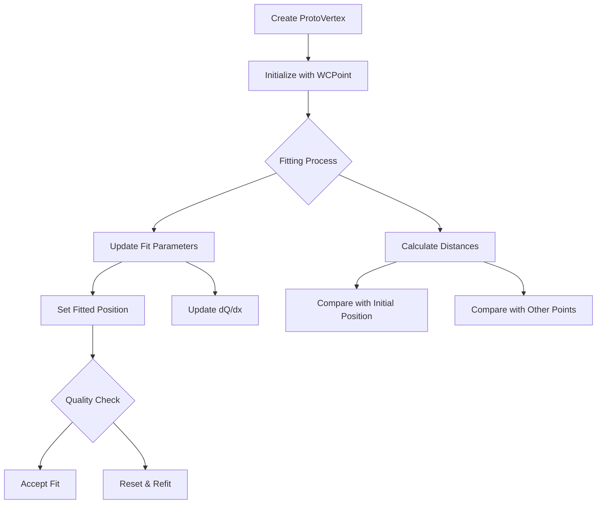

# ProtoVertex Class Documentation

## Overview
The ProtoVertex class represents a vertex in a 3D space, primarily used for track reconstruction in particle physics. It maintains both the initial position (WCPoint) and a fitted position (fit_pt), along with various properties related to track fitting and analysis.

## Class Members

### Core Properties
```cpp
protected:
    int id;                 // Unique identifier for the vertex
    int cluster_id;         // ID of the cluster this vertex belongs to
    bool flag_neutrino_vertex;  // Indicates if this is a neutrino vertex
    
    WCP::WCPointCloud<double>::WCPoint wcpt;  // Initial WCP point from the graph
    WCP::Point fit_pt;      // Best fit points after optimization
```

### Tracking and Fitting Properties
```cpp
protected:
    double dQ;             // Charge deposition
    double dx;             // Track length segment
    double pu, pv, pw, pt; // Position parameters in u,v,w,t coordinates
    double reduced_chi2;   // Goodness of fit parameter
    
    int fit_index;         // Index used in fitting procedure
    bool flag_fit_fix;     // Indicates if fit parameters are fixed
    double fit_range;      // Range parameter for fitting
    bool flag_fit;         // Indicates if vertex has been fitted
```

## Key Methods

### Constructor
```cpp
ProtoVertex(int id, WCP::WCPointCloud<double>::WCPoint& wcpt, int cluster_id)
```
- Initializes a vertex with given ID, position, and cluster ID
- Sets initial fit point to match the WCPoint position
- Initializes fitting parameters to default values

### Position Management
1. **set_wcpt(WCP::WCPointCloud<double>::WCPoint& tmp_pt)**
   - Updates the initial WCPoint position
   
2. **set_fit_pt(WCP::Point& p)**
   - Sets the fitted position directly

### Distance Calculations
1. **get_dis(WCP::Point& p)**
   - Calculates Euclidean distance between the fitted position and given point
   ```cpp
   return sqrt(pow(p.x - fit_pt.x,2) + pow(p.y - fit_pt.y,2) + pow(p.z - fit_pt.z,2));
   ```

2. **get_fit_init_dis()**
   - Calculates distance between initial and fitted positions
   - Used to evaluate fit quality

### Fitting Related Methods
1. **set_fit(...)**
   ```cpp
   void set_fit(WCP::Point& tmp_fit_pt, double tmp_dQ, double tmp_dx, 
                double tmp_pu, double tmp_pv, double tmp_pw, 
                double tmp_pt, double tmp_reduced_chi2)
   ```
   - Comprehensive method to update all fit-related parameters
   - Sets the flag_fit to true indicating successful fitting

2. **reset_fit_prop()**
   - Resets fitting properties to default values
   - Used when re-fitting is needed

## Support Structures

### ProtoVertexCompare
A comparison structure used for sorting vertices:
```cpp
struct ProtoVertexCompare {
    bool operator() (ProtoVertex *a, ProtoVertex *b) const {
        if (a->get_id() < b->get_id()) return true;
        if (a->get_id() > b->get_id()) return false;
        if (a->get_id() == b->get_id()) return a < b;
        return a < b;
    }
};
```

### Type Definitions
```cpp
typedef std::vector<ProtoVertex*> ProtoVertexSelection;
typedef std::set<ProtoVertex*, ProtoVertexCompare> ProtoVertexSet;
```

## Logic Flow Diagram



## Common Usage Pattern

1. Create a ProtoVertex with initial position
2. Set fitting parameters and range
3. Perform fitting process
4. Update vertex with fitted results
5. Calculate quality metrics (distances, chi2)
6. Use fitted parameters for track reconstruction

## Key Relationships

- A ProtoVertex is typically part of a larger cluster (indicated by cluster_id)
- Can be identified as a neutrino vertex through flag_neutrino_vertex
- Maintains both initial (wcpt) and fitted (fit_pt) positions
- Stores track quality parameters (dQ, dx, reduced_chi2)
- Can be compared and sorted using ProtoVertexCompare