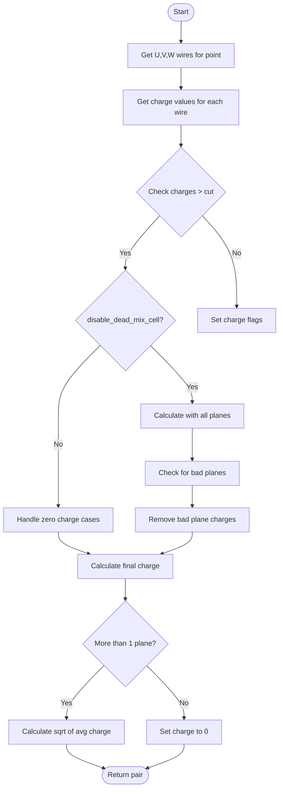

# Wire Chamber Charge Calculation Function Documentation

## Function Overview

The `calc_charge_wcp()` function is a critical component in wire chamber detector analysis, calculating charge information from multiple wire planes. This document provides a detailed explanation of its implementation and usage.

```cpp
std::pair<bool,double> calc_charge_wcp(
    WCP::WCPointCloud<double>::WCPoint& wcp,
    WCP::GeomDataSource& gds,
    bool disable_dead_mix_cell,
    double charge_cut = 4000
);
```

## Function Parameters

- `wcp`: Wire Chamber Point containing position and wire indices
- `gds`: Geometry Data Source providing wire plane information
- `disable_dead_mix_cell`: Flag controlling handling of dead/mixed cells
- `charge_cut`: Threshold for considering charge readings valid (default: 4000)

## Return Value

Returns a `std::pair` containing:
- `first`: Boolean indicating if all planes have good charge readings
- `second`: Calculated total charge value

## Logic Flow



## Implementation Details

### 1. Wire Charge Collection
```cpp
// Get charges from each wire plane
const GeomWire *uwire = gds.by_planeindex(WirePlaneType_t(0), wcp.index_u);
const GeomWire *vwire = gds.by_planeindex(WirePlaneType_t(1), wcp.index_v);
const GeomWire *wwire = gds.by_planeindex(WirePlaneType_t(2), wcp.index_w);

double charge_u = mcell->Get_Wire_Charge(uwire);
double charge_v = mcell->Get_Wire_Charge(vwire);
double charge_w = mcell->Get_Wire_Charge(wwire);
```

### 2. Charge Validation
```cpp
bool flag_charge_u = false;
bool flag_charge_v = false;
bool flag_charge_w = false;

if (charge_u > charge_cut) flag_charge_u = true;
if (charge_v > charge_cut) flag_charge_v = true;
if (charge_w > charge_cut) flag_charge_w = true;
```

### 3. Operating Modes

#### Dead/Mixed Cell Disabled Mode
When `disable_dead_mix_cell` is true:
- Initially includes all plane charges
- Removes contributions from bad planes
- Requires good signals from remaining planes

```cpp
if (disable_dead_mix_cell) {
    charge += charge_u * charge_u; ncharge++;
    charge += charge_v * charge_v; ncharge++;
    charge += charge_w * charge_w; ncharge++;
    
    // Handle bad planes
    std::vector<WirePlaneType_t> bad_planes = mcell->get_bad_planes();
    for (auto plane : bad_planes) {
        if (plane == WirePlaneType_t(0)) {
            charge -= charge_u * charge_u;
            ncharge--;
        }
        // Similar for V and W planes
    }
}
```

#### Dead/Mixed Cell Enabled Mode
When `disable_dead_mix_cell` is false:
- Only includes non-zero charges
- More permissive about plane requirements

```cpp
else {
    if (charge_u != 0) {
        charge += charge_u * charge_u;
        ncharge++;
    }
    // Similar for V and W planes
}
```

### 4. Final Charge Calculation

```cpp
if (ncharge > 1) {
    charge = sqrt(charge/ncharge);
} else {
    charge = 0;
}
return std::make_pair(flag_charge_u && flag_charge_v && flag_charge_w, charge);
```

## Usage Example

```cpp
// Example usage
WCP::WCPointCloud<double>::WCPoint wire_point;  // Your wire point
WCP::GeomDataSource geom_data;                  // Your geometry data
bool disable_dead = true;                       // Configuration choice
double threshold = 2000;                        // Custom threshold

std::pair<bool,double> result = calc_charge_wcp(
    wire_point, 
    geom_data, 
    disable_dead, 
    threshold
);

if (result.first) {
    std::cout << "All planes good, total charge: " << result.second << std::endl;
} else {
    std::cout << "Some planes below threshold, charge: " << result.second << std::endl;
}
```

## Important Notes

1. The function requires at least two valid planes to calculate a non-zero charge
2. Charge values are squared during calculations and square-rooted at the end
3. Bad plane handling depends on the `disable_dead_mix_cell` flag
4. The charge cut threshold can be adjusted based on detector conditions

## Common Use Cases

1. **Quality Control**
   - Validating wire chamber readings
   - Identifying dead or noisy channels

2. **Charge Analysis**
   - Particle track reconstruction
   - Energy deposition measurements

3. **Detector Calibration**
   - Cross-plane charge consistency checks
   - Dead channel identification