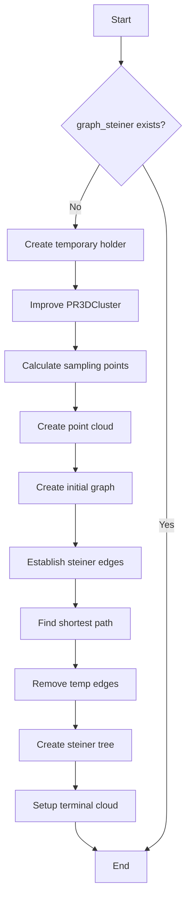

# Understanding create_steiner_graph()

## Overview
The `create_steiner_graph()` function is responsible for creating a Steiner tree graph representation of point clusters. It takes several parameters including point cloud data, geometry data source, and configuration parameters for rebinning and frame length.

## Flow Diagram


## Key Components

### 1. Initial Setup and Checking
```cpp
if (graph_steiner == (MCUGraph*)0) {
    WCP2dToy::WCPHolder *temp_holder = new WCP2dToy::WCPHolder();
    WCPPID::PR3DCluster *new_cluster = WCPPID::Improve_PR3DCluster_2(
        this, 
        ct_point_cloud, 
        gds, 
        temp_holder, 
        nrebin, 
        frame_length, 
        unit_dis
    );
}
```
The function first checks if a Steiner graph already exists. If not, it creates a temporary holder and improves the PR3DCluster.

### 2. Sampling Points Calculation
```cpp
WCPPID::calc_sampling_points(
    gds,
    new_cluster,
    nrebin, 
    frame_length, 
    unit_dis,
    false
);

new_cluster->Create_point_cloud();
new_cluster->Create_graph(ct_point_cloud, point_cloud);
```
It calculates sampling points and creates a point cloud with the associated graph structure.

### 3. Edge Management
```cpp
// Establish steiner edges
new_cluster->establish_same_mcell_steiner_edges(gds, false);

// Find shortest path
std::pair<WCPointCloud<double>::WCPoint, WCPointCloud<double>::WCPoint> wcps = 
    new_cluster->get_two_boundary_wcps();
new_cluster->dijkstra_shortest_paths(wcps.first);
new_cluster->cal_shortest_path(wcps.second);

// Remove temporary edges
new_cluster->remove_same_mcell_steiner_edges();
```

The function manages graph edges through several steps:
1. Establishes initial Steiner edges
2. Finds shortest paths between boundary points
3. Removes temporary edges used in the process

### 4. Steiner Tree Creation
```cpp
point_cloud_steiner = new ToyPointCloud();

// Create the steiner tree with basic cuts
graph_steiner = new_cluster->Create_steiner_tree(
    point_cloud_steiner, 
    flag_steiner_terminal, 
    gds, 
    mcells, 
    true, 
    false
);

establish_same_mcell_steiner_edges(gds, true, 2);
```

Creates the final Steiner tree structure and establishes permanent edges.

### 5. Terminal Cloud Setup
```cpp
point_cloud_steiner_terminal = new ToyPointCloud();
WCP::WCPointCloud<double>& cloud = point_cloud_steiner->get_cloud();
WCP::WC2DPointCloud<double>& cloud_u = point_cloud_steiner->get_cloud_u();
WCP::WC2DPointCloud<double>& cloud_v = point_cloud_steiner->get_cloud_v();
WCP::WC2DPointCloud<double>& cloud_w = point_cloud_steiner->get_cloud_w();

for (size_t i = 0; i != flag_steiner_terminal.size(); i++) {
    if (flag_steiner_terminal[i]) {
        point_cloud_steiner_terminal->AddPoint(
            cloud.pts[i],
            cloud_u.pts[i],
            cloud_v.pts[i],
            cloud_w.pts[i]
        );
    }
}
```

Sets up the terminal point cloud with points from different views (u, v, w coordinates).

## Important Parameters

1. `ct_point_cloud`: ToyCTPointCloud containing the point data
2. `gds`: GeomDataSource for geometry information
3. `nrebin`: Rebinning parameter
4. `frame_length`: Length of the frame
5. `unit_dis`: Unit distance parameter

## Example Usage

```cpp
// Create PR3DCluster instance
WCPPID::PR3DCluster cluster(1);

// Setup required parameters
WCP::ToyCTPointCloud ct_point_cloud;
WCPSst::GeomDataSource gds;
int nrebin = 4;
int frame_length = 2400;
double unit_dis = 0.1;

// Create the Steiner graph
cluster.create_steiner_graph(
    ct_point_cloud,
    gds,
    nrebin,
    frame_length,
    unit_dis
);

// Access the created graph
MCUGraph* steiner_graph = cluster.get_graph_steiner();
```

## Key Features

1. **Point Cloud Management**: Handles multiple point cloud representations
2. **Graph Construction**: Creates and manages graph structures
3. **Path Optimization**: Finds optimal paths between points
4. **Terminal Point Handling**: Manages terminal points in the Steiner tree
5. **Memory Management**: Properly handles temporary objects and cleanup

## Performance Considerations

- Memory usage depends on point cloud size and graph complexity
- Computational complexity affected by:
  - Number of points
  - Graph connectivity
  - Path finding operations
- Temporary objects are created and destroyed during processing

## Best Practices

1. Ensure input point cloud data is properly prepared
2. Monitor memory usage with large point clouds
3. Consider the impact of rebinning parameters
4. Verify geometry data source completeness
5. Handle cleanup of temporary objects

## Error Handling

The function includes various checks and balances:
- Null pointer checking for graph_steiner
- Parameter validation
- Memory management for temporary objects
- Edge case handling in path finding

## Related Functions

- `get_two_boundary_wcps()`
- `dijkstra_shortest_paths()` 
- `establish_same_mcell_steiner_edges()` For more details, refer to the [establish_same_mcell_steiner_edges.md](establish_same_mcell_steiner_edges.md) documentation.
- `Create_steiner_tree()` For more details, refer to the [create_steiner_tree.md](create_steiner_tree.md) documentation.
- `Improve_PR3DCluster_2()` For more details, refer to the [Improve_PR3DCluster_2.md](../ImproveCluster/Improve_PR3DCluster_2.md) documentation.

The function serves as a crucial component in the PR3DCluster system, creating an optimized Steiner tree representation of point clusters while managing multiple coordinate systems and graph structures.