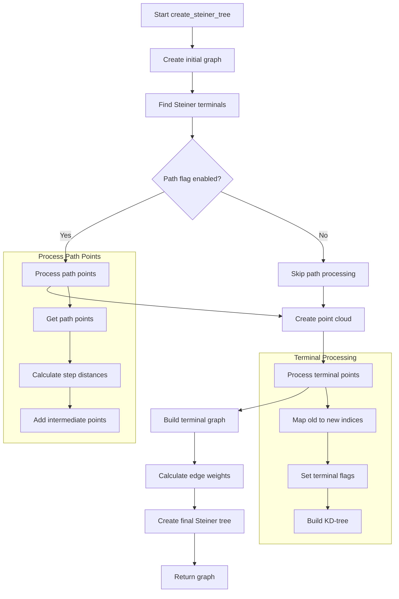

# Understanding the create_steiner_tree() Function

The `create_steiner_tree()` function is a critical component in the Wire-Cell Toolkit that constructs a Steiner tree from identified terminal points in a 3D cluster. This function creates an optimized graph structure connecting important points in particle tracks.

## Function Signature

```cpp
WCPPID::MCUGraph* PR3DCluster::Create_steiner_tree(
    WCP::ToyPointCloud *point_cloud_steiner,
    std::vector<bool>& flag_steiner_terminal,
    WCP::GeomDataSource& gds,
    WCP::SMGCSelection& old_mcells,
    bool flag_path,
    bool disable_dead_mix_cell
)
```

## Flow Diagram



## Key Components

### 1. Initialization and Graph Creation
The function starts by creating the initial graph structure and identifying terminal points:

```cpp
void Create_graph();  // Create initial graph structure
find_steiner_terminals(gds, disable_dead_mix_cell);  // Find terminal points
```

### 2. Path Processing
If path processing is enabled, the function handles path points with careful distance calculations:

```cpp
if (flag_path && path_wcps.size() > 0) {
    WCP::ToyPointCloud temp_pcloud;
    float step_dis = 0.6 * units::cm;  // Step distance for interpolation
    
    // Process each point in the path
    for (auto it = path_wcps.begin(); it != path_wcps.end(); it++) {
        WCP::Point p((*it).x, (*it).y, (*it).z);
        std::tuple<int,int,int> wire_index = std::make_tuple(
            (*it).index_u, 
            (*it).index_v, 
            (*it).index_w
        );

        // Calculate distances and add interpolation points if needed
        float dis = calculate_distance(prev_p, p);
        if (dis <= step_dis) {
            temp_pcloud.AddPoint(p, wire_index, 0);
        } else {
            add_interpolation_points(temp_pcloud, prev_p, p, dis, step_dis);
        }
    }
}
```
 For more details, refer to the [path_processing documentation](./path_processing.md).

### 3. Terminal Point Processing
The function processes terminal points and creates mappings:

```cpp
std::map<int,int> map_old_new_indices;
std::map<int,int> map_new_old_indices;

for (auto terminal_index : selected_terminal_indices) {
    // Process each terminal point
    Point p(cloud.pts[terminal_index].x,
            cloud.pts[terminal_index].y,
            cloud.pts[terminal_index].z);
            
    std::tuple<int,int,int> indices = std::make_tuple(
        cloud.pts[terminal_index].index_u,
        cloud.pts[terminal_index].index_v,
        cloud.pts[terminal_index].index_w
    );
    
    // Add point to steiner cloud
    point_cloud_steiner->AddPoint(p, indices, mcell);
    
    // Update mappings
    map_old_new_indices[terminal_index] = flag_steiner_terminal.size();
    map_new_old_indices[flag_steiner_terminal.size()] = terminal_index;
    
    // Set terminal flag
    flag_steiner_terminal.push_back(
        steiner_terminal_indices.find(terminal_index) != 
        steiner_terminal_indices.end()
    );
}
```
For more details, refer to the [terminal_point_processing documentation](./terminal_point_processing.md).


### 4. Edge Weight Calculation
The function calculates edge weights considering charge information:

```cpp
float calculate_edge_weight(float distance, float charge1, float charge2) {
    float Q0 = 10000;  // Base charge constant
    float factor1 = 0.8, factor2 = 0.4;  // Weight factors
    
    return distance * (
        factor1 + factor2 * (
            0.5 * Q0/(charge1 + Q0) + 
            0.5 * Q0/(charge2 + Q0)
        )
    );
}
```

### 5. Final Graph Construction
The function creates the final Steiner tree graph:

```cpp
MCUGraph* graph_steiner = new MCUGraph(flag_steiner_terminal.size());

for (auto edge : unique_edges) {
    int index1 = map_old_new_indices[source(edge)];
    int index2 = map_old_new_indices[target(edge)];
    float dis = get_edge_weight(edge);
    
    // Calculate charge-based weight
    float Qs = map_index_charge[source(edge)];
    float Qt = map_index_charge[target(edge)];
    float temp_dis = calculate_edge_weight(dis, Qs, Qt);
    
    // Add edge to graph
    add_edge(index1, index2, temp_dis, *graph_steiner);
}
```

## Important Details

1. **Charge Considerations**: 
   - Edge weights are modified based on charge measurements
   - A base charge constant (Q0) is used for normalization
   - Weights are adjusted using factors to balance distance and charge

2. **Point Selection**:
   - Points must meet charge thresholds
   - Points must have valid measurements in all wire planes
   - Points are validated against existing cell geometry

3. **Graph Optimization**:
   - Edges are uniquely identified
   - Redundant connections are eliminated
   - Weight calculations consider both geometric and charge information

## Example Usage

```cpp
// Create necessary objects
WCPPID::PR3DCluster cluster(1);
WCP::ToyPointCloud point_cloud_steiner;
std::vector<bool> flag_steiner_terminal;
WCP::GeomDataSource gds;
WCP::SMGCSelection old_mcells;

// Create Steiner tree
MCUGraph* steiner_tree = cluster.Create_steiner_tree(
    &point_cloud_steiner,
    flag_steiner_terminal,
    gds,
    old_mcells,
    true,  // Enable path processing
    true   // Disable dead/mixed cells
);

// Access the resulting graph
int num_vertices = boost::num_vertices(*steiner_tree);
int num_edges = boost::num_edges(*steiner_tree);
```

## Practical Applications

The Steiner tree created by this function serves several purposes:
1. Provides a minimal connecting structure for 3D particle tracks
2. Helps identify track topology and branching points
3. Supports particle identification by analyzing track structure
4. Aids in noise reduction by focusing on significant points

The resulting graph structure is particularly useful for:
- Track reconstruction
- Particle identification
- Event topology analysis
- Energy deposition studies