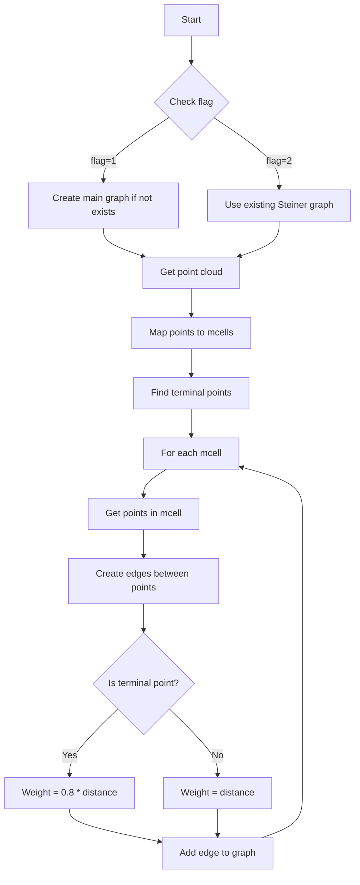

# Understanding establish_same_mcell_steiner_edges()

This document explains the functionality and logic of the `establish_same_mcell_steiner_edges()` function in the PR3DCluster class. The function creates edges between points that belong to the same merged cell (mcell) for use in Steiner tree calculations.

Also a function to `remove_same_mcell_steiner_edges()`

## Overview

The function has two different modes of operation controlled by the `flag` parameter:
1. `flag=1`: Operates on the main graph
2. `flag=2`: Operates on the Steiner graph

## Function Parameters

```cpp
void establish_same_mcell_steiner_edges(
    WCP::GeomDataSource& gds,         // Geometry data source
    bool disable_dead_mix_cell = true, // Whether to disable dead mixed cells
    int flag = 1                      // Operation mode (1 or 2)
)
```

## Core Logic Flow



## Mode 1: Main Graph Operation

In this mode, the function:
1. Creates a new graph if none exists
2. Maps points to their merged cells
3. Establishes edges between points in the same cell
4. Applies special weighting for terminal points

Example code:

```cpp
// Example of mode 1 operation
void example_mode1() {
    MCUGraph *graph = new MCUGraph();
    WCP::WCPointCloud<double>& cloud = point_cloud->get_cloud();
    
    // Map points to cells
    std::map<SlimMergeGeomCell*, std::set<int> > map_mcell_all_indices;
    
    // Create edges between points in same cell
    for (auto it = map_mcell_all_indices.begin(); 
         it != map_mcell_all_indices.end(); it++) {
        std::set<int>& temp_vec = it->second;
        for (auto it1 = temp_vec.begin(); it1 != temp_vec.end(); it1++) {
            int index1 = *it1;
            for (auto it2 = it1; it2 != temp_vec.end(); it2++) {
                if (it2 == it1) continue;
                int index2 = *it2;
                
                // Calculate distance and add edge
                double dist = calculate_distance(index1, index2);
                bool is_terminal = check_if_terminal(index1, index2);
                double weight = is_terminal ? dist * 0.8 : dist;
                
                add_edge(index1, index2, weight, *graph);
            }
        }
    }
}
```

## Mode 2: Steiner Graph Operation

In this mode, the function:
1. Uses the existing Steiner graph
2. Works with points that have associated cells (mcell != 0)
3. Creates edges with standard weights

Example code:

```cpp
// Example of mode 2 operation
void example_mode2() {
    WCP::WCPointCloud<double>& cloud = point_cloud_steiner->get_cloud();
    
    // Map points to cells (only valid cells)
    std::map<SlimMergeGeomCell*, std::set<int> > map_mcell_all_indices;
    for (size_t i = 0; i != cloud.pts.size(); i++) {
        if (cloud.pts.at(i).mcell == 0) continue;
        
        auto& mcell = cloud.pts.at(i).mcell;
        map_mcell_all_indices[mcell].insert(i);
    }
    
    // Create edges
    for (auto& mcell_indices : map_mcell_all_indices) {
        auto& indices = mcell_indices.second;
        for (auto it1 = indices.begin(); it1 != indices.end(); it1++) {
            for (auto it2 = std::next(it1); it2 != indices.end(); it2++) {
                double dist = calculate_distance(*it1, *it2);
                add_edge(*it1, *it2, dist, *graph_steiner);
            }
        }
    }
}
```

## Key Differences Between Modes

1. Graph Used
   - Mode 1: Uses main graph (`graph`)
   - Mode 2: Uses Steiner graph (`graph_steiner`)

2. Edge Weighting
   - Mode 1: Uses different weights for terminal points (0.8 * distance)
   - Mode 2: Uses uniform weights (just distance)

3. Point Selection
   - Mode 1: All points
   - Mode 2: Only points with valid cells

## Usage Examples

```cpp
// Using mode 1 (main graph)
cluster->establish_same_mcell_steiner_edges(gds, true, 1);

// Using mode 2 (Steiner graph)
cluster->establish_same_mcell_steiner_edges(gds, true, 2);
```