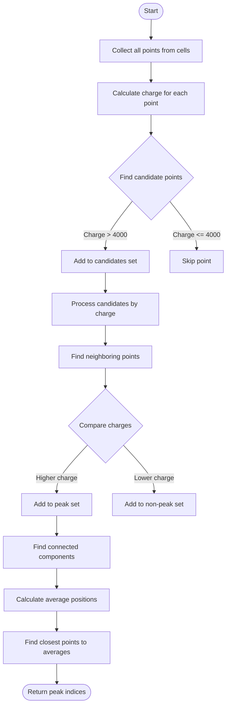

# Wire Chamber Peak Point Detection Documentation

## Function Overview

The `find_peak_point_indices()` function identifies peak points in wire chamber data by analyzing charge distributions across multiple cells. It's particularly useful for identifying significant charge deposits that could indicate particle interactions.

```cpp
std::set<int> find_peak_point_indices(
    SMGCSelection mcells,
    WCP::GeomDataSource& gds,
    bool disable_dead_mix_cell = true,
    int nlevel = 1
);
```

## Function Flow



## Implementation Details

### 1. Initial Point Collection
```cpp
std::set<int> all_indices;
for (auto it = mcells.begin(); it != mcells.end(); it++) {
    SlimMergeGeomCell *mcell = (*it);
    std::set<int>& indices = cell_point_indices_map[mcell];
    all_indices.insert(indices.begin(), indices.end());
}
```

### 2. Charge Calculation and Candidate Selection
```cpp
std::map<int, double> map_index_charge;
std::set<std::pair<double, int>, std::greater<std::pair<double, int>>> candidates_set;

for (auto it = all_indices.begin(); it != all_indices.end(); it++) {
    WCPointCloud<double>::WCPoint& wcp = cloud.pts[(*it)];
    std::pair<bool, double> temp_charge = calc_charge_wcp(wcp, gds, disable_dead_mix_cell);
    
    double charge = temp_charge.second;
    map_index_charge[(*it)] = charge;
    
    if ((charge > 4000) && temp_charge.first) {
        candidates_set.insert(std::make_pair(charge, *it));
    }
}
```

### 3. Peak Point Identification

The function uses a sophisticated algorithm to identify peak points:

```cpp
for (auto it = candidates_set.begin(); it != candidates_set.end(); it++) {
    int current_index = it->second;
    double current_charge = it->first;
    
    // Find connected points within nlevel steps
    std::set<int> total_vertices_found;
    total_vertices_found.insert(current_index);
    
    // Examine neighboring vertices
    std::set<int> vertices_to_be_examined;
    vertices_to_be_examined.insert(current_index);
    
    for (int j = 0; j != nlevel; j++) {
        std::set<int> vertices_saved_for_next;
        // Process current level vertices
        for (auto vertex_it = vertices_to_be_examined.begin(); 
             vertex_it != vertices_to_be_examined.end(); 
             vertex_it++) {
            // Find adjacent vertices
            // Add to next level if not already processed
        }
        vertices_to_be_examined = vertices_saved_for_next;
    }
}
```

### 4. Connected Component Analysis

After identifying peak points, the function analyzes connected components to ensure proper peak separation:

```cpp
if (peak_indices.size() > 1) {
    // Create graph for connected components
    boost::adjacency_list<...> temp_graph(N);
    
    // Find connected components
    std::vector<int> component(num_vertices(temp_graph));
    const int num = connected_components(temp_graph, &component[0]);
    
    // Process each component
    for (int i = 0; i != num; i++) {
        // Calculate average position
        points.at(i).x /= ncounts[i];
        points.at(i).y /= ncounts[i];
        points.at(i).z /= ncounts[i];
        
        // Find closest point to average
        for (size_t j = 0; j != component.size(); j++) {
            if (component[j] == i) {
                // Calculate distance and update if closest
            }
        }
    }
}
```

## Key Algorithms

### 1. Charge-Based Selection
- Points must exceed minimum charge threshold (4000)
- Charges are validated across multiple wire planes
- Higher charges are prioritized in candidate selection

### 2. Neighborhood Analysis
- Examines points within `nlevel` steps in the graph
- Compares charges between neighboring points
- Identifies local maxima in charge distribution

### 3. Connected Component Processing
- Groups related peak points
- Calculates centroid of each group
- Selects representative peak for each component

## Usage Example

```cpp
// Example usage
SMGCSelection merged_cells;  // Your merged cells
WCP::GeomDataSource geom_data;  // Your geometry data
bool disable_dead = true;
int neighborhood_level = 2;

std::set<int> peak_indices = find_peak_point_indices(
    merged_cells,
    geom_data,
    disable_dead,
    neighborhood_level
);

// Process the peak indices
for (auto peak_index : peak_indices) {
    WCPointCloud<double>::WCPoint& peak_point = cloud.pts[peak_index];
    // Use peak point information...
}
```

## Important Considerations

1. **Charge Threshold**
   - Default threshold of 4000 can be adjusted based on detector conditions
   - Higher thresholds reduce noise but might miss weaker signals

2. **Neighborhood Level**
   - `nlevel` parameter controls the scope of local maximum search
   - Higher values examine larger neighborhoods but increase computation time

3. **Connected Components**
   - Helps prevent multiple peaks in closely spaced regions
   - Ensures proper separation of distinct peak regions

4. **Performance Impact**
   - Processing time increases with number of points and neighborhood level
   - Connected component analysis adds additional computational overhead

## Common Applications

1. **Track Finding**
   - Identifying high-charge points along particle tracks
   - Initial seed points for track reconstruction

2. **Vertex Detection**
   - Finding interaction vertices in multi-track events
   - Identifying shower starting points

3. **Detector Calibration**
   - Mapping detector response
   - Identifying dead or noisy regions