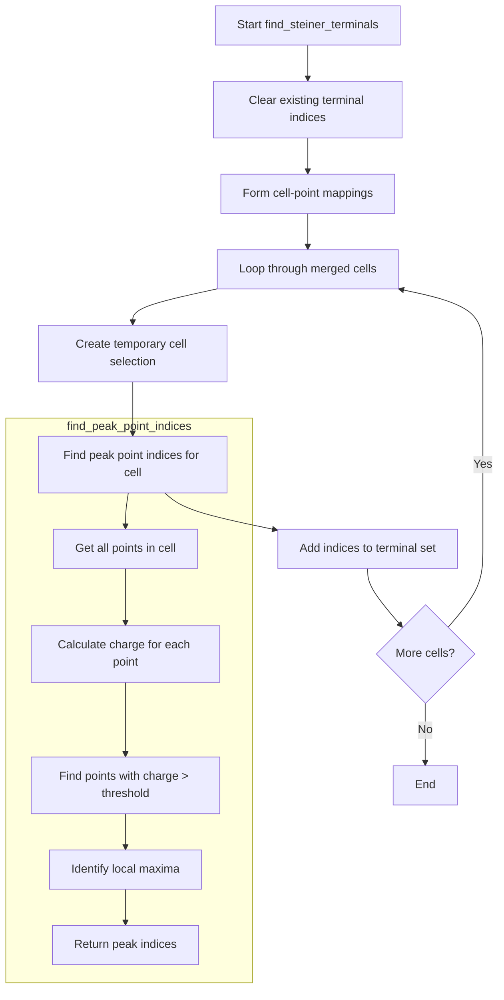

# Understanding the find_steiner_terminals() Function

The `find_steiner_terminals()` function is a crucial component in the Wire-Cell Toolkit's 3D clustering algorithm. Its primary purpose is to identify terminal points (or vertices) in a 3D cluster that will be used to construct a Steiner tree.

## Function Overview

```cpp
void WCPPID::PR3DCluster::find_steiner_terminals(WCP::GeomDataSource& gds, bool disable_dead_mix_cell) {
    // Reset the terminal indices
    steiner_terminal_indices.clear();
    
    // Create mappings between cells and points
    form_cell_points_map();

    // Process each merged cell
    for (size_t i = 0; i != mcells.size(); i++) {
        SMGCSelection temp_mcells;
        temp_mcells.push_back(mcells.at(i));
        // Find peak points for each cell
        std::set<int> indices = find_peak_point_indices(temp_mcells, gds, disable_dead_mix_cell);
        // Add these points to the terminal set
        steiner_terminal_indices.insert(indices.begin(), indices.end());
    }
}
```

## Flow Diagram



## Key Components

### 1. Cell-Point Mapping
The function first creates a mapping between geometric cells and their associated points using `form_cell_points_map()`:

```cpp
void form_cell_points_map() {
    cell_point_indices_map.clear();
    WCP::WCPointCloud<double>& cloud = point_cloud->get_cloud();
    
    for (auto mcell : mcells) {
        std::vector<int>& wcps = point_cloud->get_mcell_indices(mcell);
        std::set<int> point_indices;
        
        for (auto index : wcps) {
            WCPointCloud<double>::WCPoint& wcp = cloud.pts[index];
            point_indices.insert(wcp.index);
        }
        
        cell_point_indices_map[mcell] = point_indices;
    }
}
```

### 2. Peak Point Finding
The core logic is in `find_peak_point_indices()`, which identifies significant points in each cell:

```cpp
std::set<int> find_peak_point_indices(SMGCSelection mcells, WCP::GeomDataSource& gds, bool disable_dead_mix_cell) {
    // Get all points in the cells
    std::set<int> all_indices = get_cell_points(mcells);
    
    // Calculate charge for each point
    std::map<int, double> map_index_charge;
    for (auto index : all_indices) {
        auto charge = calc_charge_wcp(cloud.pts[index], gds, disable_dead_mix_cell);
        if (charge.second > 4000 && charge.first) {
            map_index_charge[index] = charge.second;
        }
    }
    
    // Find local maxima
    std::set<int> peak_indices;
    for (auto [charge, index] : map_index_charge) {
        if (is_local_maximum(index, map_index_charge)) {
            peak_indices.insert(index);
        }
    }
    
    return peak_indices;
}
```

## Important Details

1. **Charge Calculation**: The function uses `calc_charge_wcp()` to compute the charge at each point using information from three wire planes (U, V, W).

2. **Peak Detection**: Points are considered peaks if:
   - Their charge is above a threshold (4000)
   - They are local maxima in their neighborhood
   - They have valid charge measurements in all three wire planes

3. **Dead/Mixed Cell Handling**: The `disable_dead_mix_cell` parameter controls how the function handles cells with missing or problematic wire plane readings.

## Example Usage

Here's a simple example of how this function might be used:

```cpp
// Create a PR3DCluster object
WCPPID::PR3DCluster cluster(1);

// Add cells and create point cloud
cluster.AddCell(some_merge_cell, time_slice);
cluster.Create_point_cloud();

// Find Steiner terminals
WCP::GeomDataSource gds;  // geometry data source
bool disable_dead_mix_cell = true;
cluster.find_steiner_terminals(gds, disable_dead_mix_cell);

// Access the terminal indices
std::set<int>& terminals = cluster.get_steiner_terminals();
```

## Practical Applications

The Steiner terminals identified by this function are used to:
1. Create a minimal spanning tree connecting significant points in the cluster
2. Establish the topology of particle tracks
3. Aid in particle identification and track reconstruction

This forms a crucial part of the Wire-Cell Toolkit's 3D reconstruction capabilities, helping to convert 2D wire plane readings into 3D particle tracks.