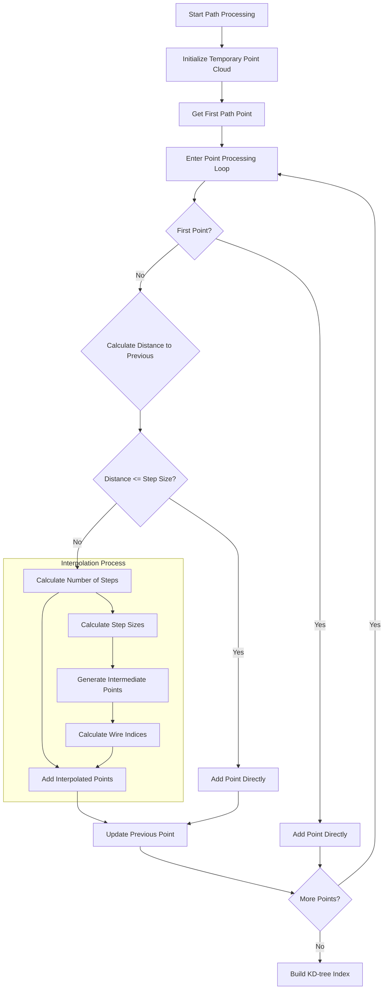

# Path Processing in create_steiner_tree()

This document provides a detailed explanation of the path processing component within the `create_steiner_tree()` function. Path processing is crucial for creating accurate representations of particle tracks by handling the interpolation and connection of points.

## Overview

The path processing logic is activated when `flag_path` is true and there are path points available (`path_wcps.size() > 0`). Its main purpose is to create a smooth, continuous path by adding intermediate points when necessary.

## Flow Diagram



## Detailed Code Analysis

### 1. Initial Setup

```cpp
if (flag_path && path_wcps.size() > 0) {
    WCP::ToyPointCloud temp_pcloud;
    WCP::Point prev_p((*(path_wcps.begin())).x, 
                      (*(path_wcps.begin())).y, 
                      (*(path_wcps.begin())).z);
    
    std::tuple<int,int,int> prev_wire_index = std::make_tuple(
        (*(path_wcps.begin())).index_u,
        (*(path_wcps.begin())).index_v,
        (*(path_wcps.begin())).index_w
    );
```

### 2. Point Processing Loop

```cpp
for (auto it = path_wcps.begin(); it != path_wcps.end(); it++) {
    // Current point data
    WCP::Point p((*it).x, (*it).y, (*it).z);
    std::tuple<int,int,int> wire_index = std::make_tuple(
        (*it).index_u,
        (*it).index_v,
        (*it).index_w
    );

    // First point handling
    if (temp_pcloud.get_num_points() == 0) {
        temp_pcloud.AddPoint(p, wire_index, 0);
        continue;
    }
```

### 3. Distance Calculation and Step Size

```cpp
float step_dis = 0.6 * units::cm;  // Standard step distance
float dis = sqrt(pow(p.x - prev_p.x, 2) + 
                pow(p.y - prev_p.y, 2) + 
                pow(p.z - prev_p.z, 2));
```

### 4. Point Addition Logic

```cpp
if (dis <= step_dis) {
    // Direct addition for close points
    temp_pcloud.AddPoint(p, wire_index, 0);
    prev_p = p;
    prev_wire_index = wire_index;
} else {
    // Interpolation for distant points
    int num_steps = dis/step_dis;
    AddInterpolatedPoints(temp_pcloud, prev_p, p, num_steps, wire_index);
}
```

### 5. Interpolation Process

Here's the detailed interpolation logic:

```cpp
void AddInterpolatedPoints(WCP::ToyPointCloud& pcloud,
                         const WCP::Point& start,
                         const WCP::Point& end,
                         int num_steps,
                         const std::tuple<int,int,int>& end_wire) {
    
    auto [start_u, start_v, start_w] = prev_wire_index;
    auto [end_u, end_v, end_w] = end_wire;

    for (int step = 1; step <= num_steps; step++) {
        // Position interpolation
        WCP::Point temp_p(
            start.x + (end.x - start.x) * step / num_steps,
            start.y + (end.y - start.y) * step / num_steps,
            start.z + (end.z - start.z) * step / num_steps
        );

        // Wire index interpolation
        std::tuple<int,int,int> temp_wire_index = std::make_tuple(
            start_u + (end_u - start_u) * step / num_steps,
            start_v + (end_v - start_v) * step / num_steps,
            start_w + (end_w - start_w) * step / num_steps
        );

        pcloud.AddPoint(temp_p, temp_wire_index, 0);
    }
}
```

## Key Concepts

### 1. Step Distance
- A fixed step distance (0.6 cm) is used to determine when interpolation is needed
- This ensures uniform point spacing throughout the path

### 2. Linear Interpolation
- Both spatial coordinates (x, y, z) and wire indices (u, v, w) are interpolated
- Linear interpolation maintains smooth transitions between points

### 3. Wire Index Handling
- Wire indices are treated as continuous values during interpolation
- This maintains the relationship between spatial position and wire plane readout

## Example Scenarios

### Case 1: Close Points
```cpp
// Given two points 0.4 cm apart
Point p1(0, 0, 0);
Point p2(0.3, 0.2, 0.2);
// Distance < 0.6 cm, so p2 is added directly
```

### Case 2: Distant Points
```cpp
// Given two points 1.8 cm apart
Point p1(0, 0, 0);
Point p2(1.5, 0.8, 0.6);
// Distance = 1.8 cm
// num_steps = 3
// Will create 2 intermediate points
```

## Impact on Tree Construction

The path processing affects the Steiner tree construction in several ways:

1. **Point Density**
   - Ensures uniform point distribution
   - Prevents gaps in track reconstruction

2. **Graph Connectivity**
   - Creates more natural connections between points
   - Improves track topology representation

3. **Charge Distribution**
   - Allows for more accurate charge distribution calculation
   - Helps in energy deposition studies

## Example Usage

```cpp
// Example of using the path processing
WCPPID::PR3DCluster cluster(1);

// Add some path points
cluster.set_path_wcps(some_path_points);

// Create Steiner tree with path processing
auto* steiner_tree = cluster.Create_steiner_tree(
    point_cloud_steiner,
    flag_steiner_terminal,
    gds,
    old_mcells,
    true,  // Enable path processing
    true   // Disable dead/mixed cells
);
```

## Practical Considerations

1. **Performance**
   - More points mean more computational overhead
   - Step size choice balances detail vs performance

2. **Memory Usage**
   - Interpolation increases memory requirements
   - Temporary point cloud helps manage memory

3. **Accuracy**
   - Linear interpolation may not capture sharp turns
   - Wire index interpolation assumes smooth detector response

4. **Edge Cases**
   - Handles first and last points specially
   - Manages transitions between segments