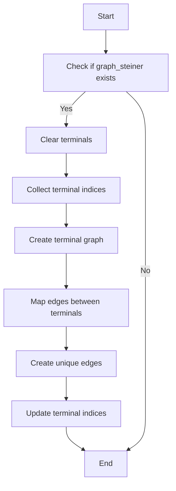

# Understanding recover_steiner_graph()

## Overview
The `recover_steiner_graph()` function is part of the PR3DCluster class and is responsible for processing a Steiner tree graph to identify and recover terminal nodes and their connections. It uses graph theory concepts to find the optimal paths between terminal points in the graph.

## Flow Diagram


## Key Components

### 1. Terminal Collection
```cpp
steiner_graph_terminal_indices.clear();
std::vector<int> terminals;
for (size_t i = 0; i != flag_steiner_terminal.size(); i++) {
    if (flag_steiner_terminal[i]) {
        terminals.push_back(i);
        steiner_graph_terminal_indices.insert(i);
    }
}
```

The function first collects all terminal points from the graph. Terminals are special points marked by `flag_steiner_terminal`.

### 2. Graph Construction
```cpp
// Create terminal graph with properties
using TerminalGraph = boost::adjacency_list<
    boost::vecS, 
    boost::vecS, 
    boost::undirectedS,
    boost::no_property, 
    WeightProperty
>;
TerminalGraph terminal_graph(N);
```

A new graph is constructed to represent connections between terminal points.

### 3. Voronoi Diagram Computation
```cpp
// Compute voronoi diagram using Dijkstra
boost::dijkstra_shortest_paths(
    *graph_steiner, 
    terminals.begin(), 
    terminals.end(), 
    boost::dummy_property_map(),
    distance_map,
    edge_weight,
    index,
    paal::utils::less(),
    boost::closed_plus<Weight>(),
    std::numeric_limits<Weight>::max(),
    0,
    boost::make_dijkstra_visitor(
        paal::detail::make_nearest_recorder(
            nearest_terminal_map, 
            last_edge, 
            boost::on_edge_relaxed{}
        )
    )
);
```

The function uses Dijkstra's algorithm to compute a Voronoi diagram, which partitions the graph based on the nearest terminal to each vertex.

### 4. Edge Mapping
```cpp
// Example of edge mapping logic
for (auto w : boost::as_array(edges(*graph))) {
    auto const &nearest_to_source = nearest_terminal_map[source(w, *graph)];
    auto const &nearest_to_target = nearest_terminal_map[target(w, *graph)];
    if (nearest_to_source != nearest_to_target) {
        Weight temp_weight = distance[source(w, *graph)] + 
                           distance[target(w, *graph)] + 
                           edge_weight[w];
        // Store the edge if it's the best path between these terminals
        map_saved_edge[std::make_pair(nearest_to_source, nearest_to_target)] = 
            std::make_pair(temp_weight, w);
    }
}
```

The function maps edges between terminals, keeping track of the best paths between them.

## Key Features

1. **Terminal Identification**: The function identifies terminal points in the Steiner graph.
2. **Path Optimization**: It finds optimal paths between terminals using Dijkstra's algorithm.
3. **Edge Selection**: The function selects the best edges to connect terminals while minimizing total weight.
4. **Graph Maintenance**: It maintains the graph structure while processing and updating terminal connections.

## Example Usage

```cpp
// Create a PR3DCluster instance
WCPPID::PR3DCluster cluster(1);

// Setup the Steiner graph
// ... (graph setup code)

// Recover the Steiner graph
cluster.recover_steiner_graph();

// Access the recovered terminals
std::set<int> terminals = cluster.get_steiner_graph_terminals();
```

## Important Notes

1. The function requires a pre-existing Steiner graph (`graph_steiner`).
2. It uses the Boost Graph Library for graph operations.
3. The function updates both `steiner_graph_terminal_indices` and `steiner_graph_selected_terminal_indices`.
4. Edge weights and distances are considered when optimizing paths.

## Performance Considerations

- Time complexity is dominated by Dijkstra's algorithm: O(E log V)
- Space complexity is O(V + E) for graph storage
- Performance depends on the number of terminals and graph connectivity