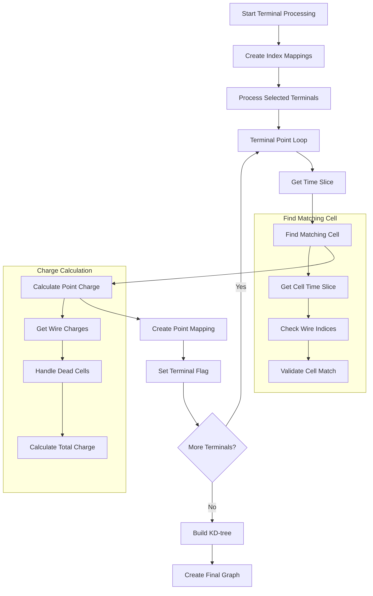

# Terminal Point Processing in create_steiner_tree()

This document provides a detailed explanation of the terminal point processing component within the `create_steiner_tree()` function. Terminal points are crucial as they represent significant positions in the particle track that must be connected in the final Steiner tree.

## Flow Diagram



## Detailed Components

### 1. Index Mapping Setup
New indices are the indices for the terminal point cloud
Old indices are the indices for the points in the original point cloud
```cpp
// Create mappings between old and new indices
std::map<int,int> map_old_new_indices;
std::map<int,int> map_new_old_indices;
```

### 2. Terminal Point Processing Loop

```cpp
for (auto terminal_index : selected_terminal_indices) {
    SlimMergeGeomCell *mcell = nullptr;
    int time_slice = cloud.pts[terminal_index].mcell->GetTimeSlice();

    // Find matching cell
    if (old_time_mcells_map.find(time_slice) != old_time_mcells_map.end()) {
        for (auto cell : old_time_mcells_map[time_slice]) {
            if (is_point_in_cell(cloud.pts[terminal_index], cell)) {
                mcell = cell;
                break;
            }
        }
    }
```

### 3. Point-in-Cell Validation

```cpp
bool is_point_in_cell(const WCPoint& point, SlimMergeGeomCell* cell) {
    // Get wire index ranges
    int u_low = cell->get_uwires().front()->index();
    int u_high = cell->get_uwires().back()->index();
    int v_low = cell->get_vwires().front()->index();
    int v_high = cell->get_vwires().back()->index();
    int w_low = cell->get_wwires().front()->index();
    int w_high = cell->get_wwires().back()->index();

    // Check if point's wire indices fall within ranges
    return (point.index_u <= u_high + 1 && point.index_u >= u_low - 1 &&
            point.index_v <= v_high + 1 && point.index_v >= v_low - 1 &&
            point.index_w <= w_high + 1 && point.index_w >= w_low - 1);
}
```

### 4. Charge Calculation

```cpp
std::pair<bool,double> calc_charge_wcp(WCP::WCPointCloud<double>::WCPoint& wcp, 
                                     WCP::GeomDataSource& gds, 
                                     bool disable_dead_mix_cell) {
    double charge = 0;
    double ncharge = 0;
    
    // Get wire charges
    const GeomWire *uwire = gds.by_planeindex(WirePlaneType_t(0), wcp.index_u);
    const GeomWire *vwire = gds.by_planeindex(WirePlaneType_t(1), wcp.index_v);
    const GeomWire *wwire = gds.by_planeindex(WirePlaneType_t(2), wcp.index_w);
    
    double charge_u = wcp.mcell->Get_Wire_Charge(uwire);
    double charge_v = wcp.mcell->Get_Wire_Charge(vwire);
    double charge_w = wcp.mcell->Get_Wire_Charge(wwire);

    // Process charges based on configuration
    if (disable_dead_mix_cell) {
        // Handle enabled cells
        charge += charge_u * charge_u; ncharge++;
        charge += charge_v * charge_v; ncharge++;
        charge += charge_w * charge_w; ncharge++;
        
        // Handle bad planes
        for (auto bad_plane : wcp.mcell->get_bad_planes()) {
            if (bad_plane == WirePlaneType_t(0)) {
                charge -= charge_u * charge_u; ncharge--;
            } else if (bad_plane == WirePlaneType_t(1)) {
                charge -= charge_v * charge_v; ncharge--;
            } else if (bad_plane == WirePlaneType_t(2)) {
                charge -= charge_w * charge_w; ncharge--;
            }
        }
    } else {
        // Handle dead cells differently
        if (charge_u != 0) { charge += charge_u * charge_u; ncharge++; }
        if (charge_v != 0) { charge += charge_v * charge_v; ncharge++; }
        if (charge_w != 0) { charge += charge_w * charge_w; ncharge++; }
    }
    
    // Calculate final charge
    if (ncharge > 1) {
        charge = sqrt(charge/ncharge);
    } else {
        charge = 0;
    }
    
    return std::make_pair(true, charge);
}
```

### 5. Point Addition and Flag Setting

```cpp
// Add point to steiner cloud
Point p(cloud.pts[terminal_index].x,
        cloud.pts[terminal_index].y,
        cloud.pts[terminal_index].z);
        
std::tuple<int,int,int> indices = std::make_tuple(
    cloud.pts[terminal_index].index_u,
    cloud.pts[terminal_index].index_v,
    cloud.pts[terminal_index].index_w
);

point_cloud_steiner->AddPoint(p, indices, mcell);

// Update mappings
map_old_new_indices[terminal_index] = flag_steiner_terminal.size();
map_new_old_indices[flag_steiner_terminal.size()] = terminal_index;

// Set terminal flag
flag_steiner_terminal.push_back(
    steiner_terminal_indices.find(terminal_index) != 
    steiner_terminal_indices.end()
);
```

## Key Concepts

### 1. Terminal Point Selection
- Points are selected based on charge and geometric criteria
- Must have valid measurements in multiple wire planes
- Should represent significant features in the track

### 2. Cell Matching
- Each terminal point must be associated with a valid cell
- Points near cell boundaries are handled with tolerance
- Time slice matching ensures temporal consistency

### 3. Charge Processing
- Charges from multiple wire planes are combined
- Dead or problematic channels are handled specially
- Charge thresholds help identify significant points

## Example Scenarios

### 1. Standard Terminal Point
```cpp
// Example of a good terminal point
Point p(10.5, 20.3, 30.7);
WireIndices w(150, 200, 250);  // u, v, w indices
Charges c(5000, 4800, 5200);   // Good charges on all planes
// Result: Valid terminal point
```

### 2. Boundary Case
```cpp
// Point near cell boundary
Point p(15.2, 25.8, 35.4);
WireIndices w(199, 250, 300);  // Near boundary
Charges c(4500, 4300, 4600);   // Good charges
// Result: Valid with boundary tolerance
```

### 3. Dead Channel Case
```cpp
// Point with dead channel
Point p(12.4, 22.6, 32.8);
WireIndices w(175, 225, 275);
Charges c(4800, 0, 5100);      // Dead v-plane
// Result: Handled based on disable_dead_mix_cell flag
```

## Impact on Tree Construction

Terminal point processing affects the Steiner tree in several ways:

1. **Graph Structure**
   - Determines key points that must be connected
   - Influences overall tree topology

2. **Charge Distribution**
   - Affects edge weight calculations
   - Influences path selection in final tree

3. **Resolution**
   - Number of terminals affects detail level
   - Balances between detail and computational efficiency

## Practical Considerations

1. **Performance**
   - Number of terminals affects computation time
   - Cell matching can be computationally intensive

2. **Accuracy**
   - Terminal selection crucial for track reconstruction
   - Balance needed between coverage and significance

3. **Edge Cases**
   - Dead channels require special handling
   - Boundary points need careful validation

4. **Memory Management**
   - Index mappings must be maintained
   - Point cloud structure grows with terminals

## Quality Assurance

The terminal point processing includes several validation checks:

1. **Charge Validation**
   - Minimum charge thresholds
   - Multi-plane consistency checks

2. **Geometric Validation**
   - Cell boundary checks
   - Wire index range validation

3. **Temporal Consistency**
   - Time slice matching
   - Adjacent cell checking

4. **Data Quality**
   - Dead channel handling
   - Noise rejection