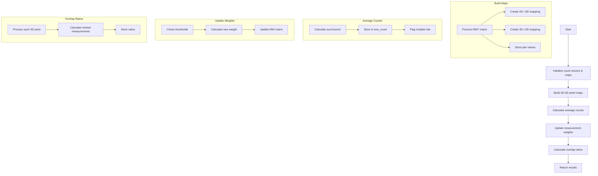

# Understanding cal_compact_matrix Function

## Overview

The `cal_compact_matrix()` function is part of a wire cell reconstruction algorithm in particle physics. It analyzes charge sharing between different wire planes by examining the overlap between adjacent detector points and modifying measurement weights accordingly.

## Function Signature
```cpp
std::vector<std::pair<double, double> > cal_compact_matrix(
    Eigen::SparseMatrix<double>& MW,    // Measurement weight matrix 
    Eigen::SparseMatrix<double>& RWT,   // Response matrix transpose
    int n_2D_w,                         // Number of 2D wire measurements
    int n_3D_pos,                       // Number of 3D positions
    double cut_pos                      // Position cut threshold
)
```

## Key Components

1. **Input Data Structures**:
   - `MW`: Weight matrix for each 2D measurement
   - `RWT`: Transposed response matrix mapping 3D positions to 2D measurements  
   - `n_2D_w`: Number of 2D wire measurements
   - `n_3D_pos`: Number of 3D positions to reconstruct
   - `cut_pos`: Position cut threshold for overlap analysis

2. **Output Structure**:
   - Returns vector of pairs containing overlap ratios for each 3D position
   - Each pair contains (previous overlap ratio, next overlap ratio)

## Detailed Logic Flow



## Key Algorithms

### 1. Building Point Maps
```cpp
// Example of building 2D-3D point mapping
std::map<int, std::set<int> > map_2D_3D;
for (int k=0; k<RWT.outerSize(); ++k) {
    for (Eigen::SparseMatrix<double>::InnerIterator it(RWT,k); it; ++it) {
        if (map_2D_3D.find(it.col()) != map_2D_3D.end()) {
            map_2D_3D[it.col()].insert(it.row());
        } else {
            std::set<int> temp_set;
            temp_set.insert(it.row());
            map_2D_3D[it.col()] = temp_set;
        }
    }
}
```

### 2. Calculating Average Counts
```cpp
// Example of calculating average counts
std::vector<std::pair<double,int>> ave_count(n_3D_pos);
for (auto it = map_3D_2D.begin(); it != map_3D_2D.end(); it++) {
    double sum1 = 0, sum2 = 0;
    int flag = 0;
    for (auto it1 = it->second.begin(); it1 != it->second.end(); it1++) {
        double val = map_pair_val[std::make_pair(it->first, *it1)];
        sum1 += count_2D[*it1] * val;
        sum2 += val;
        if (count_2D[*it1] > 2) flag = 1;
    }
    ave_count.at(it->first) = std::make_pair(sum1/sum2, flag);
}
```

### 3. Calculating Overlap Ratios
```cpp
// Example of calculating overlap ratios
for (auto it = map_3D_2D.begin(); it != map_3D_2D.end(); it++) {
    int row = it->first;
    std::vector<double> sum = {0,0,0};
    
    // Current point measurements
    for (auto it3 = it->second.begin(); it3 != it->second.end(); it3++) {
        sum[0] += 1;
    }
    
    // Calculate shared measurements with previous point
    auto it1 = map_3D_2D.find(row-1);
    if (it1 != map_3D_2D.end()) {
        std::vector<int> common_results;
        std::set_intersection(it->second.begin(), it->second.end(),
                            it1->second.begin(), it1->second.end(),
                            std::back_inserter(common_results));
        sum[1] = common_results.size();
    }
    
    // Store overlap ratios
    results.at(row).first = sum[1]/sum[0];  // Previous overlap
    results.at(row).second = sum[2]/sum[0]; // Next overlap
}
```

## Function Dependencies

The function uses the following external functions/libraries:

1. **Eigen Library Functions**:
   - `SparseMatrix` operations
   - `InnerIterator` for sparse matrix traversal

2. **STL Functions**:
   - `std::set_intersection`
   - `std::vector` operations
   - `std::map` operations
   - `std::set` operations
   
3. **Helper Functions** (called within project):
   - None - this is a self-contained function

## Usage Example

```cpp
// Create sample matrices
Eigen::SparseMatrix<double> MW(10, 10);  // 10x10 measurement weight matrix
Eigen::SparseMatrix<double> RWT(10, 20); // 10x20 response matrix transpose

// Fill matrices with some sample values
// ... (matrix filling code)

// Call the function
std::vector<std::pair<double, double>> overlaps = 
    cal_compact_matrix(MW, RWT, 10, 20, 2.0);

// Process results
for (size_t i = 0; i < overlaps.size(); i++) {
    std::cout << "Position " << i << ": "
              << "Previous overlap: " << overlaps[i].first << ", "
              << "Next overlap: " << overlaps[i].second << std::endl;
}
```

## Key Use Cases

1. **Dead Channel Handling**: 
   - Identifies measurements affected by dead channels
   - Adjusts weights to compensate for missing information

2. **Charge Sharing**:
   - Quantifies charge sharing between adjacent measurements
   - Helps improve position reconstruction accuracy

3. **Measurement Quality**:
   - Evaluates measurement quality based on overlap patterns
   - Adjusts measurement weights accordingly

## Common Pitfalls

1. **Sparse Matrix Access**:
   - Be careful with sparse matrix traversal order
   - Ensure proper initialization of sparse matrices

2. **Memory Management**:
   - Large maps and sets can consume significant memory
   - Consider clearing temporary containers when possible

3. **Numerical Stability**:
   - Check for division by zero when calculating ratios
   - Consider numerical precision in floating-point calculations