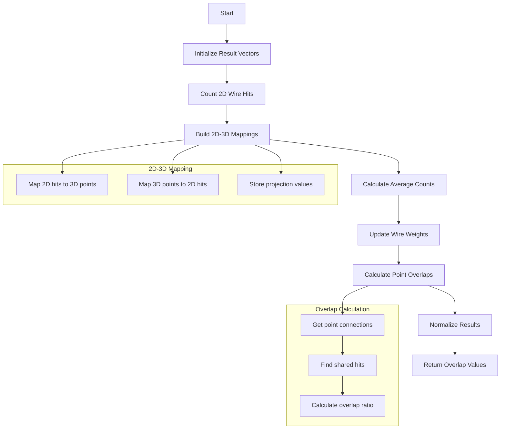

# Understanding cal_compact_matrix_multi Function

## Purpose

The `cal_compact_matrix_multi` function is designed to analyze and calculate overlap between different wire segments in a wire chamber detector, specifically dealing with connected trajectory points. It takes into account connections between 3D points and their projections onto 2D wire planes.

## Function Signature

```cpp
std::vector<std::vector<double>> cal_compact_matrix_multi(
    std::vector<std::vector<int>>& connected_vec,  // Connected points for each 3D position
    Eigen::SparseMatrix<double>& MW,               // Weight matrix for 2D projections
    Eigen::SparseMatrix<double>& RWT,              // Transpose of projection matrix
    int n_2D_w,                                    // Number of 2D wire signals
    int n_3D_pos,                                  // Number of 3D positions
    double cut_pos = 2                            // Cut threshold for counting overlaps
)
```

## Operation Flow

1. Initialize results structure:
   - Creates a vector of vectors to store overlap values for each 3D point and its connections
   - Each sub-vector corresponds to a 3D point's connections to other points

2. Initial Data Collection:
   - Counts 2D wire hits (count_2D vector)
   - Creates mappings between:
     * 2D wire hits → 3D points (map_2D_3D)
     * 3D points → 2D wire hits (map_3D_2D)
   - Stores projection values in map_pair_val

3. Calculate Average Counts:
   - For each 3D point, calculates weighted average of connected 2D hits
   - Flags points that connect to high-multiplicity wire hits

4. Adjust Wire Hit Weights:
   - Updates MW matrix weights based on hit sharing patterns
   - Applies stronger weights for shared hits above threshold

5. Calculate Final Overlap Values:
   - For each 3D point and its connections, calculates overlap ratio
   - Normalizes based on total number of shared hits

## Example Usage

```cpp
// Example setup
std::vector<std::vector<int>> connected_points = {
    {1, 2},    // Point 0 connects to points 1 and 2
    {0, 2},    // Point 1 connects to points 0 and 2
    {0, 1}     // Point 2 connects to points 0 and 1
};

// Create sparse matrices (simplified example)
Eigen::SparseMatrix<double> MW(n_2D_w, n_2D_w);
Eigen::SparseMatrix<double> RWT(n_3D_pos, n_2D_w);

// Fill matrices with projection and weight values
// ... (matrix population code)

// Calculate overlaps
auto overlaps = cal_compact_matrix_multi(connected_points, MW, RWT, 
                                       n_2D_w, n_3D_pos, 2.0);

// Example output structure:
// overlaps[0] = {0.8, 0.6}  // Point 0's overlap with points 1 and 2
// overlaps[1] = {0.8, 0.7}  // Point 1's overlap with points 0 and 2
// overlaps[2] = {0.6, 0.7}  // Point 2's overlap with points 0 and 1
```

## Key Calculations

### 2D Hit Counting
```cpp
std::vector<int> count_2D(n_2D_w, 1);
for (int k = 0; k < RWT.outerSize(); ++k) {
    int count = 0;
    for (Eigen::SparseMatrix<double>::InnerIterator it(RWT,k); it; ++it) {
        count++;
    }
    count_2D[k] = count;
}
```

### Overlap Calculation
```cpp
// For each 3D point and its connections
double sum[2] = {0, 0};
for (auto it3 = point_hits.begin(); it3 != point_hits.end(); it3++) {
    int col = *it3;
    double val = map_pair_val[std::make_pair(row, col)];
    sum[0] += 1;  // Count total hits
}
// Calculate overlap with connected point
if (connected_hits != hits.end()) {
    std::vector<int> common_hits(hits.size());
    auto it3 = std::set_intersection(hits.begin(), hits.end(), 
                                   connected_hits->begin(), connected_hits->end(), 
                                   common_hits.begin());
    common_hits.resize(it3-common_hits.begin());
    for (auto it3 = common_hits.begin(); it3 != common_hits.end(); it3++) {
        sum[1] += 1;  // Count shared hits
    }
}
// Overlap ratio
double overlap = sum[1]/(sum[0]+1e-9);
```

## Flow Diagram



## Practical Application

This function is crucial for:

1. Understanding hit sharing between adjacent trajectory points
2. Identifying potential track overlaps or crossings
3. Weighting reconstruction parameters based on hit sharing
4. Improving track reconstruction in dense detector regions

The overlap values help inform track fitting and disambiguation in cases where multiple 3D points project onto the same 2D wire regions.