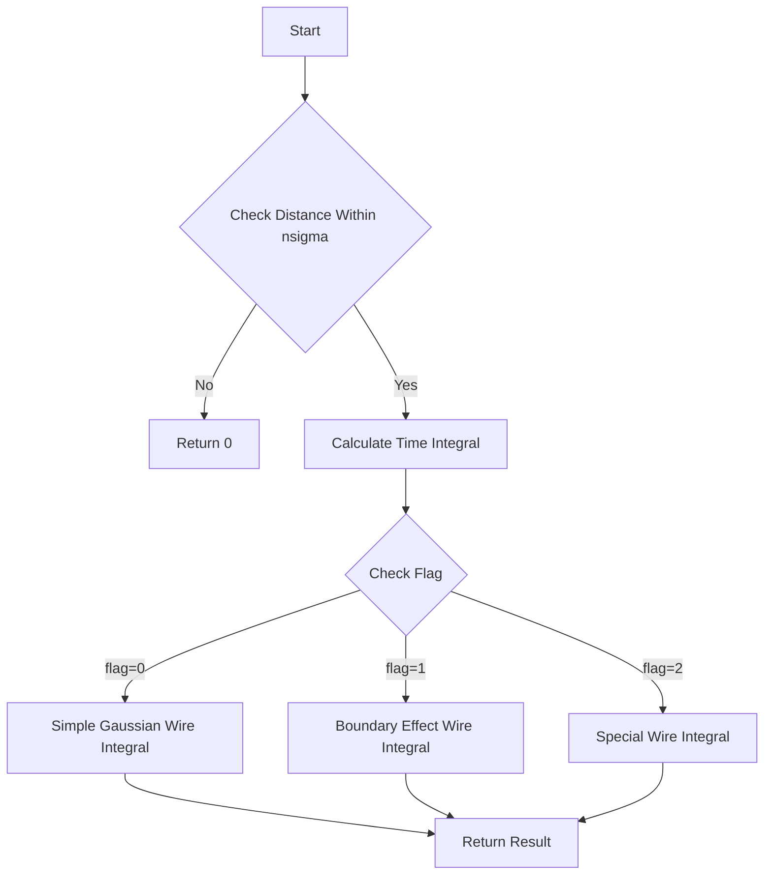

# Gaussian Integral Functions Documentation

## Overview

The `cal_gaus_integral` and related functions are used to calculate the integral of a 2D Gaussian distribution over specific time and wire bins in a wire chamber detector. These functions are critical for charge reconstruction and signal processing.

## Main Functions

### cal_gaus_integral

```cpp
double cal_gaus_integral(
    int tbin,           // Time bin
    int wbin,           // Wire bin
    double t_center,    // Center of Gaussian in time dimension
    double t_sigma,     // Sigma of Gaussian in time dimension  
    double w_center,    // Center of Gaussian in wire dimension
    double w_sigma,     // Sigma of Gaussian in wire dimension
    int flag,           // Flag for boundary effects (0=no boundary, 1=induction, 2=special)
    double nsigma       // Number of sigmas to integrate over
)
```

### cal_gaus_integral_seg

```cpp
double cal_gaus_integral_seg(
    int tbin,                          // Time bin
    int wbin,                          // Wire bin
    std::vector<double>& t_centers,    // Vector of time centers
    std::vector<double>& t_sigmas,     // Vector of time sigmas
    std::vector<double>& w_centers,    // Vector of wire centers 
    std::vector<double>& w_sigmas,     // Vector of wire sigmas
    std::vector<double>& weights,      // Vector of weights
    int flag,                          // Boundary effect flag
    double nsigma                      // Number of sigmas
)
```

## Core Logic Flow



## Detailed Explanation

1. **Distance Check**
   - Before performing expensive calculations, the function checks if the point is within a reasonable distance (nsigma * sigma) of the Gaussian center in both time and wire dimensions.
   - If outside this range, returns 0 immediately.

2. **Time Integration** 
   - For the time dimension, calculates error function (erf) integral between bin edges:
   ```cpp
   result = 0.5 * (std::erf((tbin+1-t_center)/sqrt(2.)/t_sigma) - 
                   std::erf((tbin-t_center)/sqrt(2.)/t_sigma));
   ```

3. **Wire Integration**
   Depends on flag value:

   - **flag = 0**: Simple Gaussian integration like time dimension
   ```cpp
   result *= 0.5 * (std::erf((wbin+1-w_center)/sqrt(2.)/w_sigma) -
                    std::erf((wbin-w_center)/sqrt(2.)/w_sigma));
   ```

   - **flag = 1**: Handles induction plane boundary effects
   - **flag = 2**: Special case with weighted segments

4. **Segmented Version**
   - `cal_gaus_integral_seg` handles multiple Gaussian distributions
   - Calls `cal_gaus_integral` for each segment
   - Combines results using provided weights

## Example Usage

```cpp
// Simple Gaussian integration
double result1 = cal_gaus_integral(
    10,     // time bin
    20,     // wire bin
    10.5,   // time center
    1.0,    // time sigma
    20.2,   // wire center
    0.8,    // wire sigma
    0,      // no boundary effects
    3.0     // integrate to 3 sigma
);

// Multiple segment integration
std::vector<double> t_centers = {10.5, 11.0};
std::vector<double> t_sigmas = {1.0, 1.2};
std::vector<double> w_centers = {20.2, 20.5};
std::vector<double> w_sigmas = {0.8, 0.9};
std::vector<double> weights = {1.0, 0.8};

double result2 = cal_gaus_integral_seg(
    10,         // time bin
    20,         // wire bin
    t_centers,  // vector of time centers
    t_sigmas,   // vector of time sigmas 
    w_centers,  // vector of wire centers
    w_sigmas,   // vector of wire sigmas
    weights,    // vector of weights
    0,          // no boundary effects
    3.0         // integrate to 3 sigma
);
```

## Function Dependencies

The functions depend on:
- Standard C++ math library (cmath)
- std::erf function for error function calculations
- Vector operations from STL

## Common Use Cases

1. **Signal Processing**
   - Calculating expected charge deposition in wire chambers
   - Handling boundary effects between wire planes

2. **Charge Reconstruction**
   - Converting point-like charge deposits into expected wire signals
   - Handling multiple nearby charge deposits

3. **Detector Response**
   - Modeling detector response to particle tracks
   - Accounting for diffusion and other physical effects

## Implementation Considerations

- Error function calculations can be computationally expensive
- Early distance checks help optimize performance
- Special handling needed for boundary effects
- Consider caching results for repeated calculations with same parameters

## Notes on Boundary Effects

When flag=1 (induction plane), the function handles edge effects by:
1. Calculating standard Gaussian integral
2. Applying correction factors based on distance to boundary
3. Adjusting weights based on geometric considerations

The flag=2 case provides even more sophisticated boundary handling with multiple weight factors and segment considerations.