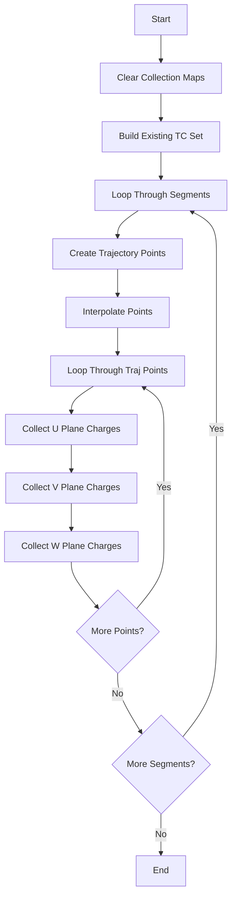

# Understanding the collect_charge_multi_trajectory Function

## Overview
The `collect_charge_multi_trajectory` function is designed to collect charge information along particle trajectories in a wire chamber detector. It operates by examining trajectory points and collecting charge information from nearby detector channels.

## Main Components

### Input Parameters
- `map_segment_vertices`: Map containing segment and vertex associations
- `ct_point_cloud`: Point cloud containing charge/time information
- `dis_cut`: Distance cut for trajectory point spacing (default: 0.6 cm)
- `range_cut`: Range for collecting nearby points (default: 1.0 cm)

### Key Data Structures
```cpp
// Store collected charge information
std::map<std::pair<int,int>, std::pair<double,double>> collected_charge_map;
// Key: (time_slice, channel)
// Value: (charge, charge_error)

// Store existing time-channel combinations
std::set<std::pair<int,int>> existing_tcs;
```

## Algorithm Flow

1. **Initialization**
   ```cpp
   // Clear existing charge map
   collected_charge_map.clear();
   
   // Build set of existing time-channel combinations
   for (auto mcell : mcells) {
       int time_slice = mcell->GetTimeSlice();
       for (auto wire : mcell->get_uwires()) {
           existing_tcs.insert({time_slice, wire->channel()});
       }
       // Repeat for v and w wires
   }
   ```

2. **Trajectory Point Collection**
   ```cpp
   PointVector traj_pts;
   for (auto point : path_wcps) {
       Point p(point.x, point.y, point.z);
       // Check if point is within detector bounds
       if (isInBounds(p)) {
           // Add points with proper spacing
           if (needsInterpolation(p, traj_pts.back())) {
               addInterpolatedPoints(traj_pts, p);
           } else {
               traj_pts.push_back(p);
           }
       }
   }
   ```

3. **Charge Collection**
   ```cpp
   for (auto point : traj_pts) {
       // Get nearby points from all wire planes
       for (int plane = 0; plane < 3; plane++) {
           auto nearby_points = ct_point_cloud.get_closest_points(point, range_cut, plane);
           
           // Store charge information if not already existing
           for (auto nearby : nearby_points) {
               auto tc_pair = std::make_pair(nearby.time_slice, nearby.channel);
               if (existing_tcs.find(tc_pair) == existing_tcs.end()) {
                   collected_charge_map[tc_pair] = {nearby.charge, nearby.charge_err};
               }
           }
       }
   }
   ```

## Example Scenarios

### Scenario 1: Simple Straight Track
```cpp
// Input trajectory points
Points = {
    {0, 0, 0},
    {1, 1, 1},
    {2, 2, 2}
}

// With dis_cut = 0.6 cm, this would create interpolated points:
traj_pts = {
    {0, 0, 0},
    {0.5, 0.5, 0.5},
    {1.0, 1.0, 1.0},
    {1.5, 1.5, 1.5},
    {2.0, 2.0, 2.0}
}
```

### Scenario 2: Charge Collection
```cpp
// For each trajectory point (x,y,z)
Point p = {1.0, 1.0, 1.0};

// Collect charges within range_cut (e.g., 1.0 cm)
// From U plane:
collected_u = {
    {time=10, channel=20, charge=100, error=10},
    {time=10, channel=21, charge=150, error=12}
};

// Similar collections for V and W planes
```

## Best Practices

1. **Boundary Checking**
   - Always verify points are within detector bounds
   - Skip points outside active volume (y < -120cm or y > 120cm)
   - Verify z coordinates (0cm to 1070cm)

2. **Error Handling**
   - Check for valid charge values
   - Verify time slice and channel numbers
   - Handle edge cases near detector boundaries

3. **Performance Optimization**
   - Use spatial indexing for point cloud queries
   - Pre-allocate vectors when possible
   - Minimize redundant calculations

## Flow Diagram


## Common Debugging Tips

1. **Missing Charges**
   - Verify range_cut is appropriate
   - Check detector boundary conditions
   - Confirm time slice alignment

2. **Interpolation Issues**
   - Verify dis_cut value
   - Check for gaps in trajectory
   - Confirm point ordering

3. **Performance Issues**
   - Monitor memory usage
   - Check point cloud query efficiency
   - Optimize container operations