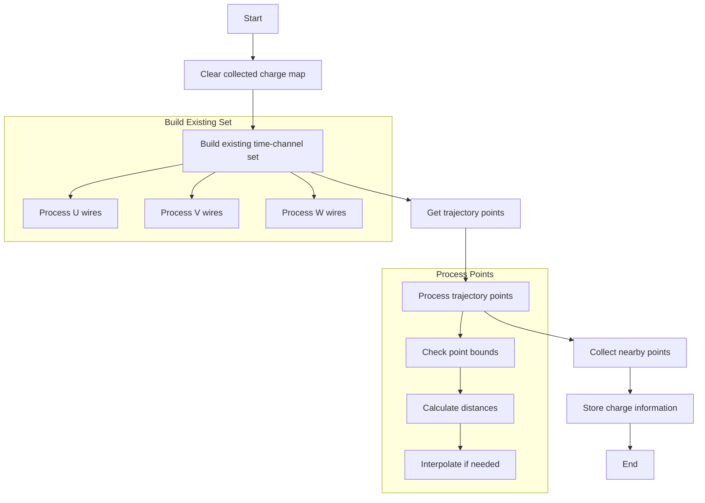

# Charge Trajectory Collection Function Documentation

## Overview
The `collect_charge_trajectory()` function is responsible for collecting charge information along a particle track trajectory. It processes point clouds and existing cell information to create a map of charges at specific time slices and channels.

## Function Signature
```cpp
void WCPPID::PR3DCluster::collect_charge_trajectory(
    ToyCTPointCloud& ct_point_cloud, 
    double dis_cut, 
    double range_cut
)
```

## Logic Flow


## Key Steps

1. **Initialize and Clear Data**
   - Clears the collected charge map
   - Creates a set for existing time-channel pairs

2. **Build Existing Time-Channel Set**
   ```cpp
   std::set<std::pair<int,int>> existing_tcs;
   // Populate from mcells for U, V, W wires
   ```

3. **Generate Trajectory Points**
   - Gets path points from WCPs
   - Interpolates points if distance exceeds `dis_cut`
   - Filters points outside detector bounds

4. **Collect Charge Information**
   - For each trajectory point:
     - Gets nearby points within `range_cut`
     - Processes all three wire planes (0, 1, 2)
     - Stores charge information if not in existing set

## Called Functions
- `get_path_wcps()`: Retrieves wire cell points for the path
- `get_closest_points()`: Gets nearby points from point cloud
- Various geometric cell and wire accessor methods

## Parameters
- `ct_point_cloud`: Point cloud containing charge/time information
- `dis_cut`: Maximum distance between trajectory points
- `range_cut`: Range for collecting nearby points

## Return Value
- Void function
- Updates internal `collected_charge_map` with time-channel to charge mapping

