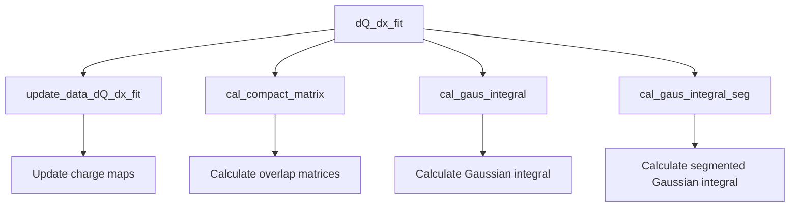
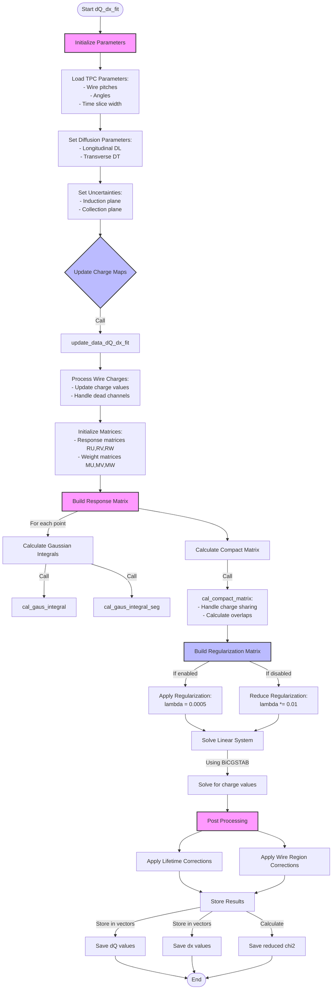

# dQ/dx Fitting Documentation

## Overview

The dQ/dx fitting functionality in the PR3DCluster class is designed to perform charge reconstruction along particle trajectories in liquid argon time projection chambers (LArTPCs). It takes into account various detector effects and performs a sophisticated fit to determine the charge deposition per unit length along the track.

## Core Function Call Flow



## Main Components

### 1. dQ_dx_fit() Main Function

This is the primary function that orchestrates the charge fitting process. Key parameters:

```cpp
void PR3DCluster::dQ_dx_fit(
    std::map<int,std::map<const GeomWire*, SMGCSelection>>& global_wc_map,
    std::map<std::pair<int,int>,std::tuple<double,double,int>>& map_2D_ut_charge,
    std::map<std::pair<int,int>,std::tuple<double,double,int>>& map_2D_vt_charge,
    std::map<std::pair<int,int>,std::tuple<double,double,int>>& map_2D_wt_charge,
    double flash_time,
    double dis_end_point_ext,
    bool flag_dQ_dx_fit_reg
)
```

### 2. Key Steps in the Process

1. **Initialize Parameters:**
```cpp
// Detector parameters
double time_slice_width = mp.get_ts_width();
double pitch_u = mp.get_pitch_u();
double pitch_v = mp.get_pitch_v();
double pitch_w = mp.get_pitch_w();

// Diffusion coefficients
double DL = 6.4 * pow(units::cm,2)/units::second; // Longitudinal
double DT = 9.8 * pow(units::cm,2)/units::second; // Transverse
```

2. **Charge Map Creation:**
The code creates and manages several charge maps:
```cpp
// Example charge map structure
std::map<std::pair<int,int>, std::tuple<double,double,int>> map_2D_ut_charge;
// Key: (wire_index, time_slice)
// Value: (charge, charge_error, flag)
```

3. **Response Matrix Construction:**
```cpp
// Create sparse matrices for each plane
Eigen::SparseMatrix<double> RU(n_2D_u, n_3D_pos);
Eigen::SparseMatrix<double> RV(n_2D_v, n_3D_pos);
Eigen::SparseMatrix<double> RW(n_2D_w, n_3D_pos);
```

### 3. Key Helper Functions

#### cal_compact_matrix()
Calculates the compact matrices for charge sharing between adjacent points:
```cpp
std::vector<std::pair<double, double>> cal_compact_matrix(
    Eigen::SparseMatrix<double>& MW,
    Eigen::SparseMatrix<double>& RWT,
    int n_2D_w,
    int n_3D_pos,
    double cut_pos
)
```

#### cal_gaus_integral()
Calculates Gaussian integrals for charge spread:
```cpp
double cal_gaus_integral(
    int tbin,
    int wbin,
    double t_center,
    double t_sigma,
    double w_center,
    double w_sigma,
    int flag,
    double nsigma
)
```

## Detailed Process Flow

1. **Initialize Detector Parameters**
   - Load wire pitches, angles, time slice widths
   - Set up diffusion coefficients
   - Initialize charge uncertainty parameters

2. **Update Charge Maps**
   - Call update_data_dQ_dx_fit()
   - Process individual wire charges
   - Handle dead channels and uncertainties

3. **Matrix Construction**
   - Build response matrices for each plane (U, V, W)
   - Create regularization matrices
   - Set up charge sharing matrices

4. **Perform Fit**
   - Solve system using BiCGSTAB solver
   - Handle regularization
   - Calculate chi-square values

5. **Post-Processing**
   - Apply lifetime corrections
   - Handle special wire regions
   - Store results in dQ and dx vectors

## Important Considerations

### 1. Dead Channel Handling
```cpp
if (std::get<2>(it->second)==0 && value > 0) {
    reg_flag_u.at(i) = 1;
}
```

### 2. Regularization
```cpp
double lambda = 0.0005;
FMatrix *= lambda;

if (!flag_dQ_dx_fit_reg)
    FMatrix *= 0.01;
```

### 3. Uncertainty Handling
```cpp
double rel_uncer_ind = 0.075; // Induction plane uncertainty
double rel_uncer_col = 0.05;  // Collection plane uncertainty
```

## Function Dependencies

- **Direct Dependencies:**
  - update_data_dQ_dx_fit() [detailed explanation](./update_data_dQ_dx_fit.md)
  - cal_compact_matrix() [detailed explanation](./cal_compact_matrix.md)
  - cal_gaus_integral() [detailed explanation](./cal_gaus_integral.md)
  - cal_gaus_integral_seg()

- **Indirect Dependencies:**
  - get_wirecharge_map()
  - get_wirechargeerr_map()
  - TPCParams singleton functions

## Example Usage

```cpp
// Initialize cluster and parameters
PR3DCluster cluster(cluster_id);
double flash_time = 4.0 * units::microsecond;
double dis_end_point_ext = 4.5 * units::mm;
bool flag_dQ_dx_fit_reg = true;

// Prepare charge maps
std::map<int,std::map<const GeomWire*, SMGCSelection>> global_wc_map;
std::map<std::pair<int,int>,std::tuple<double,double,int>> map_2D_ut_charge;
std::map<std::pair<int,int>,std::tuple<double,double,int>> map_2D_vt_charge;
std::map<std::pair<int,int>,std::tuple<double,double,int>> map_2D_wt_charge;

// Perform fit
cluster.dQ_dx_fit(
    global_wc_map,
    map_2D_ut_charge,
    map_2D_vt_charge,
    map_2D_wt_charge,
    flash_time,
    dis_end_point_ext,
    flag_dQ_dx_fit_reg
);

// Access results
std::vector<double>& dQ = cluster.get_dQ();
std::vector<double>& dx = cluster.get_dx();
```


