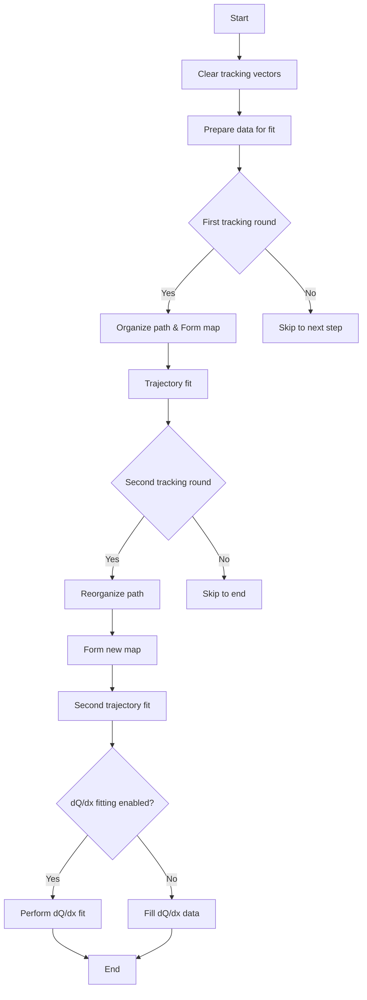

# Understanding PR3DCluster::do_tracking() Function

## Overview

The `do_tracking()` function is a key component in the PR3DCluster class that performs 3D track reconstruction using 2D wire data from multiple planes. It processes tracking information and fits charge distributions to reconstruct particle trajectories in 3D space.

## Function Arguments

```cpp
void do_tracking(
    WCP::ToyCTPointCloud& ct_point_cloud,                    // Point cloud data
    std::map<int,std::map<const GeomWire*, SMGCSelection>>& global_wc_map,  // Wire-cell mapping
    double time,                                             // Time information
    bool flag_dQ_dx_fit_reg = true,                         // Flag for fit regularization
    bool flag_dQ_dx_fit = true                              // Flag for dQ/dx fitting
)
```

## Main Steps in the Function



## Key Steps Explanation

1. **Data Preparation**:
```cpp
// Prepare the data maps for the fit
std::map<std::pair<int,int>,std::tuple<double,double, int>> map_2D_ut_charge;
std::map<std::pair<int,int>,std::tuple<double,double, int>> map_2D_vt_charge;
std::map<std::pair<int,int>,std::tuple<double,double, int>> map_2D_wt_charge;
prepare_data(ct_point_cloud, global_wc_map, map_2D_ut_charge, map_2D_vt_charge, map_2D_wt_charge);
```

2. **First Round Path Organization**:
```cpp
double low_dis_limit = 1.2*units::cm;
double end_point_limit = 0.6*units::cm;
PointVector pts = organize_wcps_path(ct_point_cloud, path_wcps, low_dis_limit, end_point_limit);
```

3. **Trajectory Fitting**:
```cpp
// Form associations between 2D and 3D points
std::map<int,std::pair<std::set<std::pair<int,int>>, float>> map_3D_2DU_set;
// ... similar for V and W
form_map(ct_point_cloud, pts, map_2D_ut_charge, map_2D_vt_charge, map_2D_wt_charge,
         map_3D_2DU_set, map_3D_2DV_set, map_3D_2DW_set,
         map_2DU_3D_set, map_2DV_3D_set, map_2DW_3D_set);
```

## Key Functions Called

1. **prepare_data()**   [more details](./track_fitting/prepare_data.md)
   - Prepares charge data maps for the fit
   - Maps time slices to wire charges

2. **organize_wcps_path()** [more details](./organize_wcps_path.md)
   - Organizes path points with distance constraints 
   - Returns vector of organized points

3. **form_map()** [more details](./form_map.md)
   - Creates associations between 2D and 3D points
   - Maps wire plane hits to 3D space points

4. **trajectory_fit()**
   - Performs fitting of track trajectory
   - Uses charge information from multiple planes

5. **organize_ps_path()**
   - Reorganizes points after initial fit
   - Applies additional constraints

6. **dQ_dx_fit()**
   - Performs charge/distance (dQ/dx) fitting
   - Uses regularization if enabled

## Example Usage

Here's a basic example of using the tracking function:

```cpp
PR3DCluster cluster(cluster_id);
// ... initialize cluster with cells

// Create point cloud
ToyCTPointCloud ct_point_cloud;
// ... populate point cloud

// Create wire-cell mapping
std::map<int,std::map<const GeomWire*, SMGCSelection>> global_wc_map;
// ... populate mapping

// Perform tracking
cluster.do_tracking(ct_point_cloud, global_wc_map, 4.0*units::microsecond);

// Access results
auto& track_points = cluster.get_fine_tracking_path();
auto& track_charges = cluster.get_dQ();
auto& track_distances = cluster.get_dx();
```

## Output Data

The function populates several member variables:

- `fine_tracking_path`: Vector of 3D points along the track
- `dQ`: Vector of charge deposits
- `dx`: Vector of distance segments
- `pu`, `pv`, `pw`: Projected coordinates in U, V, W planes
- `pt`: Time coordinates
- `reduced_chi2`: Fit quality measures

## Important Considerations

1. The function requires properly initialized point cloud data
2. Wire-cell mapping must be complete and accurate
3. Regularization can be controlled via flags
4. Performance depends on point cloud quality
5. Multiple fitting passes improve accuracy