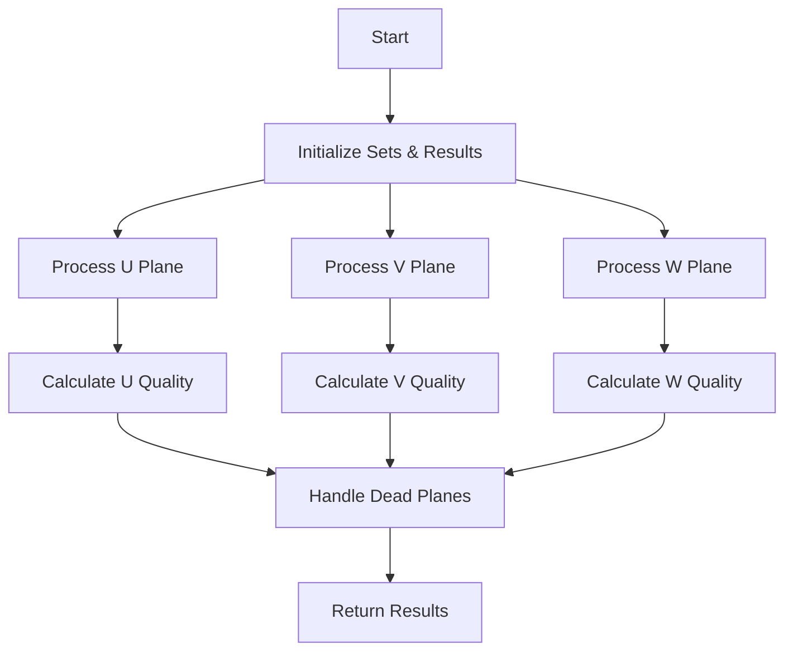

# Point Association Analysis in Track Fitting

## Function Overview

The `examine_point_association` function is part of the WCPPID::PR3DCluster class and analyzes the association of points across three wire planes (U, V, W) in a time projection chamber detector.

## Purpose

This function evaluates and filters point associations between different detector planes while handling cases where one or more planes may be "dead" or providing unreliable data.

## Function Signature

```cpp
std::vector<float> examine_point_association(
    std::vector<int>& temp_results,
    std::set<std::pair<int,int> >& temp_2dut,
    std::set<std::pair<int,int> >& temp_2dvt,
    std::set<std::pair<int,int> >& temp_2dwt,
    std::map<std::pair<int,int>,std::tuple<double,double, int> >& map_2D_ut_charge,
    std::map<std::pair<int,int>,std::tuple<double,double, int> >& map_2D_vt_charge,
    std::map<std::pair<int,int>,std::tuple<double,double, int> >& map_2D_wt_charge,
    bool flag_end_point,
    double charge_cut
)
```

## Key Components

### Input Parameters
- `temp_results`: Vector containing time and wire information for each plane
- `temp_2dut/vt/wt`: Sets of wire-time pairs for U/V/W planes
- `map_2D_ut/vt/wt_charge`: Maps associating wire-time pairs with charge information
- `flag_end_point`: Boolean flag for endpoint processing
- `charge_cut`: Threshold for charge consideration

### Return Value
Returns a vector of 3 floats representing quality metrics for each plane.

## Algorithm Flow



## Key Processing Steps

1. **Initial Processing**
   ```cpp
   // Example of initial processing for U plane
   for (auto it = temp_2dut.begin(); it!=temp_2dut.end(); it++) {
       auto it1 = map_2D_ut_charge.find(*it);
       if (it1!=map_2D_ut_charge.end() && std::get<0>(it1->second) > charge_cut) {
           temp_types_u.insert(std::get<2>(it1->second));
           // ... process charge information
       }
   }
   ```

2. **Dead Plane Handling**
   - Function handles cases where one or more planes are "dead"
   - Uses charge-weighted averaging to validate point associations
   - Implements fallback mechanisms when planes are inactive

3. **Quality Metrics**
   - Calculates position-based quality metrics
   - Uses RMS calculations for cluster validation
   - Implements thresholds for point acceptance

## Common Use Cases

1. **Normal Operation**
   - All planes active
   - Points validated across three planes

2. **Dead Plane Scenarios**
   ```cpp
   // Example: Handling when U and V planes are dead
   if (saved_2dut.size()==0 && saved_2dvt.size()==0 && saved_2dwt.size()!=0) {
       saved_2dut.insert(std::make_pair(temp_results.at(1), temp_results.at(0)));
       saved_2dvt.insert(std::make_pair(temp_results.at(2), temp_results.at(0)));
       // ... additional processing
   }
   ```

## Related Functions

The function operates independently but is part of the track fitting system. No direct function calls are made to other methods, but it interacts with:

1. Data structures populated by track finding algorithms
2. Wire chamber geometry handling systems
3. Charge reconstruction systems

## Performance Considerations

- Efficient handling of dead planes
- Charge-weighted calculations for improved accuracy
- RMS-based validation to filter outliers
