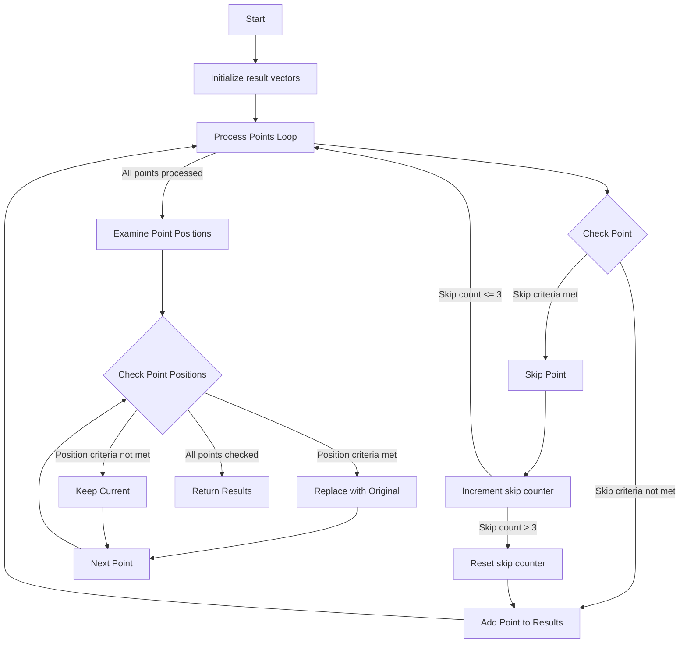

# Understanding the examine_trajectory Function

## Overview
The `examine_trajectory` function is part of PR3DCluster and is responsible for examining and potentially adjusting trajectory points in 3D space. Its main purpose is to validate and correct the positioning of points along a trajectory to ensure smoother and more accurate paths.

### Algorithm Summary
The algorithm works in three main phases:

1. **Initial Point Processing**
   - Processes points sequentially with skip protection
   - Maintains trajectory continuity while allowing limited point exclusion
   - Uses vector maps to track 2D projections in U, V, W wire planes

2. **Geometric Validation**
   - Performs three distinct geometric checks on each point
   - Uses triangle area calculations to detect deviations
   - Compares current point positions with original trajectory

3. **Point Correction**
   - Applies corrections based on geometric criteria
   - Preserves endpoint integrity
   - Ensures smooth transitions between points

## Function Signature
```cpp
WCP::PointVector examine_trajectory(
    WCP::PointVector& final_ps_vec,      // Final points vector
    WCP::PointVector& init_ps_vec,       // Initial points vector
    std::vector<int>& init_indices,       // Initial indices
    std::map<int, std::pair<std::set<std::pair<int,int>>, float>>& map_3D_2DU_set,  // U projection mapping
    std::map<int, std::pair<std::set<std::pair<int,int>>, float>>& map_3D_2DV_set,  // V projection mapping
    std::map<int, std::pair<std::set<std::pair<int,int>>, float>>& map_3D_2DW_set,  // W projection mapping
    /* ... Additional parameters for charge data and geometric transforms ... */
)
```

## Logical Flow



## Detailed Algorithm Description

### Phase 1: Initial Point Processing
The algorithm begins by examining each point in the trajectory sequence:

1. **Point Skip Assessment**
   - For each point p(i) in the trajectory:
     - Calculate skip criteria based on surrounding points
     - Check wire plane projections (U, V, W)
     - Apply maximum skip limit (3 consecutive points)

2. **Skip Criteria**
   ```cpp
   bool should_skip = (deviation > threshold) && 
                     (skip_count <= 3) && 
                     (!is_endpoint);
   ```

3. **Point Collection**
   - Maintain two vectors:
     - `result_ps`: Filtered point sequence
     - `orig_ps`: Original point sequence for reference

### Phase 2: Geometric Analysis
For each point, three geometric tests are performed:

1. **Adjacent Point Test (-1, +1)**
   ```
   Given: Points p(i-1), p(i), p(i+1)
   Calculate:
   - a = distance(p(i-1), p(i))
   - b = distance(p(i), p(i+1))
   - c = distance(p(i-1), p(i+1))
   - s = (a + b + c)/2
   - area = √(s(s-a)(s-b)(s-c))
   ```

2. **Extended Back Test (-2, +1)**
   ```
   Given: Points p(i-2), p(i), p(i+1)
   Calculate similar triangle area
   Compare with threshold * path_length
   ```

3. **Extended Forward Test (-1, +2)**
   ```
   Given: Points p(i-1), p(i), p(i+2)
   Calculate similar triangle area
   Compare with threshold * path_length
   ```

### Phase 3: Point Correction
Points are corrected based on the geometric analysis:

1. **Replacement Criteria**
   ```cpp
   bool needs_replacement = 
       (area1 > 1.8mm * path_length) && 
       (area1 > 1.7 * original_area);
   ```

2. **Correction Application**
   - If any geometric test fails:
     - Replace current point with original
     - Maintain endpoint positions
     - Update surrounding point connections

3. **Smoothing Rules**
   - Maximum deviation angle: 60 degrees
   - Minimum segment length: 0.6 * average_segment_length
   - Maximum segment length: 1.6 * average_segment_length

## Key Components

### 1. Skip Logic for Points
The function uses a skip counter to control how many consecutive points can be skipped:

```cpp
int skip_count = 0;
for (size_t i=0; i!=final_ps_vec.size(); i++) {
    Point p = final_ps_vec.at(i);
    bool flag_skip = skip_trajectory_point(p, i, init_indices.at(i), /*...*/);
    
    // Never skip vertices
    if (i == 0 || i+1 == final_ps_vec.size()) 
        flag_skip = false;
        
    if (flag_skip) {
        skip_count++;
        if (skip_count <= 3)
            continue;
        else
            skip_count = 0;
    }
    // Add point to results
    result_ps.push_back(p);
}
```

### 2. Position Validation
The function checks points against three geometric criteria:

```cpp
for (size_t i=0; i!=result_ps.size(); i++) {
    bool flag_replace = false;
    
    // Check -1 vs +1 points
    if (i != 0 && i+1 != result_ps.size()) {
        double a = calculate_distance(result_ps.at(i-1), result_ps.at(i));
        double b = calculate_distance(result_ps.at(i+1), result_ps.at(i));
        double c = calculate_distance(result_ps.at(i-1), result_ps.at(i+1));
        
        // Calculate triangle area
        double s = (a+b+c)/2.;
        double area = sqrt(s*(s-a)*(s-b)*(s-c));
        
        if (area > threshold && area > factor * original_area)
            flag_replace = true;
    }
    
    // Similar checks for -2 vs +1 and -1 vs +2 points
    // ...
}
```

### 3. Point Replacement Logic
When position criteria indicate a point should be replaced:

```cpp
if (flag_replace) {
    // Replace current point with original point
    result_ps.at(i) = orig_ps.at(i);
}
```

## Key Features

1. **Point Skip Protection**: 
   - Limits consecutive point skips to 3
   - Never skips endpoint vertices
   - Resets skip counter after limit reached

2. **Geometric Validation**:
   - Checks point positions using triangular area calculations
   - Three different position checks:
     - Adjacent points (-1, +1)
     - Extended back check (-2, +1)
     - Extended forward check (-1, +2)

3. **Point Replacement**:
   - Replaces points that fail geometric criteria with original points
   - Preserves endpoint vertices
   - Maintains trajectory smoothness

## Usage Example

```cpp
// Example usage in trajectory fitting
WCP::PointVector final_points = examine_trajectory(
    fitted_points,           // Points after initial fitting
    original_points,         // Original trajectory points
    point_indices,          // Point indices
    map_3D_2DU_set,        // Wire plane mappings
    map_3D_2DV_set,
    map_3D_2DW_set,
    charge_data_u,         // Charge data for each plane
    charge_data_v,
    charge_data_w,
    geometric_transforms   // Coordinate transformation parameters
);
```

## Mathematical Foundation

### Area Calculations
The algorithm uses triangle area calculations to detect point deviations:

1. **Triangle Area Formula**
   ```
   s = (a + b + c)/2  // semi-perimeter
   area = √(s(s-a)(s-b)(s-c))  // Heron's formula
   ```

2. **Deviation Thresholds**
   ```
   area_threshold = 1.8mm * path_length
   area_ratio_threshold = 1.7 * original_area
   ```

3. **Distance Metrics**
   ```cpp
   double distance = sqrt(
       pow(p1.x - p2.x, 2) +
       pow(p1.y - p2.y, 2) +
       pow(p1.z - p2.z, 2)
   );
   ```

### Wire Plane Projections
The algorithm considers projections onto three wire planes:

1. **U-Plane Projection**
   ```
   u = offset_u + (slope_yu * y + slope_zu * z)
   ```

2. **V-Plane Projection**
   ```
   v = offset_v + (slope_yv * y + slope_zv * z)
   ```

3. **W-Plane Projection**
   ```
   w = offset_w + (slope_yw * y + slope_zw * z)
   ```

## Error Cases and Edge Conditions

1. **Single Point Trajectories**: 
   - Function preserves endpoints
   - No geometric checks performed

2. **Short Trajectories** (< 3 points):
   - Skip checks not performed
   - Basic position validation only

3. **Large Deviations**:
   - Points with significant deviation replaced with originals
   - Maintains trajectory stability

4. **Boundary Points**:
   - Special handling for first/last points
   - No skip or replacement allowed