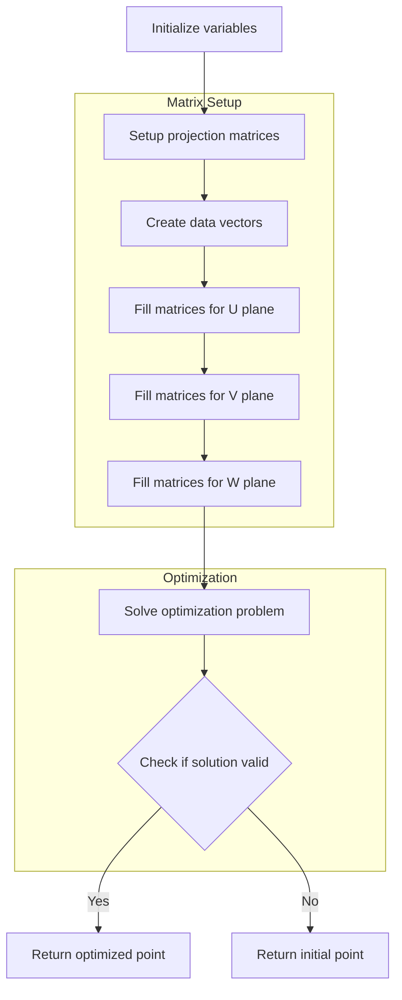

# Understanding the fit_point Function (end points, vertex)

The `fit_point` function is a critical component in Wire-Cell's 3D trajectory fitting algorithm. It fits a single 3D point by minimizing the differences between the projected 2D coordinates and the measured charge deposits in three wire planes (U, V, and W).

## Purpose

The function takes a 3D point and its associated 2D projections and charge measurements, then optimizes the point's position to better match the measured charge deposits while maintaining physical constraints.

## Logical Flow



## Key Components

### 1. Input Parameters

```cpp
Point& init_p                  // Initial 3D point position
int i                         // Point index
map_3D_2DU/V/W_set           // Maps of 3D points to 2D projections
map_2D_ut/vt/wt_charge       // Maps of 2D charge measurements
map_U/V/Wdiv_fac             // Division factors for charge sharing
// ... geometry parameters ...
```

### 2. Matrix Setup

The function sets up sparse matrices to represent the projection from 3D to 2D planes:

```cpp
// Size of projection data for each plane
int n_2D_u = 2 * map_3D_2DU_set[i].first.size();
int n_2D_v = 2 * map_3D_2DV_set[i].first.size();
int n_2D_w = 2 * map_3D_2DW_set[i].first.size();

// Create sparse projection matrices
Eigen::SparseMatrix<double> RU(n_2D_u, 3);
Eigen::SparseMatrix<double> RV(n_2D_v, 3);
Eigen::SparseMatrix<double> RW(n_2D_w, 3);
```

### 3. Data Vector Population

For each wire plane, the function:
1. Collects charge measurements
2. Calculates projection coordinates
3. Applies scaling factors
4. Handles dead/noisy channels

```cpp
// Example for U plane
for (auto it = map_3D_2DU_set[i].first.begin(); it!=map_3D_2DU_set[i].first.end(); it++) {
    double charge = std::get<0>(map_2D_ut_charge[*it]);
    double charge_err = std::get<1>(map_2D_ut_charge[*it]);
    
    // Scale based on charge measurement quality
    double scaling = charge/charge_err * map_Udiv_fac[...];
    
    // Fill data and projection matrices
    data_u_2D(2*index) = scaling * (it->first - offset_u);
    data_u_2D(2*index+1) = scaling * (it->second - offset_t);
    
    RU.insert(2*index, 1) = scaling * slope_yu;  // Y→U projection
    RU.insert(2*index, 2) = scaling * slope_zu;  // Z→U projection
    RU.insert(2*index+1,0) = scaling * slope_x;  // X→T projection
}
```

### 4. Optimization

The function solves a linear system to minimize the difference between projected coordinates and measurements:

```cpp
// Setup system matrices
Eigen::SparseMatrix<double> RUT = RU.transpose();
Eigen::SparseMatrix<double> RVT = RV.transpose();
Eigen::SparseMatrix<double> RWT = RW.transpose();

// Create and solve system
Eigen::BiCGSTAB<Eigen::SparseMatrix<double>> solver;
Eigen::VectorXd b = RUT * data_u_2D + RVT * data_v_2D + RWT * data_w_2D;
Eigen::SparseMatrix<double> A = RUT * RU + RVT * RV + RWT * RW;

// Solve with initial guess
temp_pos_3D = solver.solveWithGuess(b, temp_pos_3D_init);
```

## Error Handling

The function includes robust error handling:
- Checks for NaN in solver results
- Falls back to initial position if optimization fails
- Handles missing charge measurements
- Scales influence based on measurement quality

## Key Features

1. **Charge Quality Weighting**: Measurements are weighted by their uncertainty and quality
2. **Dead Channel Handling**: Special handling for dead or noisy channels
3. **Geometric Constraints**: Maintains physical constraints from wire geometry
4. **Iterative Solution**: Uses BiCGSTAB solver for sparse system optimization
5. **Robust Fallbacks**: Multiple fallback mechanisms if optimization fails

## Usage Example

```cpp
Point init_point(x, y, z);
Point optimized_point = fit_point(
    init_point,
    point_index,
    map_3D_2DU_set,
    map_3D_2DV_set,
    map_3D_2DW_set,
    map_2D_ut_charge,
    map_2D_vt_charge,
    map_2D_wt_charge,
    map_Udiv_fac,
    map_Vdiv_fac,
    map_Wdiv_fac,
    offset_t, slope_x,
    offset_u, slope_yu, slope_zu,
    offset_v, slope_yv, slope_zv,
    offset_w, slope_yw, slope_zw
);
```

The resulting optimized point better matches the measured charge deposits while maintaining physical constraints from the detector geometry.