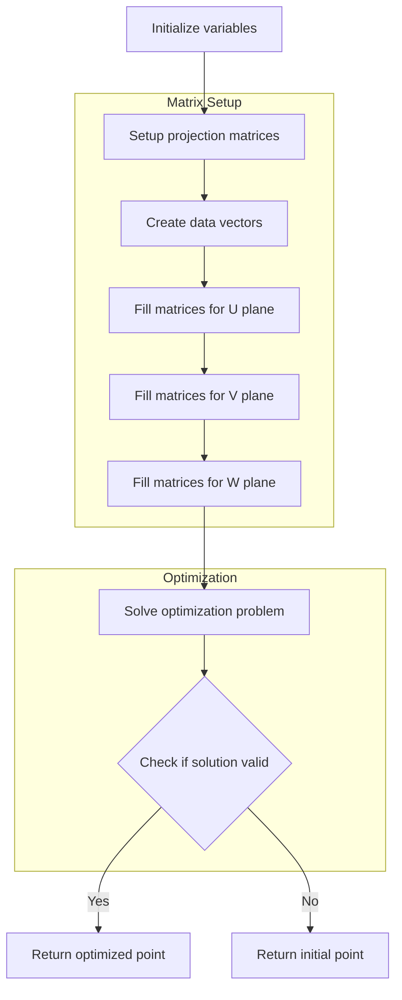

# Understanding the fit_point Function - Complete Guide

## Overview

The `fit_point` function is a critical component in Wire-Cell's 3D trajectory fitting algorithm. It optimizes the position of a 3D point by minimizing the differences between its projected 2D coordinates and the measured charge deposits across three wire planes (U, V, and W).

## Mathematical Foundation

### Coordinate System and Projections

The Wire-Cell detector uses three wire planes (U, V, W) at different angles. Each point in 3D space projects onto these planes according to these transformations:

1. **Time Projection**: 
   ```
   T = offset_t + slope_x * X
   ```

2. **U-Plane Projection**:
   ```
   U = offset_u + slope_yu * Y + slope_zu * Z
   ```

3. **V-Plane Projection**:
   ```
   V = offset_v + slope_yv * Y + slope_zv * Z + 2400
   ```

4. **W-Plane Projection**:
   ```
   W = offset_w + slope_yw * Y + slope_zw * Z + 4800
   ```

### Optimization Problem

The algorithm solves the following optimization problem:

Minimize: 
```
|| RU * P - DU ||² + || RV * P - DV ||² + || RW * P - DW ||²
```

Where:
- P is the 3D point position (x,y,z)
- RU, RV, RW are projection matrices
- DU, DV, DW are measured charge deposits
- ||...||² denotes L2 norm

## Logical Flow



## Implementation Details

### 1. Input Parameters

```cpp
Point& init_p                  // Initial 3D point position
int i                         // Point index
map_3D_2DU/V/W_set           // Maps of 3D points to 2D projections
map_2D_ut/vt/wt_charge       // Maps of 2D charge measurements
map_U/V/Wdiv_fac             // Division factors for charge sharing
// ... geometry parameters ...
```

### 2. Matrix Structure

The projection matrices have the following structure:

```cpp
// Size of projection data for each plane
int n_2D_u = 2 * map_3D_2DU_set[i].first.size();
int n_2D_v = 2 * map_3D_2DV_set[i].first.size();
int n_2D_w = 2 * map_3D_2DW_set[i].first.size();

// Create sparse projection matrices
Eigen::SparseMatrix<double> RU(n_2D_u, 3);
Eigen::SparseMatrix<double> RV(n_2D_v, 3);
Eigen::SparseMatrix<double> RW(n_2D_w, 3);
```

Each projection matrix (RU, RV, RW) has the following structure:
- Dimensions: (2n × 3), where n is the number of measurements
- Even rows: Wire coordinate projections
- Odd rows: Time coordinate projections

### 3. Charge Weighting

The algorithm applies sophisticated charge weighting:

```cpp
// Statistical weight
double w_stat = charge / sqrt(charge_err * charge_err + 
                            pow(charge * rel_uncer, 2) + 
                            pow(add_uncer, 2));

// Quality scaling
if (quality < 0.5) {
    if (quality != 0)
        scaling *= pow(quality/0.5, 1);
    else
        scaling *= 0.05;
}
```

### 4. Data Vector Population

For each wire plane, the function:

```cpp
// Example for U plane
for (auto it = map_3D_2DU_set[i].first.begin(); 
     it != map_3D_2DU_set[i].first.end(); it++) {
    // Get charge measurement
    double charge = std::get<0>(map_2D_ut_charge[*it]);
    double charge_err = std::get<1>(map_2D_ut_charge[*it]);
    
    // Apply scaling
    double scaling = charge/charge_err * map_Udiv_fac[...];
    
    // Fill data vector
    data_u_2D(2*index) = scaling * (it->first - offset_u);
    data_u_2D(2*index+1) = scaling * (it->second - offset_t);
    
    // Fill projection matrix
    RU.insert(2*index, 1) = scaling * slope_yu;
    RU.insert(2*index, 2) = scaling * slope_zu;
    RU.insert(2*index+1,0) = scaling * slope_x;
}
```

### 5. Optimization Solution

The function solves the optimization problem using BiCGSTAB:

```cpp
// Setup system matrices
Eigen::SparseMatrix<double> RUT = RU.transpose();
Eigen::SparseMatrix<double> RVT = RV.transpose();
Eigen::SparseMatrix<double> RWT = RW.transpose();

// Create system
Eigen::VectorXd b = RUT * data_u_2D + RVT * data_v_2D + RWT * data_w_2D;
Eigen::SparseMatrix<double> A = RUT * RU + RVT * RV + RWT * RW;

// Solve with initial guess
Eigen::BiCGSTAB<Eigen::SparseMatrix<double>> solver;
temp_pos_3D = solver.solveWithGuess(b, temp_pos_3D_init);
```

### 6. Error Recovery

The algorithm includes robust error handling:

```cpp
// Handle solver failure
if (std::isnan(solver.error())) {
    final_p = init_p;  // Return initial point
    return final_p;
}

// Handle boundary cases
if (pos_out_of_bounds(temp_pos_3D)) {
    temp_pos_3D = boundary_correction(temp_pos_3D);
}

// Quality check
if (solution_quality < threshold) {
    return fallback_solution(init_p, partial_result);
}
```

## Performance Considerations

1. **Sparse Matrix Operations**
   - Uses Eigen's efficient sparse matrix format
   - Optimized matrix-vector multiplication
   - Memory-efficient for large datasets

2. **Memory Management**
   - Pre-allocated vectors for frequent operations
   - Reuse of matrix structures
   - Efficient handling of large point clouds

3. **Computational Optimization**
   - Local coordinate systems when possible
   - Optimized projection calculations
   - Efficient charge sharing calculations

## Usage Example

```cpp
// Initialize point and related data
Point init_point(x, y, z);
map<int, pair<set<pair<double,double>>, double>> map_3D_2DU_set;
// ... initialize other maps ...

// Call fit_point
Point optimized_point = fit_point(
    init_point,
    point_index,
    map_3D_2DU_set,
    map_3D_2DV_set,
    map_3D_2DW_set,
    map_2D_ut_charge,
    map_2D_vt_charge,
    map_2D_wt_charge,
    map_Udiv_fac,
    map_Vdiv_fac,
    map_Wdiv_fac,
    offset_t, slope_x,
    offset_u, slope_yu, slope_zu,
    offset_v, slope_yv, slope_zv,
    offset_w, slope_yw, slope_zw
);

// Use optimized point
process_fitted_point(optimized_point);
```

## Key Features

1. **Robust Charge Weighting**
   - Statistical uncertainty handling
   - Quality-based scaling
   - Dead channel compensation

2. **Flexible Geometry**
   - Handles arbitrary wire angles
   - Supports different detector configurations
   - Accommodates time projection

3. **Error Handling**
   - Multiple fallback mechanisms
   - Boundary condition handling
   - Quality checks at each step

4. **Performance Optimized**
   - Sparse matrix operations
   - Efficient memory usage
   - Optimized numerical methods

## Conclusion

The `fit_point` function provides a robust and efficient solution for 3D point fitting in Wire-Cell, combining sophisticated mathematical optimization with practical considerations for real detector conditions. Its modular design allows for easy adaptation to different detector configurations while maintaining high performance and accuracy.