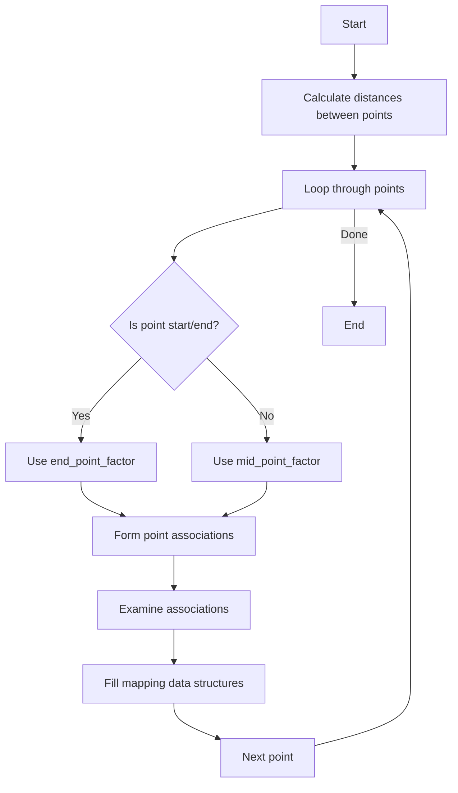

# PR3DCluster::form_map() Function Analysis

## Purpose
The `form_map()` function is a key component in the PR3DCluster class that helps map 3D space points to corresponding 2D projections in a wire chamber detector. It creates associations between 3D points and their 2D wire/time charge measurements.

## Function Signature
```cpp
void form_map(
    WCP::ToyCTPointCloud& ct_point_cloud,    // Point cloud for charge/time info
    WCP::PointVector& pts,                   // 3D points vector
    std::map<...>& map_2D_ut_charge,        // U plane time-charge map  
    std::map<...>& map_2D_vt_charge,        // V plane time-charge map
    std::map<...>& map_2D_wt_charge,        // W plane time-charge map
    std::map<...>& map_3D_2DU_set,          // 3D to U wire associations
    std::map<...>& map_3D_2DV_set,          // 3D to V wire associations 
    std::map<...>& map_3D_2DW_set,          // 3D to W wire associations
    std::map<...>& map_2DU_3D_set,          // U wire to 3D associations
    std::map<...>& map_2DV_3D_set,          // V wire to 3D associations
    std::map<...>& map_2DW_3D_set,          // W wire to 3D associations
    double end_point_factor = 0.6,           // Factor for endpoint distances
    double mid_point_factor = 0.9,           // Factor for midpoint distances
    int nlevel = 3,                         // Number of neighbor levels
    double time_cut = 5,                    // Time cut threshold
    double charge_cut = 2000                // Charge cut threshold
)
```

## Flow Diagram


## Key Steps

1. **Distance Calculation:**
```cpp
// Calculate distances between consecutive points
std::vector<double> distances;
for (size_t i=0; i+1!=pts.size(); i++) {
    distances.push_back(sqrt(pow(pts.at(i+1).x-pts.at(i).x,2) +
                           pow(pts.at(i+1).y-pts.at(i).y,2) +
                           pow(pts.at(i+1).z-pts.at(i).z,2)));
}
```

2. **Point Processing:**
For each point, the function:
- Determines if it's a start/end point or middle point
- Calculates distance cut based on position:
```cpp
double dis_cut;
if (i==0) {
    // Start point
    dis_cut = std::min(distances.at(i) * end_point_factor, 
                       4/3.*end_point_factor*units::cm);
} else if (i+1==pts.size()) {
    // End point
    dis_cut = std::min(distances.back() * end_point_factor,
                       4/3.*end_point_factor*units::cm);
} else {
    // Middle point
    dis_cut = std::min(std::max(distances.at(i-1)*mid_point_factor,
                               distances.at(i)*mid_point_factor),
                       4/3.*mid_point_factor*units::cm);
}
```

3. **Association Formation:**
The function then forms associations between 3D points and 2D wire/time coordinates:
```cpp
std::set<std::pair<int,int> > temp_2dut, temp_2dvt, temp_2dwt;
form_point_association(pts.at(i), temp_2dut, temp_2dvt, temp_2dwt, 
                      ct_point_cloud, dis_cut, nlevel, time_cut);
```

## Called Functions

1. `form_point_association()`  [more details](./form_point_association.md)
   - Forms associations between 3D points and 2D wire/time coordinates
   - Called for each point being processed

2. `examine_point_association()` [more details](./examine_point_association.md)
   - Examines validity of associations
   - Checks charge thresholds and dead channels
   - Returns association quality flags

3. `ct_point_cloud.convert_3Dpoint_time_ch()`
   - Converts 3D points to time and channel coordinates

## Output Data Structures

The function fills several mapping data structures:

1. `map_3D_2DU/V/W_set`: Maps from 3D points to sets of 2D wire/time coordinates
```cpp
// Example structure
map_3D_2DU_set[3D_point_index] = {
    first: {(wire1,time1), (wire2,time2)...},
    second: quality_factor
}
```

2. `map_2DU/V/W_3D_set`: Maps from 2D wire/time coordinates to sets of 3D points
```cpp
// Example structure
map_2DU_3D_set[(wire,time)] = {3D_point_index1, 3D_point_index2...}
```

## Usage Example

```cpp
// Example usage of form_map
PR3DCluster cluster(1);
WCP::PointVector pts = {...}; // 3D points
WCP::ToyCTPointCloud ct_cloud;

// Maps to store charge data
std::map<std::pair<int,int>, std::tuple<double,double,int>> map_2D_ut_charge;
// ... similar maps for V and W planes

// Maps for associations
std::map<int, std::pair<std::set<std::pair<int,int>>, float>> map_3D_2DU_set;
// ... similar maps for other planes and reverse mappings

// Call form_map
cluster.form_map(ct_cloud, pts,
                map_2D_ut_charge, map_2D_vt_charge, map_2D_wt_charge,
                map_3D_2DU_set, map_3D_2DV_set, map_3D_2DW_set,
                map_2DU_3D_set, map_2DV_3D_set, map_2DW_3D_set);
```

## Important Notes

- The function handles dead channels and noisy regions by examining charge patterns
- Quality factors are assigned to associations based on charge consistency
- The function supports both normal track points and endpoint handling
- Association distances are scaled differently for endpoints vs middle points
- Multiple time slices and charge thresholds are considered for robustness