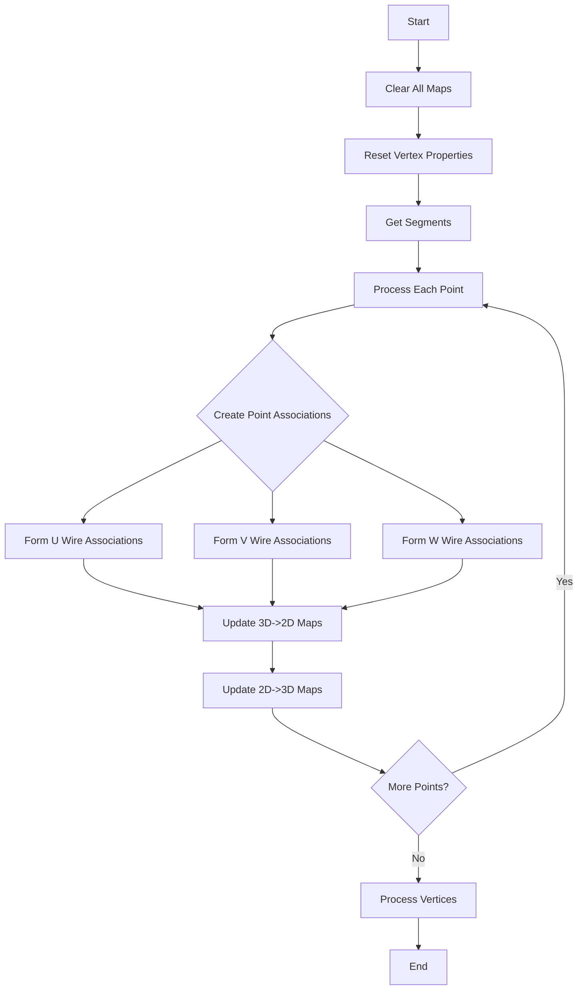

# Form_map_multi_segments Function Documentation

## Overview
The `form_map_multi_segments` function is a critical component in the Wire-Cell reconstruction toolkit that handles the creation of mapping relationships between 3D points and 2D wire projections for particle trajectories. It's used to associate track segments with detector readout information.

## Function Signature
```cpp
void form_map_multi_segments(
    Map_Proto_Vertex_Segments& map_vertex_segments,
    Map_Proto_Segment_Vertices& map_segment_vertices,
    WCP::ToyCTPointCloud& ct_point_cloud,
    std::map<std::pair<int,int>,std::tuple<double,double,int>>& map_2D_ut_charge,
    std::map<std::pair<int,int>,std::tuple<double,double,int>>& map_2D_vt_charge,
    std::map<std::pair<int,int>,std::tuple<double,double,int>>& map_2D_wt_charge,
    std::map<int,std::pair<std::set<std::pair<int,int>>,float>>& map_3D_2DU_set,
    std::map<int,std::pair<std::set<std::pair<int,int>>,float>>& map_3D_2DV_set,
    std::map<int,std::pair<std::set<std::pair<int,int>>,float>>& map_3D_2DW_set,
    std::map<int,std::tuple<WCPPID::ProtoVertex*,WCPPID::ProtoSegment*,int>>& map_3D_tuple,
    std::map<std::pair<int,int>,std::set<int>>& map_2DU_3D_set,
    std::map<std::pair<int,int>,std::set<int>>& map_2DV_3D_set,
    std::map<std::pair<int,int>,std::set<int>>& map_2DW_3D_set,
    bool flag_exclusion
)
```

## Key Mapping Structures

1. **3D to 2D Mappings**:
   - `map_3D_2DU_set`: Maps 3D point indices to sets of U-wire time-channel pairs
   - `map_3D_2DV_set`: Maps 3D point indices to sets of V-wire time-channel pairs  
   - `map_3D_2DW_set`: Maps 3D point indices to sets of W-wire time-channel pairs

2. **2D to 3D Mappings**:
   - `map_2DU_3D_set`: Maps U-wire (time,channel) pairs to sets of 3D point indices
   - `map_2DV_3D_set`: Maps V-wire (time,channel) pairs to sets of 3D point indices
   - `map_2DW_3D_set`: Maps W-wire (time,channel) pairs to sets of 3D point indices

## Core Logic Flow

1. **Initialization**
```cpp
// Clear all mapping structures
map_3D_2DU_set.clear();
map_3D_2DV_set.clear();
map_3D_2DW_set.clear();
map_3D_tuple.clear();
map_2DU_3D_set.clear();
map_2DV_3D_set.clear();
map_2DW_3D_set.clear();
```

2. **Vertex Reset**
```cpp
// Reset fit properties for vertices while preserving fix flags
for (auto it = map_vertex_segments.begin(); it!=map_vertex_segments.end(); it++) {
    if (it->first->get_cluster_id() != cluster_id) continue;
    WCPPID::ProtoVertex *vtx = it->first;
    bool flag_fix = vtx->get_flag_fit_fix();
    vtx->reset_fit_prop();
    vtx->set_flag_fit_fix(flag_fix);
}
```

3. **Point Association**  
```cpp
// For each point in trajectory
Point curr_point = pts.at(i);
std::set<std::pair<int,int>> temp_2dut, temp_2dvt, temp_2dwt;

// Form associations with wire readouts
form_point_association(curr_point, temp_2dut, temp_2dvt, temp_2dwt, 
    ct_point_cloud, dis_cut, nlevel, time_cut);

// Optional exclusion handling
if (flag_exclusion)
    update_association(temp_2dut, temp_2dvt, temp_2dwt, sg, segments);

// Store associations in maps
if (temp_flag.at(0) + temp_flag.at(1) + temp_flag.at(2) > 0) {
    map_3D_2DU_set[count] = std::make_pair(temp_2dut, temp_flag.at(0));
    map_3D_2DV_set[count] = std::make_pair(temp_2dvt, temp_flag.at(1));
    map_3D_2DW_set[count] = std::make_pair(temp_2dwt, temp_flag.at(2));
}
```

[form_point_associations](./form_point_association.md)

[update_point_association](./update_association.md)

4. **Bidirectional Mapping Creation**
```cpp
// Create 2D to 3D mapping
for (auto it = temp_2dut.begin(); it!=temp_2dut.end(); it++) {
    if (map_2DU_3D_set.find(*it) == map_2DU_3D_set.end()) {
        std::set<int> temp_set;
        temp_set.insert(count);
        map_2DU_3D_set[*it] = temp_set;
    } else {
        map_2DU_3D_set[*it].insert(count);
    }
}
```

## Example Usage

```cpp
// Create necessary mapping structures
Map_Proto_Vertex_Segments vertex_segments;
Map_Proto_Segment_Vertices segment_vertices;
std::map<std::pair<int,int>, std::set<int>> map_2DU_3D_set;
// ... initialize other maps ...

// Call the function
form_map_multi_segments(
    vertex_segments,
    segment_vertices,
    ct_point_cloud,
    map_2D_ut_charge,
    map_2D_vt_charge,
    map_2D_wt_charge,
    map_3D_2DU_set,
    map_3D_2DV_set,
    map_3D_2DW_set,
    map_3D_tuple,
    map_2DU_3D_set,
    map_2DV_3D_set,
    map_2DW_3D_set,
    true
);

// Access mapped information
for (auto& mapping : map_3D_2DU_set) {
    int point_index = mapping.first;
    auto& wire_pairs = mapping.second.first;
    float quality = mapping.second.second;
    // Process the mappings...
}
```

## Flow Diagram



## Notes

- The function maintains both forward (3D->2D) and backward (2D->3D) mappings to allow efficient lookup in either direction
- Quality flags are stored with the mappings to indicate confidence levels
- The exclusion flag allows filtering of potentially problematic associations
- Vertex positions are preserved while other properties are reset
- Wire plane specific logic handles U, V, and W readout planes separately