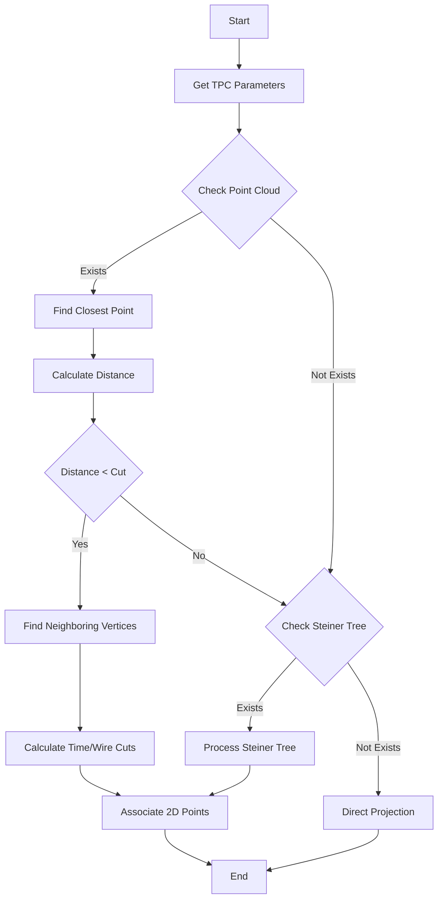

# Form Point Association Function Documentation

## Overview

The `form_point_association` function is part of the Wire-Cell Prototype's PR3DCluster class. Its primary purpose is to associate 3D points with their corresponding 2D projections on three wire planes (U, V, W), taking into account both spatial and temporal relationships.

## Function Signature

```cpp
void WCPPID::PR3DCluster::form_point_association(
    WCP::Point &p,                                    // Input 3D point
    std::set<std::pair<int,int>>& temp_2dut,         // Output U-plane time pairs
    std::set<std::pair<int,int>>& temp_2dvt,         // Output V-plane time pairs
    std::set<std::pair<int,int>>& temp_2dwt,         // Output W-plane time pairs
    WCP::ToyCTPointCloud& ct_point_cloud,            // Point cloud utility
    double dis_cut,                                   // Distance cut parameter
    int nlevel,                                       // Number of neighbor levels
    double time_cut                                   // Time cut parameter
)
```

## Logic Flow



## Main Components

1. **TPC Parameter Initialization**
   - Gets wire pitch, angles, and timing parameters
   - Example:
   ```cpp
   TPCParams& mp = Singleton<TPCParams>::Instance();
   double pitch_u = mp.get_pitch_u();
   double angle_u = mp.get_angle_u();
   ```

2. **Point Cloud Processing**
   - Finds closest points in the main point cloud
   - Processes neighboring vertices
   - Example:
   ```cpp
   WCP::WCPointCloud<double>::WCPoint wcp = point_cloud->get_closest_wcpoint(p);
   double temp_dis = sqrt(pow(wcp.x-p.x,2) + pow(wcp.y-p.y,2) + pow(wcp.z-p.z,2));
   ```

3. **Steiner Tree Processing**
   - Secondary point cloud processing
   - Uses graph structure for connectivity

4. **Direct Projection**
   - Fallback method when no associations found
   - Example:
   ```cpp
   std::vector<int> temp_results = ct_point_cloud.convert_3Dpoint_time_ch(p);
   int cur_time_slice = temp_results.at(0);
   int cur_index_u = temp_results.at(1);
   ```

## Key Functions Called

1. `get_closest_wcpoint(Point)` - From WCPointCloud class
   - Finds nearest point in point cloud

2. `convert_3Dpoint_time_ch(Point)` - From ToyCTPointCloud class
   - Converts 3D points to channel/time information

3. `boost::adjacent_vertices()` - From Boost Graph Library
   - Gets neighboring vertices in graph structure

4. Various getter methods from TPCParams:
   - `get_pitch_u/v/w()`
   - `get_angle_u/v/w()`
   - `get_ts_width()`

## Algorithm Details

The function uses three main approaches to associate points:

1. **Primary Point Cloud Association**
   - Uses spatial proximity
   - Considers time slice correlations
   - Applies distance and time cuts

2. **Steiner Tree Association**
   - Uses graph-based connectivity
   - Processes additional points for better coverage

3. **Direct Projection**
   - Fallback method
   - Projects points directly onto wire planes

The association process considers both spatial and temporal constraints, using various cuts to ensure proper matching:
```cpp
double rem_dis_cut_u = pow(dis_cut_u,2) - pow((cur_time_slice - this_time_slice)*time_slice_width,2);
if (rem_dis_cut_u > 0 && fabs(cur_time_slice-this_time_slice) <= time_cut) {
    // Process association
}
```
</markdown>
