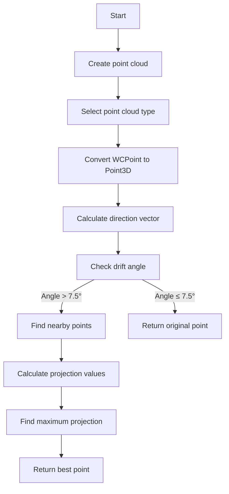

# Analysis of get_local_extension Function

## Function Overview

`get_local_extension` extends a path locally from a given point, considering drift direction constraints and neighboring points within a 10cm radius.

## Function Signature
```cpp
WCP::WCPointCloud<double>::WCPoint get_local_extension(
    WCP::WCPointCloud<double>::WCPoint wcp, 
    int flag
)
```

## Parameters
- `wcp`: Starting point for extension
- `flag`: Point cloud selector (1=regular, 2=Steiner)

## Detailed Algorithm Flow



## Algorithm Steps

1. **Point Cloud Initialization**
   ```cpp
   Create_point_cloud();
   ToyPointCloud *temp_point_cloud = point_cloud;
   if (flag==2) temp_point_cloud = point_cloud_steiner;
   ```

2. **Direction Calculation**
   - Uses VHoughTrans to get direction vector
   - Calculates angle with drift direction
   ```cpp
   TVector3 dir1 = VHoughTrans(p, 10*units::cm);
   dir1 *= (-1);
   ```

3. **Drift Angle Check**
   - If angle with drift direction < 7.5°, returns original point
   - Prevents extension along drift direction
   ```cpp
   if (fabs(dir1.Angle(drift_dir)/3.1415926*180.-90) < 7.5) 
       return wcp;
   ```

4. **Point Extension**
   - Finds points within 10cm radius
   - Projects points onto direction vector
   - Selects point with maximum projection

## Key Features

1. **Direction Constraints**
   - Prevents extensions nearly parallel to drift direction
   - Ensures physically meaningful extensions

2. **Local Search**
   - Limits search to 10cm radius
   - Balances extension length vs accuracy

3. **Projection Selection**
   - Uses dot product for projection values
   - Chooses maximum projection for best extension

## Usage Example

```cpp
WCPointCloud<double>::WCPoint start_point = /* initial point */;
WCPointCloud<double>::WCPoint extended_point = cluster.get_local_extension(start_point, 1);
```

## Performance Considerations

1. **Search Radius**
   - Fixed 10cm radius limits computation
   - Appropriate for typical detector geometries

2. **Early Returns**
   - Quick return for drift-aligned directions
   - Avoids unnecessary calculations

3. **Point Cloud Type**
   - Supports both regular and Steiner point clouds
   - Allows flexibility in path finding