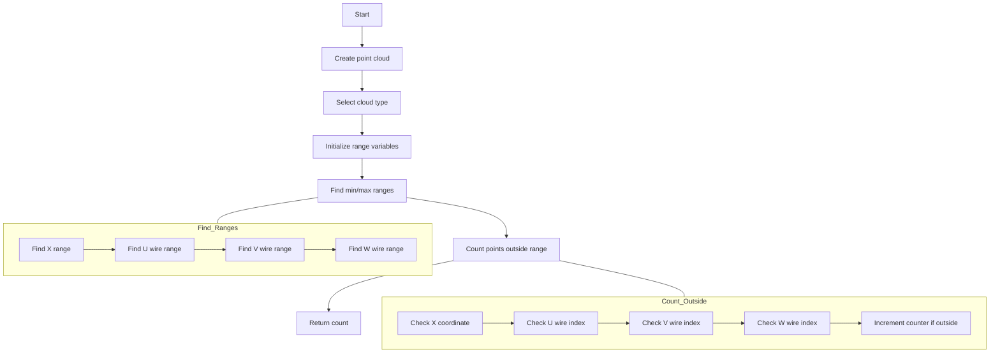

# get_num_outside_range_points Function Analysis

## Function Overview

The `get_num_outside_range_points` function counts points that lie outside the range defined by the established path in terms of both spatial coordinates and wire indices.

## Function Signature
```cpp
int get_num_outside_range_points(int flag)
```

## Parameters
- `flag`: Determines point cloud type
  - 1: Regular point cloud
  - 2: Steiner point cloud

## Algorithm Flow



## Detailed Algorithm Steps

1. **Point Cloud Initialization**
   ```cpp
   Create_point_cloud();
   ToyPointCloud *temp_point_cloud = point_cloud;
   if (flag==2) temp_point_cloud = point_cloud_steiner;
   ```

2. **Range Variable Initialization**
   ```cpp
   double min_x = 1e9, max_x = -1e9;
   double min_u = 1e9, max_u = -1e9;
   double min_v = 1e9, max_v = -1e9;
   double min_w = 1e9, max_w = -1e9;
   ```

3. **Path Range Determination**
   - Iterates through path_wcps to find:
     - X coordinate range
     - U wire index range
     - V wire index range
     - W wire index range

4. **Point Counting**
   - For each point in cloud:
     - Checks if point lies outside any range
     - Increments counter if outside

## Range Check Conditions
```cpp
if (cloud.pts[i].index_u > max_u || cloud.pts[i].index_u < min_u ||
    cloud.pts[i].index_v > max_v || cloud.pts[i].index_v < min_v ||
    cloud.pts[i].index_w > max_w || cloud.pts[i].index_w < min_w ||
    cloud.pts[i].x > max_x || cloud.pts[i].x < min_x)
```

## Key Features

1. **Multi-dimensional Range Check**
   - Checks both spatial (X) coordinates
   - Checks wire indices in all three planes (U,V,W)

2. **Comprehensive Path Coverage**
   - Uses existing path_wcps for range definition
   - Considers full extent of tracked path

3. **Flexibility**
   - Supports both regular and Steiner point clouds
   - Adapts to different tracking scenarios

## Usage Example

```cpp
int outside_points = cluster.get_num_outside_range_points(1);
if (outside_points > threshold) {
    // Handle case with many points outside range
}
```

## Performance Considerations

1. **Memory Efficiency**
   - Uses existing point cloud structure
   - No additional memory allocation needed

2. **Computation Efficiency**
   - Single pass through points for range finding
   - Single pass for point counting
   - O(n) complexity where n is number of points

3. **Range Calculation**
   - Pre-calculates ranges once
   - Reuses ranges for all point checks
