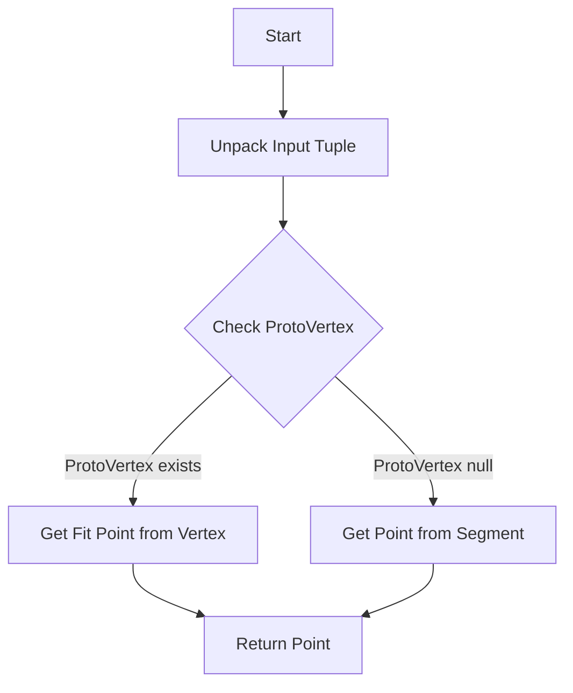
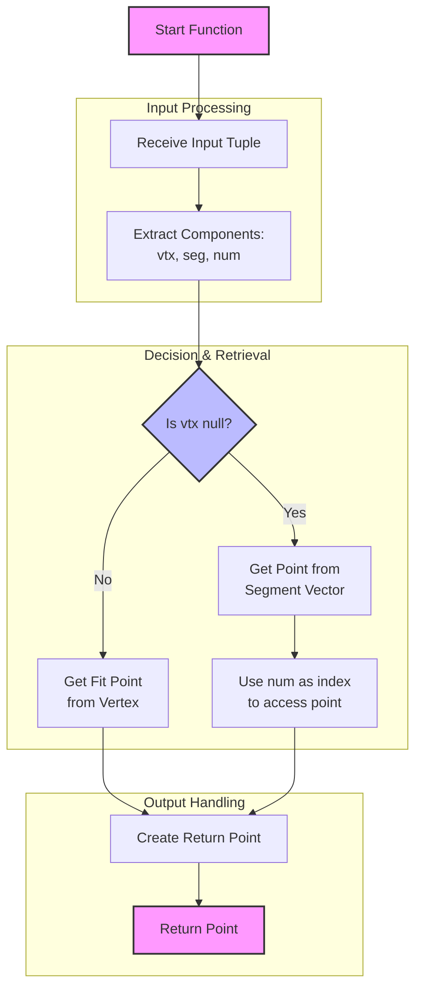

# Understanding get_pos_multi Function

## Overview
The `get_pos_multi` function is a utility function in the WCPPID::PR3DCluster class that retrieves the 3D position from either a ProtoVertex or a ProtoSegment based on input parameters. It's primarily used in trajectory fitting and path organization.

## Function Signature
```cpp
WCP::Point WCPPID::PR3DCluster::get_pos_multi(std::tuple<WCPPID::ProtoVertex*, WCPPID::ProtoSegment*, int>& input)
```

## Function Logic Flow



## Detailed Explanation

1. Input Parameters:
   - The function takes a tuple containing:
     - A pointer to a ProtoVertex
     - A pointer to a ProtoSegment 
     - An integer index

2. Function Body:
   ```cpp
   WCPPID::ProtoVertex* vtx = std::get<0>(input);
   WCPPID::ProtoSegment* seg = std::get<1>(input);
   int num = std::get<2>(input);
   Point p;
   
   if (vtx != 0) {
       p = vtx->get_fit_pt();
   } else {
       p = seg->get_point_vec().at(num);
   }
   return p;
   ```

3. Decision Process:
   - If ProtoVertex exists (vtx != 0):
     - Returns the fitted point from vertex using get_fit_pt()
   - If ProtoVertex is null:
     - Uses the ProtoSegment and index to get point from segment's point vector

## Usage Example

```cpp
// Example setup
WCPPID::ProtoVertex* vertex = new ProtoVertex();
WCPPID::ProtoSegment* segment = new ProtoSegment();
int index = 5;

// Case 1: Using vertex
auto tuple1 = std::make_tuple(vertex, segment, index);
Point p1 = get_pos_multi(tuple1);  // Returns vertex fit point

// Case 2: Using segment
auto tuple2 = std::make_tuple((WCPPID::ProtoVertex*)0, segment, index);
Point p2 = get_pos_multi(tuple2);  // Returns segment point at index 5
```

## Key Points

1. The function serves as a uniform interface to get positions from either vertices or segments
2. It's designed to handle null vertex cases gracefully
3. The integer parameter is only used when accessing segment points
4. Returns a WCP::Point object containing x, y, z coordinates

## Common Use Cases

1. **Trajectory Fitting**:
   ```cpp
   // During trajectory fitting
   Point p = get_pos_multi(map_3D_tuple[point_index]);
   double central_t = slope_x * p.x + offset_t;
   ```

2. **Path Organization**:
   ```cpp
   // When organizing path segments
   Point pos = get_pos_multi(vertex_segment_tuple);
   organize_path(pos);
   ```

## Error Handling
- The function assumes valid pointers and indices
- No explicit error checking is performed
- Caller must ensure:
  - Valid segment pointer when vertex is null
  - Valid index within segment's point vector range

## Performance Considerations
- Lightweight function with minimal overhead
- Direct access to points without computation
- No memory allocation (returns Point by value)

# Flow Diagram
