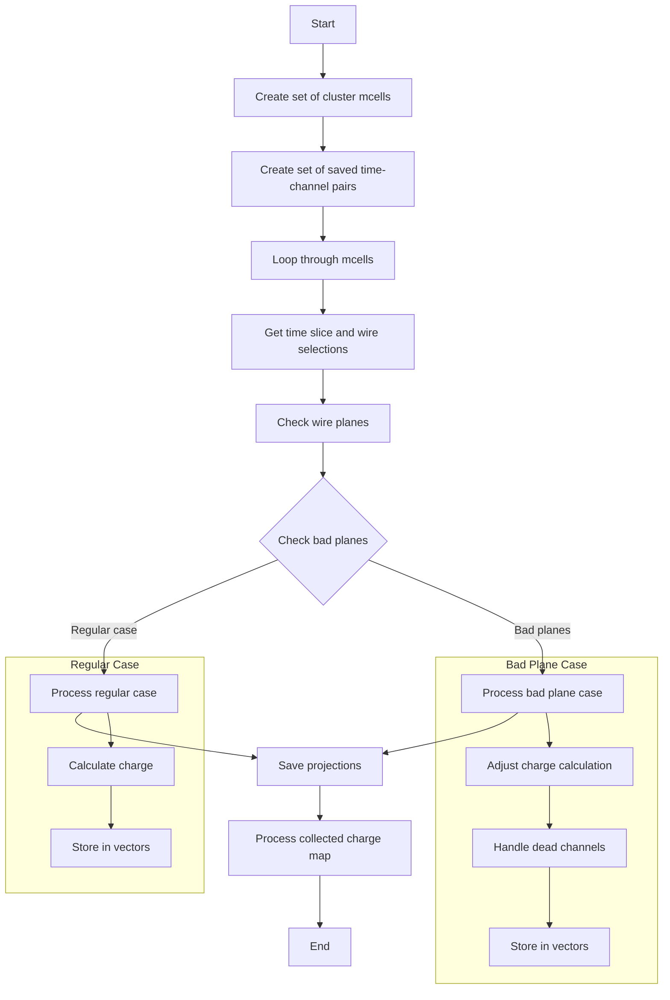

# PR3DCluster::get_projection() Function Documentation

## Overview
The `get_projection()` function is responsible for creating 2D projections of 3D space points onto wire planes in a wire chamber detector. It takes space points from merged cells (mcells) and projects them onto U, V, and W wire planes while handling charge measurements and various edge cases like dead channels.

## Function Signature
```cpp
void get_projection(
    std::vector<int>& proj_channel,     // Output: projected channel numbers
    std::vector<int>& proj_timeslice,   // Output: time slices
    std::vector<int>& proj_charge,      // Output: charge measurements
    std::vector<int>& proj_charge_err,  // Output: charge measurement errors
    std::vector<int>& proj_flag,        // Output: flags for different cases
    std::map<int,std::map<const GeomWire*, SMGCSelection > >& global_wc_map // Input: global wire-cell map
)
```

## Flow Diagram


## Key Components

### 1. Data Structures
- `cluster_mcells_set`: Set of merged cells in the cluster
- `saved_time_channel`: Set of already processed time-channel pairs
- Vectors for storing projections:
  - `proj_channel`: Wire channel numbers
  - `proj_timeslice`: Time slices
  - `proj_charge`: Charge values
  - `proj_charge_err`: Charge errors
  - `proj_flag`: Status flags

### 2. Flag Values
```cpp
// proj_flag values:
0  // Dead channels
1  // Good channels or overlapping channels
2  // Isolated channels
3  // Additional channels
```

## Example Implementation

Here's a simplified example showing how projections are processed:

```cpp
// Process regular channels
void process_regular_channels(const GeomWireSelection& wires, int time_slice) {
    for (auto wire : wires) {
        int ch = wire->channel();
        int charge = mcell->Get_Wire_Charge(wire);
        int charge_err = mcell->Get_Wire_Charge_Err(wire);
        
        if (saved_time_channel.find(std::make_pair(time_slice, ch)) 
            == saved_time_channel.end()) {
            proj_channel.push_back(ch);
            proj_timeslice.push_back(time_slice);
            proj_charge.push_back(charge);
            proj_charge_err.push_back(charge_err);
            proj_flag.push_back(1);
            saved_time_channel.insert(std::make_pair(time_slice, ch));
        }
    }
}

// Process bad planes
void process_bad_planes(const GeomWireSelection& wires, int time_slice) {
    double avg_charge = mcell->get_q() * 1.0 / wires.size();
    double charge_err = sqrt(pow(avg_charge * 0.1, 2) + pow(600, 2));
    
    for (auto wire : wires) {
        int ch = wire->channel();
        proj_channel.push_back(ch);
        proj_timeslice.push_back(time_slice);
        proj_charge.push_back(avg_charge);
        proj_charge_err.push_back(charge_err);
        proj_flag.push_back(0);
    }
}
```

## Called Functions
The function calls several other methods:

1. `SMGCSelection::get_mcells()`
2. `SlimMergeGeomCell::GetTimeSlice()`
3. `SlimMergeGeomCell::get_uwires()`
4. `SlimMergeGeomCell::get_vwires()`
5. `SlimMergeGeomCell::get_wwires()`
6. `SlimMergeGeomCell::get_bad_planes()`
7. `SlimMergeGeomCell::Get_Wire_Charge()`
8. `SlimMergeGeomCell::Get_Wire_Charge_Err()`
9. `SlimMergeGeomCell::get_q()`
10. `GeomWire::channel()`

## Error Handling and Edge Cases

1. **Dead Channels**
```cpp
if (charge <= 0 && flag_bad_plane) {
    charge = mcell->get_q() * 1.0 / uwires.size();
    charge_err = sqrt(pow(charge * 0.1, 2) + pow(600, 2));
    temp_flag = 0;
}
```

2. **Overlapping Wires**
```cpp
if (num_shared_wires > 0.15 * uwires.size() && num_shared_wires > 1)
    flag_reg_save = false;
```

3. **Zero Charge**
```cpp
if (charge <= 0) {
    charge = 0;
    charge_err = 1000;
}
```

## Performance Considerations
- Uses sets for efficient lookup of processed channels
- Handles wire plane overlaps to avoid double counting
- Calculates errors considering both statistical and systematic uncertainties

## Usage Example
```cpp
std::vector<int> proj_channel, proj_timeslice, proj_charge, proj_charge_err, proj_flag;
std::map<int,std::map<const GeomWire*, SMGCSelection>> global_wc_map;

// Initialize global_wc_map...

cluster.get_projection(
    proj_channel, 
    proj_timeslice, 
    proj_charge, 
    proj_charge_err, 
    proj_flag, 
    global_wc_map
);

// Process results
for (size_t i = 0; i < proj_channel.size(); i++) {
    std::cout << "Channel: " << proj_channel[i] 
              << " Time: " << proj_timeslice[i]
              << " Charge: " << proj_charge[i]
              << " Error: " << proj_charge_err[i]
              << " Flag: " << proj_flag[i] << std::endl;
}
```