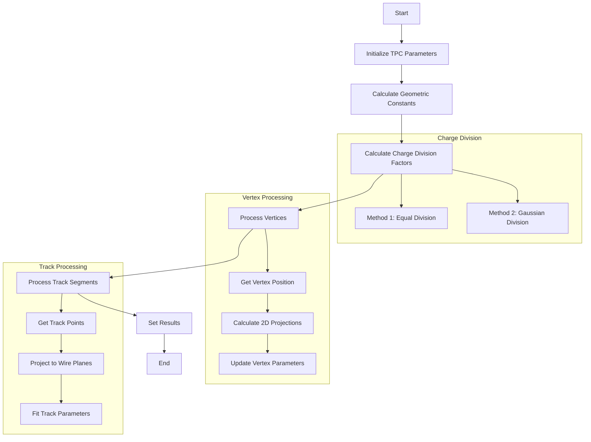

# Multi-Trajectory Fit Documentation

## Overview

The `multi_trajectory_fit` function is designed to perform trajectory fitting for multiple track segments in 3D space while considering 2D projections in three wire planes (U, V, W). It's part of a larger reconstruction system for wire chamber detectors.

## Function Signature

```cpp
void WCPPID::PR3DCluster::multi_trajectory_fit(
    WCPPID::Map_Proto_Vertex_Segments& map_vertex_segments,
    WCPPID::Map_Proto_Segment_Vertices& map_segment_vertices,
    std::map<int, std::pair<std::set<std::pair<int,int>>, float>>& map_3D_2DU_set,
    std::map<int, std::pair<std::set<std::pair<int,int>>, float>>& map_3D_2DV_set,
    std::map<int, std::pair<std::set<std::pair<int,int>>, float>>& map_3D_2DW_set,
    std::map<int, std::tuple<WCPPID::ProtoVertex*, WCPPID::ProtoSegment*, int>>& map_3D_tuple,
    std::map<std::pair<int,int>, std::set<int>>& map_2DU_3D_set,
    std::map<std::pair<int,int>, std::set<int>>& map_2DV_3D_set,
    std::map<std::pair<int,int>, std::set<int>>& map_2DW_3D_set,
    std::map<std::pair<int,int>, std::tuple<double,double,int>>& map_2D_ut_charge,
    std::map<std::pair<int,int>, std::tuple<double,double,int>>& map_2D_vt_charge,
    std::map<std::pair<int,int>, std::tuple<double,double,int>>& map_2D_wt_charge,
    int charge_div_method = 1,
    double div_sigma = 0.6*units::cm
)
```

## Input Parameters

1. Track/Vertex Maps:
   - `map_vertex_segments`: Maps vertices to their connected segments
   - `map_segment_vertices`: Maps segments to their connected vertices 

2. 3D to 2D Projection Maps:
   - `map_3D_2DU_set`: Maps 3D points to U-plane projections
   - `map_3D_2DV_set`: Maps 3D points to V-plane projections 
   - `map_3D_2DW_set`: Maps 3D points to W-plane projections

3. Lookup Maps:
   - `map_3D_tuple`: Maps 3D point indices to their associated geometry
   - `map_2DU_3D_set`: Maps U-plane points to 3D points
   - `map_2DV_3D_set`: Maps V-plane points to 3D points
   - `map_2DW_3D_set`: Maps W-plane points to 3D points

4. Charge Maps:
   - `map_2D_ut_charge`: Charge information for U-plane
   - `map_2D_vt_charge`: Charge information for V-plane
   - `map_2D_wt_charge`: Charge information for W-plane

5. Configuration:
   - `charge_div_method`: Method for charge division (1 or 2)
   - `div_sigma`: Sigma parameter for charge division

## Logical Flow



## Key Functions Called

1. `get_pos_multi()`:  [more details](./get_pos_multi.md)
   - Purpose: Gets 3D position from tuple data
   - Input: Proto vertex/segment tuple
   - Output: 3D point

2. `fit_point()`:  [more details](./fit_point.md)
   - Purpose: Fits single 3D point using 2D projections
   - Input: Initial point, indices, projection maps
   - Output: Fitted 3D point

3. `examine_trajectory()`: [more details](./examine_trajectory.md)
   - Purpose: Validates and smooths trajectory points
   - Input: Point vectors, indices, projection maps
   - Output: Validated point vector

## Example Code

Here's a simplified example demonstrating the core fitting logic:

```cpp
// Initialize fitting parameters
double slope_x = 1./time_slice_width;
double slope_yu = -1./pitch_u * sin(angle_u);
double slope_zu = 1./pitch_u * cos(angle_u);
// Similar for V and W planes...

// Process each vertex
for (auto it = map_vertex_segments.begin(); it != map_vertex_segments.end(); it++) {
    if (it->first->get_cluster_id() != cluster_id) continue;
    WCPPID::ProtoVertex *vtx = it->first;
    int i = vtx->get_fit_index();
    
    if (!vtx->get_flag_fit_fix()) {
        // Fit vertex position
        Point init_p = vtx->get_fit_pt();
        init_p = fit_point(init_p, i, 
            map_3D_2DU_set, map_3D_2DV_set, map_3D_2DW_set,
            map_2D_ut_charge, map_2D_vt_charge, map_2D_wt_charge,
            map_Udiv_fac, map_Vdiv_fac, map_Wdiv_fac,
            offset_t, slope_x, offset_u, slope_yu, slope_zu,
            offset_v, slope_yv, slope_zv, offset_w, slope_yw, slope_zw);
    }
    
    // Update vertex parameters
    vtx->set_fit(init_p, /* additional parameters */);
}

// Process track segments
for (auto it = map_segment_vertices.begin(); it != map_segment_vertices.end(); it++) {
    if (it->first->get_cluster_id() != cluster_id) continue;
    WCPPID::ProtoSegment *sg = it->first;
    
    // Get endpoints and fit track
    PointVector init_ps = sg->get_point_vec();
    std::vector<int> init_indices = sg->get_fit_index_vec();
    PointVector final_ps = examine_trajectory(/* parameters */);
    
    // Set results
    sg->set_fit_vec(final_ps, /* additional parameters */);
}
```

## Detailed Algorithms

### Vertex Processing Algorithm

The vertex processing algorithm handles both fixed and unfixed vertices in the track network. Here's the detailed process:

1. **Vertex Classification**
   ```cpp
   for (auto it = map_vertex_segments.begin(); it != map_vertex_segments.end(); it++) {
       WCPPID::ProtoVertex *vtx = it->first;
       bool flag_fit_fix = vtx->get_flag_fit_fix();
       if (!flag_fit_fix) {
           // Process unfixed vertex
       } else {
           // Use existing fixed position
       }
   }
   ```

2. **Projection Collection**
   - For each vertex:
     - Collect associated 2D projections in U, V, W planes
     - Calculate charge weights for each projection
     - Form charge-weighted position constraints

3. **Position Optimization**
   ```cpp
   // For unfixed vertices
   if (!vtx->get_flag_fit_fix()) {
       Point init_p = vtx->get_fit_pt();
       
       // Build constraint matrices
       Eigen::SparseMatrix<double> RU(n_2D_u, 3);
       Eigen::SparseMatrix<double> RV(n_2D_v, 3);
       Eigen::SparseMatrix<double> RW(n_2D_w, 3);
       
       // Fill matrices with wire plane projections
       for (auto it = map_3D_2DU_set[i].first.begin(); 
            it != map_3D_2DU_set[i].first.end(); it++) {
           // Add U plane constraints
       }
       // Similar for V and W planes
       
       // Solve optimization problem
       init_p = fit_point(init_p, i, /*parameters*/);
   }
   ```

4. **Parameter Updates**
   ```cpp
   // Update vertex fit parameters
   vtx->set_fit(init_p, 0, -1,
       offset_u + 0.5 + (slope_yu * init_p.y + slope_zu * init_p.z),
       offset_v + 0.5 + (slope_yv * init_p.y + slope_zv * init_p.z) + 2400,
       offset_w + 0.5 + (slope_yw * init_p.y + slope_zw * init_p.z) + 4800,
       offset_t + 0.5 + slope_x * init_p.x,
       -1);
   ```

### Point Processing Algorithm

The point processing algorithm handles track segments between vertices. Here's the detailed process:

1. **Track Segment Initialization**
   ```cpp
   for (auto it = map_segment_vertices.begin(); 
        it != map_segment_vertices.end(); it++) {
       WCPPID::ProtoSegment *sg = it->first;
       PointVector init_ps = sg->get_point_vec();
       std::vector<int> init_indices = sg->get_fit_index_vec();
   ```

2. **Point Collection and Sorting**
   ```cpp
   // Get endpoints
   WCPPID::ProtoVertex *start_v = (*it->second.begin());
   WCPPID::ProtoVertex *end_v = (*it->second.rbegin());
   
   // Set boundary conditions
   init_ps.front() = start_v->get_fit_pt();
   init_ps.back() = end_v->get_fit_pt();
   ```

3. **Individual Point Fitting**
   ```cpp
   PointVector final_ps;
   for (size_t i = 0; i != init_ps.size(); i++) {
       if (i == 0 || i + 1 == init_ps.size()) {
           // Handle endpoints
           final_ps.push_back(i == 0 ? start_v->get_fit_pt() 
                                   : end_v->get_fit_pt());
       } else {
           Point temp_p = init_ps.at(i);
           if (!init_fit_skip.at(i)) {
               // Fit intermediate points
               temp_p = fit_point(init_ps.at(i), init_indices.at(i),
                   /*parameters*/);
           }
           final_ps.push_back(temp_p);
       }
   }
   ```

4. **Trajectory Smoothing**
   ```cpp
   final_ps = examine_trajectory(final_ps, init_ps, init_indices,
       /*parameters*/);
   
   // Smoothing checks
   for (size_t i = 0; i != final_ps.size(); i++) {
       bool flag_replace = false;
       
       // Check point spacing
       if (i != 0 && i + 1 != final_ps.size()) {
           double a = sqrt(pow(final_ps.at(i-1).x - final_ps.at(i).x, 2)
                         + pow(final_ps.at(i-1).y - final_ps.at(i).y, 2)
                         + pow(final_ps.at(i-1).z - final_ps.at(i).z, 2));
           // Additional spacing checks
           
           if (area1 > 1.8 * units::mm * c && area1 > 1.7 * area2)
               flag_replace = true;
       }
       
       // Replace problematic points
       if (flag_replace) {
           final_ps.at(i) = orig_ps.at(i);
       }
   }
   ```

5. **Parameter Calculation**
   ```cpp
   // Calculate derived parameters
   std::vector<double> tmp_dQ_vec(final_ps.size(), 0);
   std::vector<double> tmp_dx_vec(final_ps.size(), -1);
   std::vector<double> tmp_pu_vec(final_ps.size(), 0);
   // Similar for other parameters
   
   for (size_t i = 0; i != final_ps.size(); i++) {
       // Calculate wire plane projections
       tmp_pu_vec.at(i) = offset_u + 0.5 + 
           (slope_yu * final_ps.at(i).y + slope_zu * final_ps.at(i).z);
       // Similar calculations for V and W planes
   }
   ```

6. **Result Storage**
   ```cpp
   // Store final results
   sg->set_fit_vec(final_ps, tmp_dQ_vec, tmp_dx_vec,
       tmp_pu_vec, tmp_pv_vec, tmp_pw_vec,
       tmp_pt_vec, tmp_reduced_chi2_vec);
   ```

### Charge Division Methods

1. Equal Division (Method 1):
   ```cpp
   // Each 3D point gets equal weight
   map_Udiv_fac[key] = 1./points.size();
   ```

2. Gaussian Division (Method 2):
   ```cpp
   // Weight based on distance using Gaussian function
   double factor = exp(-0.5 * (pow(delta_t,2) + pow(delta_ch,2))/pow(div_sigma,2));
   map_Udiv_fac[key] = factor/sum;
   ```

### Point Fitting

The point fitting uses a sparse linear system solver (BiCGSTAB) to optimize 3D positions based on 2D projections:

```cpp
Eigen::BiCGSTAB<Eigen::SparseMatrix<double>> solver;
Eigen::VectorXd b = RUT * data_u_2D + RVT * data_v_2D + RWT * data_w_2D;
Eigen::SparseMatrix<double> A = RUT * RU + RVT * RV + RWT * RW;
solver.compute(A);
temp_pos_3D = solver.solveWithGuess(b, temp_pos_3D_init);
```

## Output

The function updates:
1. Vertex positions and parameters in the vertex map
2. Track segment points and parameters in the segment map
3. All associated 2D projections and charge distributions

Each fitted object contains:
- 3D positions
- Charge (dQ) values
- Path length (dx) values
- Wire plane projections (pu, pv, pw)
- Time projection (pt)
- Fit quality metrics (reduced chi-square)