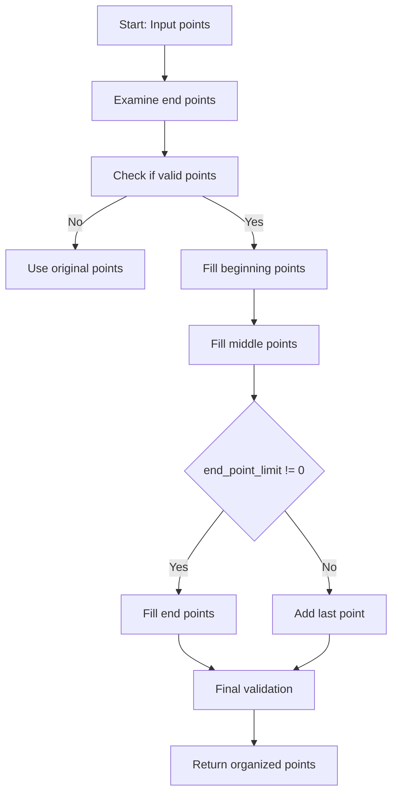
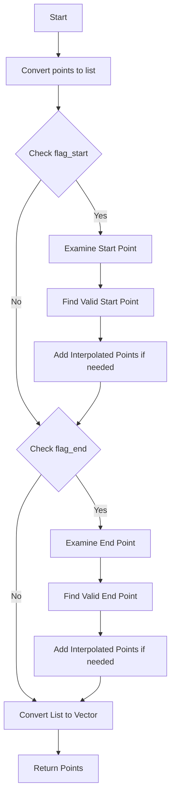

# organize_ps_path() Function Documentation

## Overview
The `organize_ps_path()` function in PR3DCluster is responsible for organizing and refining a trajectory path represented by 3D points. It ensures points are properly spaced and handles endpoint conditions. The function aims to create a more uniform and well-behaved path representation.

## Key Parameters
- `pts`: Input/output vector of 3D points representing the trajectory
- `low_dis_limit`: Minimum desired distance between consecutive points 
- `end_point_limit`: Extension distance for endpoint adjustments
- `ct_point_cloud`: Point cloud used for validation checks

## Function Flow



## Key Steps

### 1. Examine End Points
First, the function examines and validates the endpoints using `examine_end_ps_vec()`:

```cpp
WCP::PointVector ps_vec = examine_end_ps_vec(ct_point_cloud, pts, true, true);
if (ps_vec.size()<=1) 
    ps_vec = pts;
pts.clear();
```

### 2. Fill Beginning Points
The function adds points at the beginning of the path with proper spacing:

```cpp
// Example of filling beginning points
{
    Point p1 = ps_vec.front();
    Point p2 = ps_vec.front(); 
    double dis1 = 0;
    
    // Find first point with sufficient distance
    for (auto it = ps_vec.begin(); it!=ps_vec.end(); it++) {
        p2 = *it;
        dis1 = sqrt(pow(p1.x-p2.x,2) + pow(p1.y-p2.y,2) + pow(p1.z-p2.z,2));
        if (dis1 > low_dis_limit) break;
    }
    
    // Add extended point if needed
    if (dis1 > low_dis_limit) {
        p1.x += (p1.x - p2.x)/dis1 * end_point_limit;
        p1.y += (p1.y - p2.y)/dis1 * end_point_limit;
        p1.z += (p1.z - p2.z)/dis1 * end_point_limit;
        pts.push_back(p1);
    }
}
```

### 3. Fill Middle Points
The function fills in intermediate points ensuring proper spacing:

```cpp
// Example of filling middle points
for (size_t i=0; i!=ps_vec.size(); i++) {
    Point p1 = ps_vec.at(i);
    double dis = sqrt(pow(p1.x-pts.back().x,2) + 
                     pow(p1.y-pts.back().y,2) + 
                     pow(p1.z-pts.back().z,2));

    if (dis < low_dis_limit * 0.8) {
        continue; // Skip points too close
    } 
    else if (dis < low_dis_limit * 1.6) {
        pts.push_back(p1); // Add point directly
    }
    else {
        // Interpolate points for large gaps
        int npoints = std::round(dis/low_dis_limit);
        Point p_save = pts.back();
        for (int j=0; j!=npoints; j++) {
            Point p(p_save.x + (p1.x-p_save.x) / npoints * (j+1),
                   p_save.y + (p1.y-p_save.y) / npoints * (j+1),
                   p_save.z + (p1.z-p_save.z) / npoints * (j+1));
            pts.push_back(p);
        }
    }
}
```

### 4. Fill End Points
Finally, handles the endpoint depending on `end_point_limit`:

```cpp
if (end_point_limit != 0) {
    // Add extended endpoint
    Point p1 = ps_vec.back();
    // Calculate extension similar to beginning points
    pts.push_back(p1);
}
else {
    // Add last point if sufficiently distant
    Point p1 = ps_vec.back();
    double dis1 = sqrt(pow(p1.x-pts.back().x,2) + 
                      pow(p1.y-pts.back().y,2) + 
                      pow(p1.z-pts.back().z,2));
    if (dis1 >= 0.45*units::cm)
        pts.push_back(p1);
}
```

## Key Functions Called

1. `examine_end_ps_vec()`
   - Purpose: Validates and adjusts endpoints
   - Called at start to verify path endpoints

2. `ct_point_cloud.is_good_point()`
   - Purpose: Validates if a point is valid in space
   - Used during endpoint examination

3. Mathematical utilities:
   - `sqrt()`, `pow()`: Used for distance calculations
   - Vector arithmetic for point interpolation

## Important Behaviors

1. **Point Spacing**:
   - Points closer than `0.8 * low_dis_limit` are skipped
   - Points between `0.8 * low_dis_limit` and `1.6 * low_dis_limit` are kept as-is
   - Gaps larger than `1.6 * low_dis_limit` are filled with interpolated points

2. **Endpoint Handling**:
   - If `end_point_limit != 0`, endpoints are extended by the specified distance
   - Otherwise, endpoints are only added if they maintain minimum spacing

3. **Fallback Behavior**:
   - If endpoint examination fails, original points are used
   - If resulting path is too short, original path is restored

## Usage Example

```cpp
// Example usage of organize_ps_path
WCP::PointVector points = {...}; // Initial trajectory points
double low_dis_limit = 0.6 * units::cm;  // Minimum spacing
double end_point_limit = 0.3 * units::cm; // Endpoint extension

organize_ps_path(ct_point_cloud, points, low_dis_limit, end_point_limit);
// points now contains the organized trajectory
```

## Common Parameters
- Typical `low_dis_limit`: 0.6-1.2 cm
- Typical `end_point_limit`: 0.3-0.45 cm

The function is crucial for ensuring trajectories have well-behaved point spacing and proper endpoints, which is essential for downstream tracking and analysis tasks.

# examine_end_ps_vec() Function

## Overview
The `examine_end_ps_vec()` function is responsible for validating and potentially adjusting the endpoints of a trajectory. It ensures that the endpoints are in valid regions of the detector and handles cases where endpoints might be in problematic areas.

## Function Signature
```cpp
WCP::PointVector examine_end_ps_vec(
    WCP::ToyCTPointCloud& ct_point_cloud, 
    WCP::PointVector& pts,
    bool flag_start,  // Whether to examine start point
    bool flag_end     // Whether to examine end point
)
```

## Flow Diagram



## Key Steps

### 1. Start Point Examination
```cpp
if (flag_start) {
    Point temp_start = ps_list.front();
    // Find first good point
    while (ps_list.size() > 0) {
        if (ct_point_cloud.is_good_point(ps_list.front(), 0.2*units::cm, 0, 0)) 
            break;
        temp_start = ps_list.front();
        ps_list.pop_front();
    }
    
    // Interpolate between bad and good points if needed
    if (ps_list.size() > 0) {
        double dis_step = 0.2 * units::cm;
        double temp_dis = sqrt(pow(temp_start.x - ps_list.front().x,2) + 
                             pow(temp_start.y - ps_list.front().y,2) + 
                             pow(temp_start.z - ps_list.front().z,2));
        int ntest = std::round(temp_dis/dis_step);
        
        // Try points along the line until finding a good one
        for (size_t i=1; i<ntest; i++) {
            Point test_p(
                temp_start.x + (ps_list.front().x - temp_start.x)/ntest * i,
                temp_start.y + (ps_list.front().y - temp_start.y)/ntest * i,
                temp_start.z + (ps_list.front().z - temp_start.z)/ntest * i
            );
            if (ct_point_cloud.is_good_point(test_p, 0.2*units::cm, 0, 0)) {
                ps_list.push_front(test_p);
                break;
            }
        }
    }
}
```

### 2. End Point Examination
Similar process is applied to the end point if `flag_end` is true:
```cpp
if (flag_end) {
    Point temp_end = ps_list.back();
    // Find last good point
    while (ps_list.size() > 0) {
        if (ct_point_cloud.is_good_point(ps_list.back(), 0.2*units::cm, 0, 0)) 
            break;
        temp_end = ps_list.back();
        ps_list.pop_back();
    }
    
    // Similar interpolation as start point...
}
```

## Key Features

1. **Point Validation**:
   - Uses `ct_point_cloud.is_good_point()` to validate points
   - Standard validation distance is 0.2 cm
   - Points are checked against detector geometry and other constraints

2. **Interpolation Logic**:
   - When a bad endpoint is found, searches for closest good point
   - Interpolates between bad and good points to find acceptable endpoint
   - Uses fixed step size (0.2 cm) for interpolation

3. **Fallback Behavior**:
   - If no good points are found, preserves original endpoint
   - If list becomes empty, restores original endpoints

4. **Direction Preservation**:
   - Maintains trajectory direction while finding valid endpoints
   - Interpolated points follow the original trajectory path

## Important Parameters

1. `ct_point_cloud`: Point cloud object containing detector geometry and validity checks
2. `flag_start`: Controls whether to examine starting point
3. `flag_end`: Controls whether to examine ending point
4. Fixed parameters:
   - Validation distance: 0.2 cm
   - Step size for interpolation: 0.2 cm

## Usage Example

```cpp
WCP::PointVector points = {...}; // Initial trajectory points
bool check_start = true;
bool check_end = true;

WCP::PointVector validated_points = examine_end_ps_vec(
    ct_point_cloud, 
    points,
    check_start,
    check_end
);
```

## Common Use Cases

1. **Track Endpoint Validation**:
   - Ensuring track endpoints are in valid detector regions
   - Avoiding endpoints in dead or problematic detector areas

2. **Path Refinement**:
   - Pre-processing step before detailed track fitting
   - Ensuring valid endpoints for trajectory reconstruction

3. **Quality Assurance**:
   - Validation step in track reconstruction
   - Ensuring trajectories have well-defined endpoints