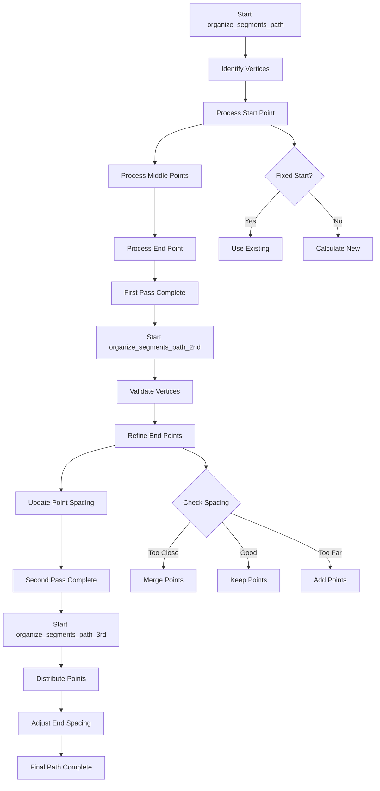

# Detailed Analysis of organize_segments_path Functions

## Core Concepts

Before diving into the functions, let's understand key concepts:

1. **ProtoSegment**: Represents a segment of a track
2. **ProtoVertex**: Represents vertices where segments connect
3. **Point**: 3D coordinates (x,y,z) in the detector space
4. **WCPoint**: Wire cell points with additional properties

## Parameters Deep Dive

```cpp
// Key distance parameters
double low_dis_limit;     // Controls minimum spacing between points
double end_point_limit;   // Controls endpoint extension distance
double step_size;         // Controls uniform spacing in final pass

// Important coordinate conversion parameters
double slope_x = 1./time_slice_width;
double slope_yu = -1./pitch_u * sin(angle_u);
double slope_zu = 1./pitch_u * cos(angle_u);
double slope_yv = -1./pitch_v * sin(angle_v);
double slope_zv = 1./pitch_v * cos(angle_v);
double slope_yw = -1./pitch_w * sin(angle_w);
double slope_zw = 1./pitch_w * cos(angle_w);
```

## 1. organize_segments_path - Initial Path Creation

### Step 1: Vertex Identification
```cpp
// For each segment
for (auto it = map_segment_vertices.begin(); it != map_segment_vertices.end(); it++) {
    WCPPID::ProtoSegment *sg = it->first;
    // Find start and end vertices
    WCPPID::ProtoVertex *start_v = 0, *end_v = 0;
    if ((*it->second.begin())->get_wcpt().index == sg->get_wcpt_vec().front().index) {
        start_v = (*it->second.begin());
        end_v = (*it->second.rbegin());
    } else {
        end_v = (*it->second.begin());
        start_v = (*it->second.rbegin());
    }
}
```

### Step 2: Vertex Classification
```cpp
bool flag_startv_end = true;
bool flag_endv_end = true;
// Check if vertices connect multiple segments
if (map_vertex_segments[start_v].size() > 1) flag_startv_end = false;
if (map_vertex_segments[end_v].size() > 1) flag_endv_end = false;
```

### Step 3: Start Point Processing
```cpp
if (!start_v->get_flag_fit_fix()) {
    // Initialize from wire cell point
    start_p.x = temp_wcps_vec.front().x;
    start_p.y = temp_wcps_vec.front().y;
    start_p.z = temp_wcps_vec.front().z;
    
    if (flag_startv_end) {
        // Find reference point beyond minimum distance
        Point p2;
        double dis1 = 0;
        for (auto it = temp_wcps_vec.begin(); it != temp_wcps_vec.end(); it++) {
            p2.x = (*it).x;
            p2.y = (*it).y;
            p2.z = (*it).z;
            dis1 = sqrt(pow(start_p.x-p2.x,2) + pow(start_p.y-p2.y,2) + 
                       pow(start_p.z-p2.z,2));
            if (dis1 > low_dis_limit) break;
        }
        
        // Extend start point
        if (dis1 != 0) {
            start_p.x += (start_p.x-p2.x)/dis1*end_point_limit;
            start_p.y += (start_p.y-p2.y)/dis1*end_point_limit;
            start_p.z += (start_p.z-p2.z)/dis1*end_point_limit;
        }
    }
    start_v->set_fit_pt(start_p);
}
```

### Step 4: Middle Point Processing
```cpp
pts.push_back(start_p);
for (size_t i = 0; i != temp_wcps_vec.size(); i++) {
    Point p1(temp_wcps_vec.at(i).x, temp_wcps_vec.at(i).y, temp_wcps_vec.at(i).z);
    double dis = low_dis_limit;
    double dis1 = sqrt(pow(p1.x-end_p.x,2) + pow(p1.y-end_p.y,2) + 
                      pow(p1.z-end_p.z,2));
    
    if (pts.size() > 0)
        dis = sqrt(pow(p1.x-pts.back().x,2) + pow(p1.y-pts.back().y,2) + 
                  pow(p1.z-pts.back().z,2));

    // Point spacing logic
    if (dis1 < low_dis_limit * 0.8 || dis < low_dis_limit * 0.8) {
        continue; // Skip points too close
    } else if (dis < low_dis_limit * 1.6) {
        pts.push_back(p1); // Add point directly
    } else {
        // Interpolate for large gaps
        int npoints = std::round(dis/low_dis_limit);
        Point p_save = pts.back();
        for (int j = 0; j != npoints; j++) {
            Point p(p_save.x + (p1.x-p_save.x)/npoints*(j+1),
                   p_save.y + (p1.y-p_save.y)/npoints*(j+1),
                   p_save.z + (p1.z-p_save.z)/npoints*(j+1));
            pts.push_back(p);
        }
    }
}
```

## 2. organize_segments_path_2nd - Path Refinement

### Step 1: Additional Vertex Validation
```cpp
// Check for degenerate cases
if (sqrt(pow(start_v->get_fit_pt().x - end_v->get_fit_pt().x,2) + 
         pow(start_v->get_fit_pt().y - end_v->get_fit_pt().y,2) + 
         pow(start_v->get_fit_pt().z - end_v->get_fit_pt().z,2)) < 0.01*units::cm) {
    // Reset single-segment vertex positions
    if (map_vertex_segments[start_v].size() == 1) {
        Point tmp_p(start_v->get_wcpt().x, start_v->get_wcpt().y, start_v->get_wcpt().z);
        start_v->set_fit_pt(tmp_p);
    }
    if (map_vertex_segments[end_v].size() == 1) {
        Point tmp_p(end_v->get_wcpt().x, end_v->get_wcpt().y, end_v->get_wcpt().z);
        end_v->set_fit_pt(tmp_p);
    }
}
```

### Step 2: End Point Refinement
```cpp
void examine_end_ps_vec(WCP::ToyCTPointCloud& ct_point_cloud, 
                       PointVector& sg_pts,
                       bool flag_startv_end,
                       bool flag_endv_end) {
    // Analyze trajectory endpoints
    if (flag_startv_end) {
        // Refine start point position
        double dis1 = sqrt(pow(sg_pts.front().x - sg_pts.back().x,2) +
                         pow(sg_pts.front().y - sg_pts.back().y,2) +
                         pow(sg_pts.front().z - sg_pts.back().z,2));
        // Apply corrections based on trajectory
    }
    if (flag_endv_end) {
        // Similar process for end point
    }
}
```

## 3. organize_segments_path_3rd - Final Spacing Optimization 

### Step 1: Point Distribution
```cpp
for (size_t i = 0; i != curr_pts.size(); i++) {
    Point p1 = curr_pts.at(i);
    dis_end = sqrt(pow(p1.x-end_p.x,2) + pow(p1.y-end_p.y,2) + 
                   pow(p1.z-end_p.z,2));
    if (dis_end < step_size) continue;

    dis_prev = sqrt(pow(p1.x-pts.back().x,2) + pow(p1.y-pts.back().y,2) + 
                    pow(p1.z-pts.back().z,2));
    
    // Accumulate distance and add points
    if (dis_prev + extra_dis > step_size) {
        extra_dis += dis_prev;
        while (extra_dis > step_size) {
            Point tmp_p;
            tmp_p.x = pts.back().x + (p1.x - pts.back().x)/dis_prev * step_size;
            tmp_p.y = pts.back().y + (p1.y - pts.back().y)/dis_prev * step_size;
            tmp_p.z = pts.back().z + (p1.z - pts.back().z)/dis_prev * step_size;
            pts.push_back(tmp_p);
            extra_dis -= step_size;
        }
    }
}
```

### Step 2: Final Point Adjustment
```cpp
// Handle endpoint spacing
double dis1 = sqrt(pow(pts.back().x-end_p.x,2) + pow(pts.back().y-end_p.y,2) + 
                  pow(pts.back().z-end_p.z,2));

if (dis1 < step_size * 0.6) {
    // Adjust last point for short segments
    if (pts.size() > 1) {
        double dis2 = sqrt(pow(pts.back().x - pts.at(pts.size()-2).x,2) + 
                         pow(pts.back().y - pts.at(pts.size()-2).y,2) + 
                         pow(pts.back().z - pts.at(pts.size()-2).z,2));
        double dis3 = (dis1+dis2)/2.;
        // Reposition last point
        Point tmp_p = interpolatePoint(pts, dis3);
        pts.pop_back();
        pts.push_back(tmp_p);
    }
} else if (dis1 > step_size * 1.6) {
    // Add intermediate points for large gaps
    int npoints = std::round(dis1/step_size);
    addInterpolatedPoints(pts, end_p, npoints);
}
```

## Key Algorithms

### Distance Calculation
```cpp
double calculateDistance(const Point& p1, const Point& p2) {
    return sqrt(pow(p1.x-p2.x,2) + pow(p1.y-p2.y,2) + pow(p1.z-p2.z,2));
}
```

### Point Interpolation
```cpp
Point interpolatePoint(const Point& p1, const Point& p2, double fraction) {
    Point p;
    p.x = p1.x + (p2.x-p1.x) * fraction;
    p.y = p1.y + (p2.y-p1.y) * fraction;
    p.z = p1.z + (p2.z-p1.z) * fraction;
    return p;
}
```

## Flow Control Logic



## Error Handling and Edge Cases

1. **Degenerate Segments**
   - Segments with zero length
   - Overlapping vertices
   - Single point segments

2. **Boundary Conditions**
   - Start/end of detector
   - Dead regions
   - Multiple segment intersections

3. **Spacing Constraints**
   - Minimum point separation
   - Maximum gap interpolation
   - Endpoint extension limits

## Performance Considerations

1. **Memory Management**
   - Point vector pre-allocation
   - Temporary vector reuse
   - Efficient distance calculations

2. **Computational Efficiency**
   - Early termination checks
   - Cached distance calculations
   - Optimized point insertion

3. **Numerical Stability**
   - Distance threshold checks
   - Interpolation parameter bounds
   - Coordinate system scaling